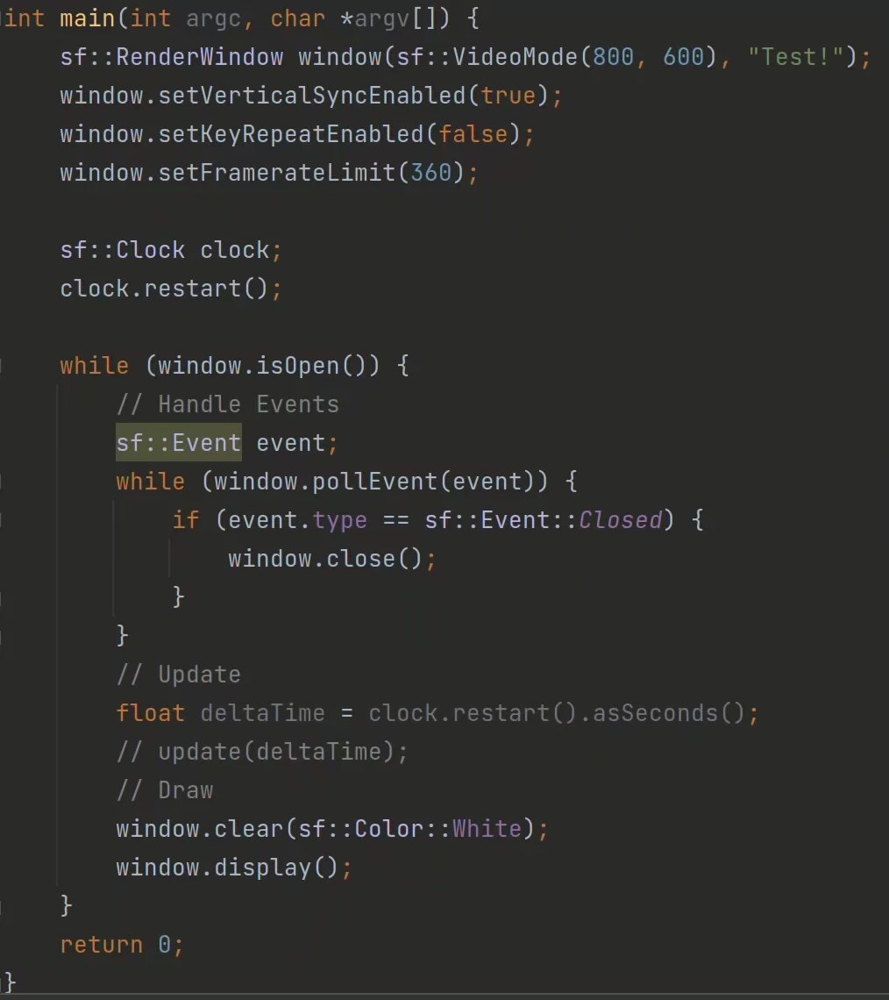
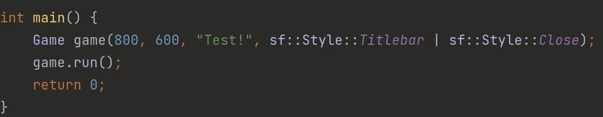
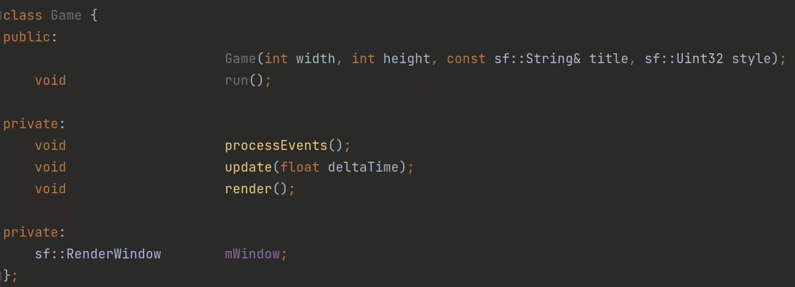

搭配上SFML的内容，我们先写出类似学习SDL时的游戏结构：

这件事做起来很轻松，不是吗？

但是，这并不是很好看。我们为什么不把它重新包装一下，让它更好理解呢？这样如何？

我们尽量把这些过程都拆开，分而治之，不然到时候很有可能搞不清自己到底在做什么。

具体的函数实现就不放在这了，你自己心里面应该有数。

这只是第一步，但是已经能足够我们写一些简单的东西了。

在这之后我们将造出一系列轮子，最后再将他们拼接到一起，构建出我们想要的，更方便的游戏结构。
