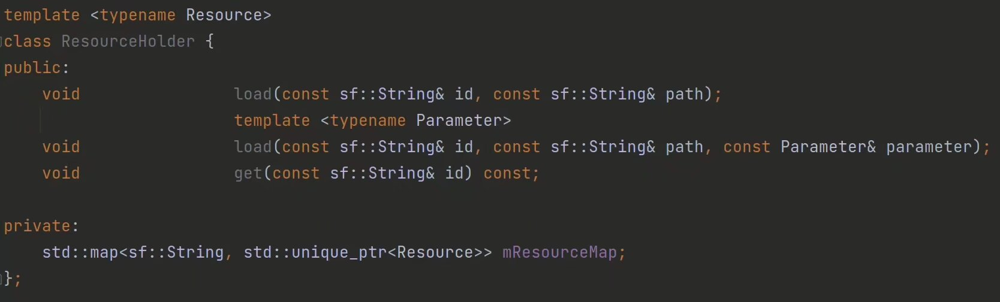
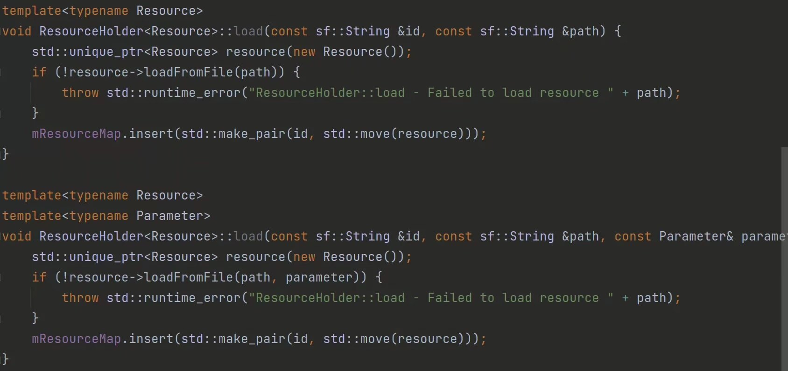
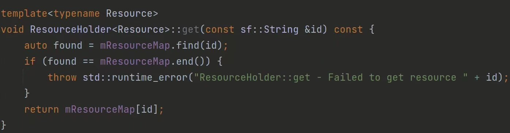
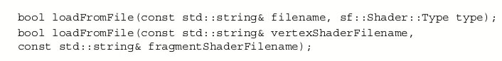

把文件一个一个声明并且读入固然十分有效，但是太麻烦了，根本不好用。

所以为什么我们不自己写一个类，让他来控制所有文件的存取呢？我们可以给每一个加载的内容都带上一个特殊的id，想要的时候再通过id把它取出来，这样既能保证文件只被加载一次，同时也能让存取的步骤更加的简单：

load函数的实现：

get函数的实现：

为什么要准备两种load：

用于视觉特效的sf::Shader的加载方式为：

可以看到它在加载的过程中需要不止一个参数，所以再准备一个load以备不时之需。

不支持的类型？：
由于sf::Music打开方式的特殊性（这里暂且不提），它的加载函数为openFromFile(path)而不是loadFromFile(path)。所以无法在这里加载，不过我们也并不会在ResourceHolder里面加载这种文件，我们显然需要一个单独的东西来处理游戏音乐和音效的。
