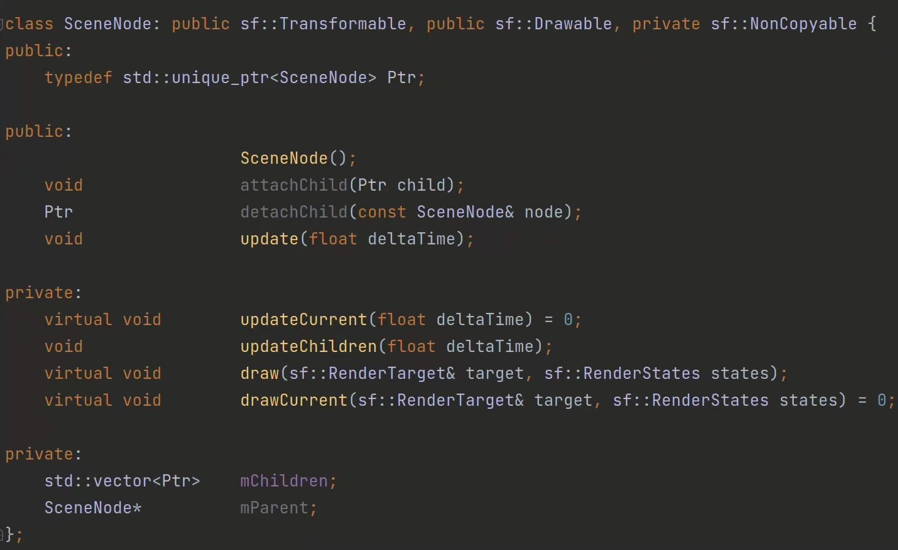
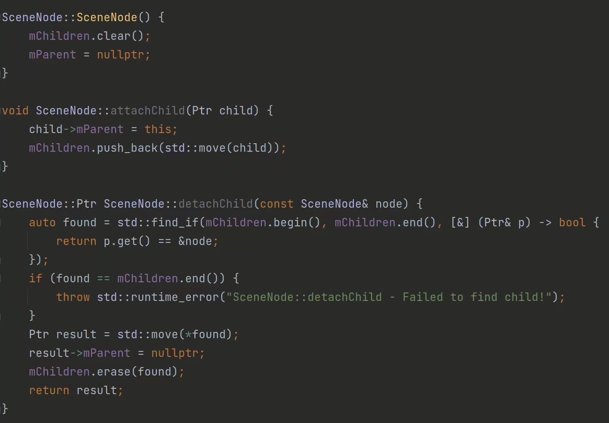
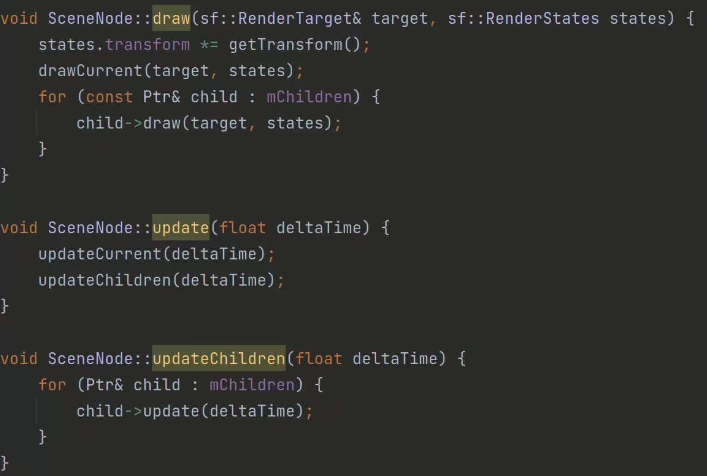
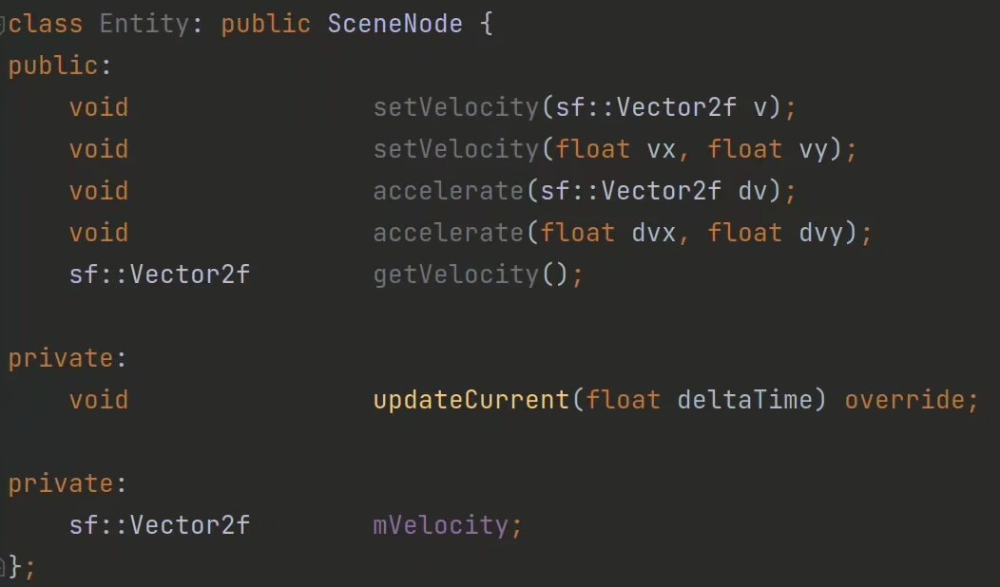

在游戏中我们时常能见到某个实体围绕另一个实体做运动，它实际上是以这个被围绕的实体为参照的相对位置，如果直接使用绝对位置来计算固然可以，但是十分麻烦。比如某游戏中主角有一个闪电球始终环绕着旋转，这时我们既要考虑主角的运动情况，还要考虑到球绕着主角的旋转情况，计算起来非常地繁琐。

又没有更好的方法可以解决这个问题呢？

我们可以用“树”的结构来解决这个问题，依照上文的例子，我们把闪电球作为子节点连接到主角上，这时，我们便只需要考虑球的旋转就行，其他的位置已经由主角决定好，就相当于，坐标的变换从父节点到子节点一路叠Buff，用这种结构，我们甚至能为这个闪电球再添加围绕它的别的什么球。

每个节点的性质需要能被绘制、能做坐标系上的变换，不能被随便拷贝（防止内存泄漏），所以最后得出的结构是这样的：

实现：

顺便，我们借着SceneNode顺便实现一下实体类（Entity），它只需要负责所有实体都会做的事情：运动。

具体实现非常弱智，就不放了。
