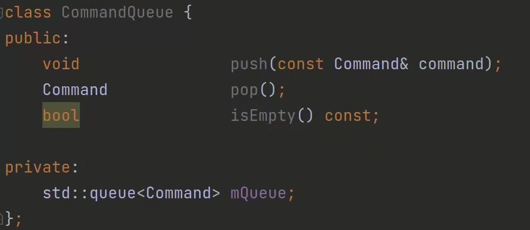
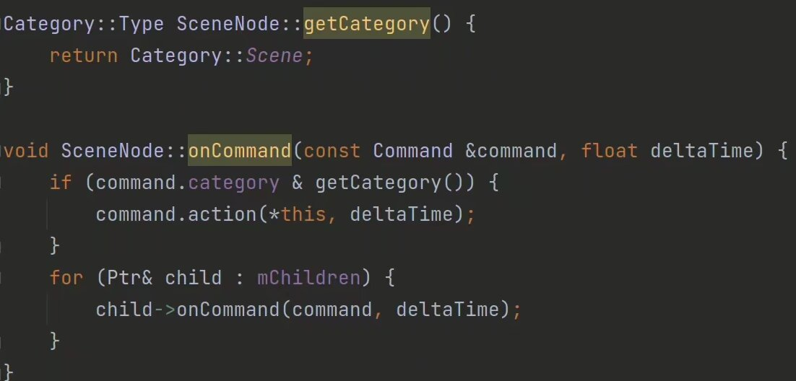

在游戏每帧的更新过程中对所有不同类型的实体，还有背景、GUI等进行更新是在是太麻烦了，而且，除了之前写好的SceneNode之外，你还需要东西来分类存储他们。
那太麻烦了，不好用，又没有更简单的？

我们引入指令系统，将指令传入整棵树，让它自行选取符合条件的实体进行更新。每帧我们根据用户的输入情况以及游戏的整体情况决定需要进行哪些更新，然后往里面扔就完事了！

这几样东西一摆，不说也应该知道干啥了吧？
