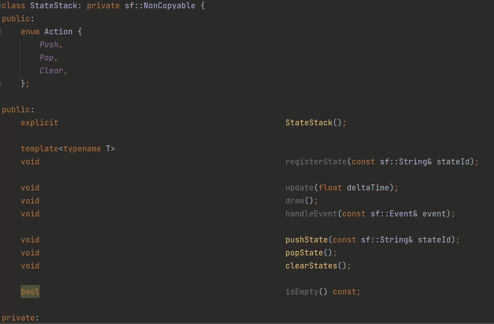
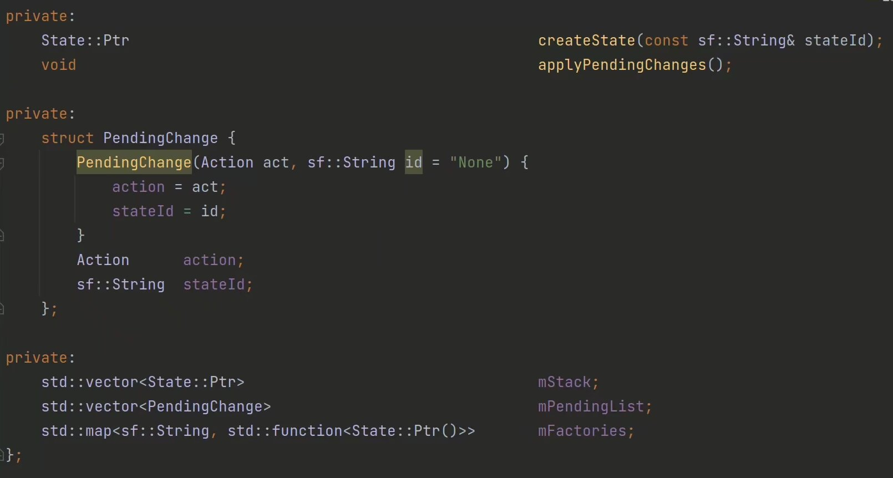
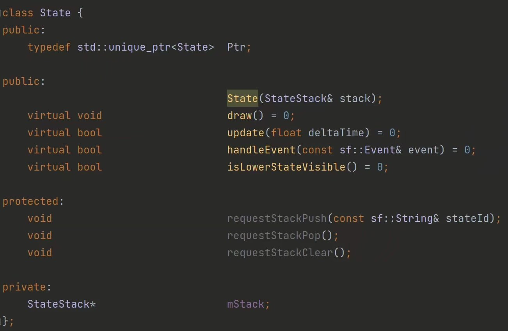
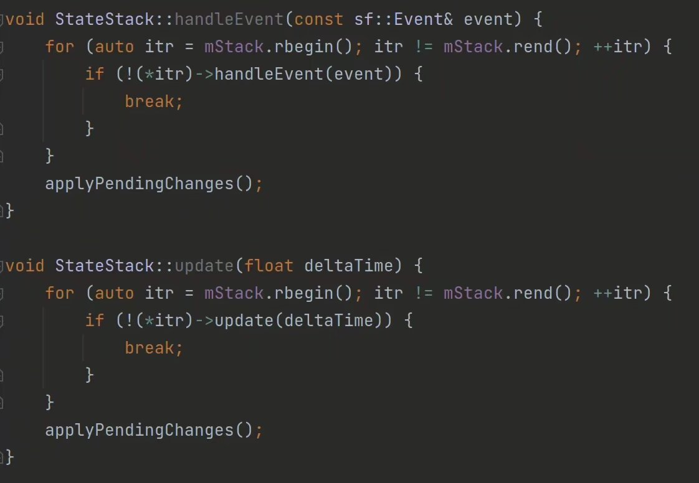
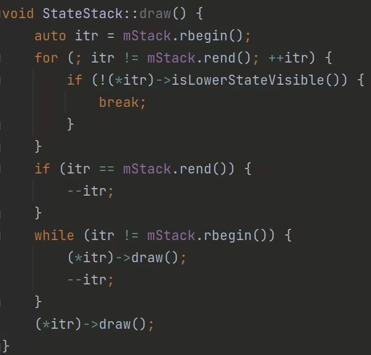

我们都知道，我们游戏的场景之间的切换，都是依靠一个栈来实现。一个很简单的例子，当你启动游戏的时候，将标题画面的内容压入一个栈，当你选择开始游玩，将游戏的内容继续压入，当你结束游戏，游戏内容从栈中弹出，这时你又会重新看到原来的那个标题画面，我们想要达成这个简单的压入弹出。

那想法就很简单了，写一个栈！然后把各种界面都整成同一种通用类型的子类往里面压入不就完事了？行，开写。

`StateStack` 类：

还有 `State` 类：

照着写就完事了。

不过有需要注意的一点：

当游戏画面渲染的时候，我们有时想要让下层的界面也要显示出来，比如游戏暂停的时候，我们只是想不允许下一层内容更新，但是在画面上我们仍想要看到下一层内容，因为我们想要的暂停效果只不过是给画面蒙上一层灰色透明的长方形，然后在正当中贴上一个 `PAUSE` 而已。

这时候 `State` 里面 `update` 和 `handleEvent` 以及 `isLowerStateVisible` 返回的 `bool` 内容就能派上用场了：

`draw` 确实比较麻烦，因为它需要从下往上画，我们得先清楚我们要从哪里开始画：

