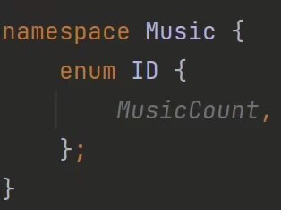
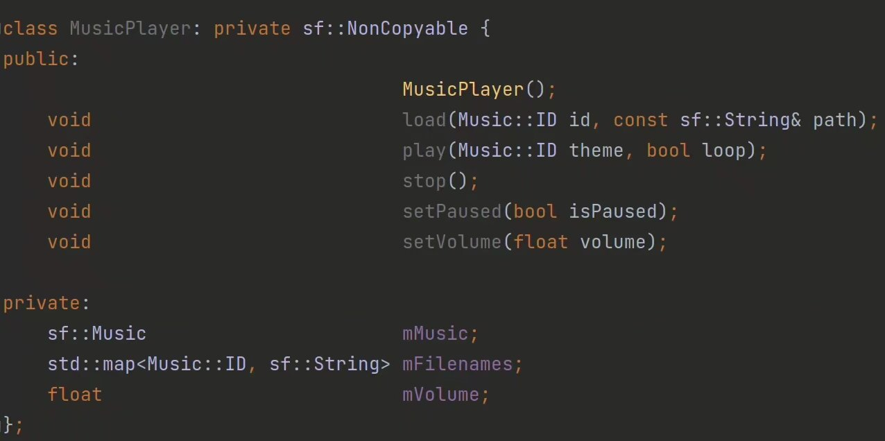
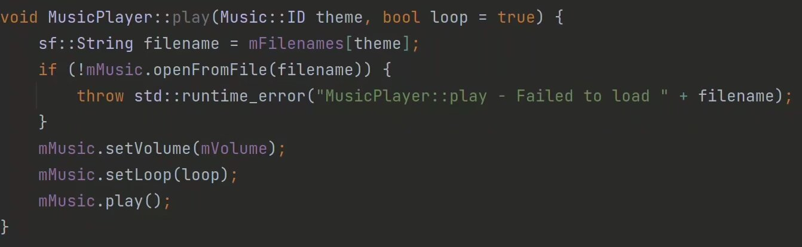
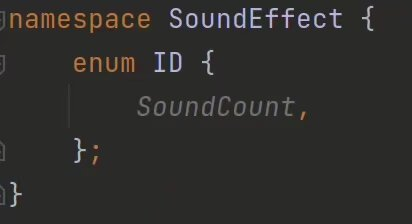
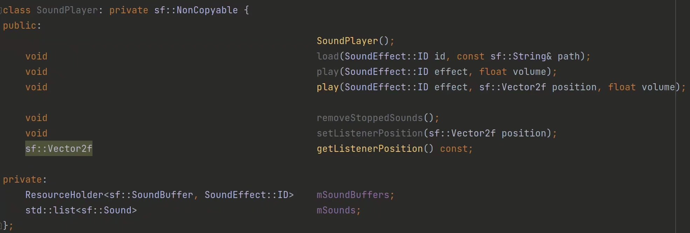
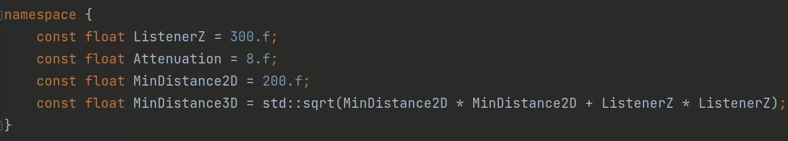
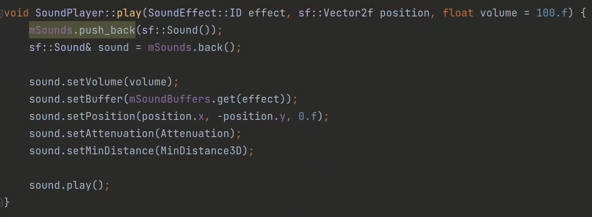
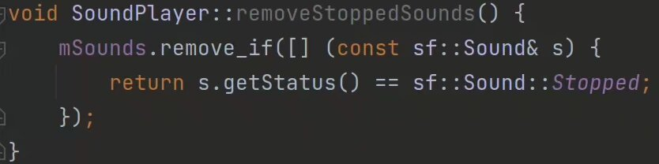

为了让我们能够很轻松地用简单的几句话控制音乐的播放、音量还有暂停，以及游戏音效的随意施放，我们有必要写两个类来分别处理音乐和音效：

先给自己准备好的每一个音乐都准备好独特的id，在这里我们实际上还没有准备任何的音乐，所以我们这里只放上一个MusicCount用来占位。

然后就是MusicPlayer类：

在这里需要注意的是，音乐和其它文件是不一样的，音乐文件一般比较大，因为音乐很长，所以SFML的打开方式并不是像其他类型的文件一样，而是根据音乐播放的进度选取文件当中的某一段读入，在之后销毁掉换成另一段，也就是说这个音乐播放时需要保证文件一直能够访问到。

此外是SoundPlayer：

同理先记id

在这里特别需要注意的是，游戏音效往往是有位置的，不仅仅是 3D 游戏会有声音随着位置改变，2D 游戏也是一样。一种理解是根据主角位置的不同将其他物体发出的声音按照方向环绕在玩家耳边，另一种理解是玩家坐在电脑面前，相当于在一张二维平面图上方一定距离处，在这个平面上不同位置发出的声音，玩家听到的感觉肯定也不一样。

所以在写 `SoundPlayer` 的时候要特别注意这点。

*SFML Game Development* 这本书为我们提供了非常合适的常量，我们直接用上：

然后在播放的时候指定播放的位置。

别忘了每次更新的时候要把已经播放完的音效清除。
这样就完成了对音乐和音效的播放的类的编写。
