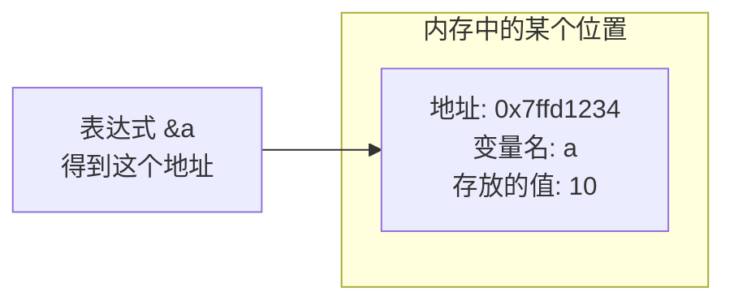

## 学习目标

学完本篇，你会理解：

- 变量不只是名字，它在内存里有一个真实的“门牌号”。
- `&` 运算符可以取出这个门牌号。
- 指针变量就是专门用来保存门牌号的变量。
- 为什么 C 语言非要设计指针这种东西。

## 变量在内存中住在哪里

之前我们写代码时，总是说“定义一个变量 `int a = 10;`，然后 `printf("%d", a);` 把它的值打印出来”。这让你觉得变量好像就是 `a` 这个名字本身，值为 10。

但真实的计算机里，程序运行时要占用内存。内存可以想象成一排小房间，每个房间都有一个编号。这个编号就叫**地址**。变量 `a` 的 10 其实就存在某一个房间里，而 `a` 只是程序员给这个房间起的外号。

```c
#include <stdio.h>

int main(void) {
    int a = 10;
    printf("a 的值是：%d\n", a);
    printf("a 的地址是：%p\n", (void *)&a);
    return 0;
}
```

运行后你可能会看到类似这样的输出：

```text
a 的值是：10
a 的地址是：0000005A8F4FFB14
```

:::tip 关于 %p
`%p` 用来打印地址，要求传入 `void *` 类型，所以我们用 `(void *)&a` 做类型转换。初学阶段先记住这个写法，后面会理解为什么。
:::

每个人的电脑、每次运行，这个地址通常都不一样，这很正常。重要的是：**地址是变量在内存中的位置，值是存在那个位置里的数据。这是两个完全不同的东西。**




## & 取地址运算符

`&` 放在变量前面，表示“取这个变量的地址”。它不是数学里的“与”，也不是按位与，在指针语境下它就是一个单目运算符。

```c
int a = 10;
int b = 20;

printf("a 的地址：%p\n", (void *)&a);
printf("b 的地址：%p\n", (void *)&b);
```

注意，你只能对变量取地址，不能对常量或表达式取地址。比如 `&(a + 1)` 或 `&10` 是非法的。

## 为什么需要指针

现在你可能想问：我直接写 `a` 就能拿到 10，为什么要去关心那个地址？

理由有很多，我们只看最现实的几个：

1. **函数想修改外面的变量**。之前学函数时，参数是“值传递”，函数内部改的是副本，调用者那边的原变量不受影响。如果我们能把地址传进去，函数就能顺着地址找到真正的变量并修改它。
2. **处理大量数据**。数组在函数间传递时，直接复制整个数组很慢，传地址就很轻量。
3. **动态内存**。程序运行时才知道要存多少数据，这时需要用指针向系统申请一块内存。
4. **复杂数据结构**。链表、树、图都离不开指针。

一句话：**指针让函数之间可以共享同一块内存，让程序可以灵活地管理内存。**

## 指针变量保存的是地址

指针变量和普通变量没什么神秘的，只是它保存的内容类型不同：

- `int a` 保存一个整数。
- `int *p` 保存一个“整型变量的地址”。

类型名旁边的 `*` 表示“这是一个指针”。

```c
#include <stdio.h>

int main(void) {
    int a = 10;
    int *p = &a;  // p 保存了 a 的地址

    printf("a 的值：%d\n", a);
    printf("a 的地址：%p\n", (void *)&a);
    printf("p 保存的地址：%p\n", (void *)p);

    return 0;
}
```

这里 `p` 和 `&a` 打印出来的值应该是一样的。也就是说，`p` 这个变量里存的不是 10，而是 `a` 住在哪间房。

:::tip 指针变量自己也有地址
`p` 作为一个变量，也要占内存，所以 `&p` 是 `p` 自己的地址，而 `p` 是 `a` 的地址。这是两个不同的地址，别搞混。
:::

## 先记住这些

本篇不讲解解引用 `*` 的复杂操作，只希望你能建立下面的直觉：

- 每个变量都有地址，用 `&` 取。
- 指针变量存的是地址，类型写成 `int *`、`char *` 等。
- 指针存在的意义，是为了让程序能跨函数、动态地访问和修改内存。

下一篇我们会讲如何通过指针去访问和修改它指向的内容，也就是“解引用”。

## 常见错误

1. **以为 `int *p = a;` 是对的**。指针变量保存地址，所以必须赋地址给它。`int *p = &a;` 才对。
2. **忽略 `%p` 的类型转换**。某些编译器会警告 `printf("%p", &a);`，写成 `(void *)&a` 更安全。
3. **混淆“指针的值”和“指针指向的值”**。`p` 本身是一个地址，`*p` 才是那个地址里的值。`*` 我们下篇细讲。

## 小结

- 变量在内存中有地址，`&` 用于取地址。
- 指针变量专门存放地址，声明时类型后加 `*`。
- 指针是 C 语言的核心机制，理解地址是理解指针的第一步。

## 下一篇预告

下一篇《指针变量的操作与解引用》会讲如何用 `*` 读写指针指向的内容，以及空指针、野指针、指针算术等基础操作。
