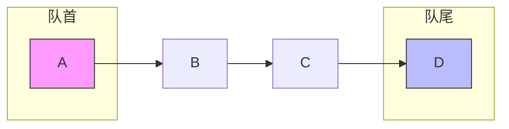

## 什么是队列？

排队买票、打印机处理任务、CPU 调度进程……这些场景的共同点是：先来的请求先被服务。这种“先进先出”（First In First Out，简称 FIFO）的规则就是队列的核心思想。

队列只允许在一端插入元素，在另一端删除元素。插入的一端叫**队尾（rear）**，删除的一端叫**队头（front）**。




## 学习目标

读完本文后，你将能够：

- 理解队列的 FIFO 特性；
- 掌握顺序队列、循环队列和链式队列的实现；
- 理解循环队列如何解决“假溢出”。

## 生活中的队列

- **排队买票**：先到窗口的人先买票，后到的人排在队尾。
- **打印机任务队列**：多份文档依次进入打印队列，按顺序打印。
- **BFS 广度优先搜索**：搜索时把相邻节点依次加入队列，保证按层次遍历。

## 顺序队列：用数组实现

最简单的想法是用数组存元素，再用两个下标 `front` 和 `rear` 标记队头和队尾。

```c
typedef struct {
    int* data;
    int capacity;
    int front;  // 队头下标
    int rear;   // 队尾下一个位置的下标
} SeqQueue;
```

初始时 `front == rear == 0`。入队时把数据放到 `rear` 位置，然后 `rear++`；出队时取 `front` 位置的数据，然后 `front++`。

```c
void enqueue_simple(SeqQueue* q, int value) {
    if (q->rear == q->capacity) {
        printf("队列已满\n");
        return;
    }
    q->data[q->rear++] = value;
}

int dequeue_simple(SeqQueue* q, int* out) {
    if (q->front == q->rear) {
        printf("队列为空\n");
        return 0;
    }
    *out = q->data[q->front++];
    return 1;
}
```

## 假溢出：顺序队列的痛点

上面的实现有个问题：经过若干次入队和出队后，`rear` 可能到达数组末尾，但数组前面其实还有空位。此时队列并没有真正满，却无法再入队。这就叫**假溢出**。

解决这个问题的方法是采用**循环队列**：把数组想象成首尾相接的环，下标绕到数组开头继续用。

## 循环队列

循环队列通过取模运算让下标循环：

```c
void enqueue(SeqQueue* q, int value) {
    if ((q->rear + 1) % q->capacity == q->front) {
        printf("队列已满\n");
        return;
    }
    q->data[q->rear] = value;
    q->rear = (q->rear + 1) % q->capacity;
}

int dequeue(SeqQueue* q, int* out) {
    if (q->front == q->rear) {
        printf("队列为空\n");
        return 0;
    }
    *out = q->data[q->front];
    q->front = (q->front + 1) % q->capacity;
    return 1;
}
```

判空：`front == rear`。

判满：我们故意浪费一个数组单元，用 `(rear + 1) % capacity == front` 表示队列已满。这样可以区分“空”和“满”两种状态，否则两者都会是 `front == rear`。

:::tip 为什么要浪费一个位置？
如果不浪费位置，空队列和满队列都是 `front == rear`，没法区分。解决方法除了“牺牲一个单元”，还可以额外维护一个 `size` 变量记录元素个数。两种方案都常见，选一种用熟即可。
:::

## 链式队列

链式队列用两个指针分别指向链表头部和尾部。出队在头部进行，入队在尾部进行。

```c
typedef struct QNode {
    int data;
    struct QNode* next;
} QNode;

typedef struct {
    QNode* front;
    QNode* rear;
} LinkedQueue;
```

```c
LinkedQueue* create_linked_queue() {
    LinkedQueue* q = (LinkedQueue*)malloc(sizeof(LinkedQueue));
    q->front = q->rear = NULL;
    return q;
}

void enqueue_linked(LinkedQueue* q, int value) {
    QNode* node = (QNode*)malloc(sizeof(QNode));
    node->data = value;
    node->next = NULL;
    if (q->rear == NULL) {
        q->front = q->rear = node;
    } else {
        q->rear->next = node;
        q->rear = node;
    }
}

int dequeue_linked(LinkedQueue* q, int* out) {
    if (q->front == NULL) {
        printf("队列为空\n");
        return 0;
    }
    QNode* temp = q->front;
    *out = temp->data;
    q->front = q->front->next;
    if (q->front == NULL) {
        q->rear = NULL;
    }
    free(temp);
    return 1;
}
```

:::tip 删除最后一个元素时要更新 rear
链式队列出队后，如果 `front` 变成了 `NULL`，说明队列空了，一定要把 `rear` 也置为 `NULL`。否则 `rear` 会指向已经被释放的内存。
:::

## 完整可运行代码（循环队列版）

```c
#include <stdio.h>
#include <stdlib.h>

typedef struct {
    int* data;
    int capacity;
    int front;
    int rear;
} SeqQueue;

SeqQueue* create_queue(int capacity) {
    SeqQueue* q = (SeqQueue*)malloc(sizeof(SeqQueue));
    q->data = (int*)malloc(sizeof(int) * capacity);
    q->capacity = capacity;
    q->front = q->rear = 0;
    return q;
}

int is_empty(SeqQueue* q) {
    return q->front == q->rear;
}

int is_full(SeqQueue* q) {
    return (q->rear + 1) % q->capacity == q->front;
}

void enqueue(SeqQueue* q, int value) {
    if (is_full(q)) {
        printf("队列已满\n");
        return;
    }
    q->data[q->rear] = value;
    q->rear = (q->rear + 1) % q->capacity;
}

int dequeue(SeqQueue* q, int* out) {
    if (is_empty(q)) {
        printf("队列为空\n");
        return 0;
    }
    *out = q->data[q->front];
    q->front = (q->front + 1) % q->capacity;
    return 1;
}

void free_queue(SeqQueue* q) {
    free(q->data);
    free(q);
}

int main() {
    SeqQueue* q = create_queue(5);  // 实际最多存 4 个元素

    enqueue(q, 10);
    enqueue(q, 20);
    enqueue(q, 30);

    int val;
    dequeue(q, &val);
    printf("出队：%d\n", val);  // 10

    enqueue(q, 40);
    enqueue(q, 50);

    printf("剩余元素：");
    while (dequeue(q, &val)) {
        printf("%d ", val);  // 20 30 40 50
    }
    printf("\n");

    free_queue(q);
    return 0;
}
```

## 完整可运行代码（链式队列版）

```c
#include <stdio.h>
#include <stdlib.h>

typedef struct QNode {
    int data;
    struct QNode* next;
} QNode;

typedef struct {
    QNode* front;
    QNode* rear;
} LinkedQueue;

LinkedQueue* create_linked_queue() {
    LinkedQueue* q = (LinkedQueue*)malloc(sizeof(LinkedQueue));
    q->front = q->rear = NULL;
    return q;
}

void enqueue_linked(LinkedQueue* q, int value) {
    QNode* node = (QNode*)malloc(sizeof(QNode));
    node->data = value;
    node->next = NULL;
    if (q->rear == NULL) {
        q->front = q->rear = node;
    } else {
        q->rear->next = node;
        q->rear = node;
    }
}

int dequeue_linked(LinkedQueue* q, int* out) {
    if (q->front == NULL) {
        printf("队列为空\n");
        return 0;
    }
    QNode* temp = q->front;
    *out = temp->data;
    q->front = q->front->next;
    if (q->front == NULL) {
        q->rear = NULL;
    }
    free(temp);
    return 1;
}

void free_linked_queue(LinkedQueue* q) {
    int dummy;
    while (dequeue_linked(q, &dummy));
    free(q);
}

int main() {
    LinkedQueue* q = create_linked_queue();

    enqueue_linked(q, 1);
    enqueue_linked(q, 2);
    enqueue_linked(q, 3);

    int val;
    printf("出队顺序：");
    while (dequeue_linked(q, &val)) {
        printf("%d ", val);  // 1 2 3
    }
    printf("\n");

    free_linked_queue(q);
    return 0;
}
```

## 常见错误与注意事项

1. **front 和 rear 更新时忘记取模**：这是循环队列最容易犯的错，少写一个 `% capacity` 就会导致数组越界。
2. **判空和判满条件写反**：空是 `front == rear`，满是 `(rear + 1) % capacity == front`，不要混淆。
3. **出队时没有判空**：空队列出队会造成非法访问。
4. **链式队列删除最后一个元素后没有更新 rear**：队列空时 `rear` 必须同步置空。
5. **循环队列的 capacity 和实际容量不同**：如果采用“牺牲一个单元”的方案，最多只能存 `capacity - 1` 个元素。

## 小结与预告

队列是“先进先出”的线性结构。顺序队列简单直观，但容易出现假溢出；循环队列通过取模巧妙地解决了这个问题；链式队列则不受固定容量限制，更加灵活。

队列在 BFS、缓冲、任务调度等领域大放异彩。下一篇，我们将接触一种更高效的字符串结构——字典树 Trie。
