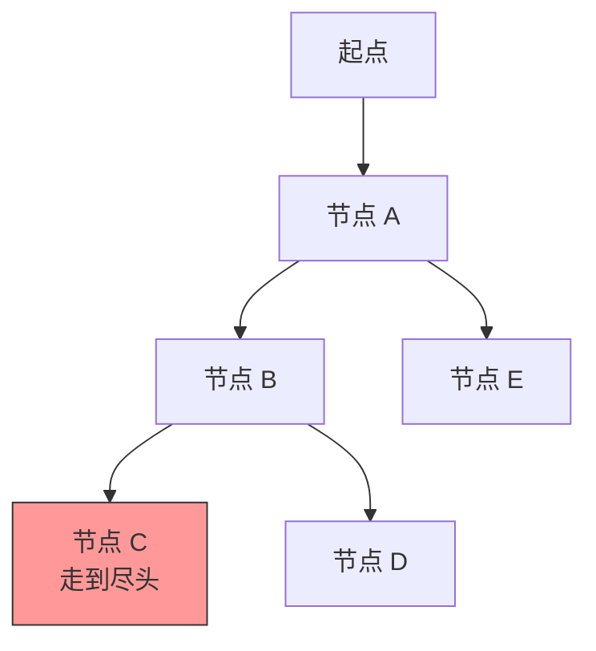

## 引入：从递归到搜索

上一篇我们学习了递归：函数自己调用自己，把大问题拆成小问题。递归非常适合解决一类叫做“搜索”的问题。

想象你在一个迷宫里找出口。你的策略可能是：随便选一条路往前走，能走就一直走；遇到死胡同就退回到上一个岔路口，换另一条路。这种“一条路走到黑，走不通再回头”的策略，就是**深度优先搜索**，简称 DFS（Depth-First Search）。




DFS 是算法学习中的里程碑。掌握了它，你就可以解决走迷宫、全排列、子集、连通块等一大批经典问题。

## 学习目标

- 理解 DFS “一条路走到黑，走不通再回头”的思想。
- 掌握递归实现 DFS 的模板。
- 理解访问标记的作用。
- 能通过几个经典例子加深理解。
- 会分析 DFS 的时间复杂度和空间复杂度。

## DFS 的基本思想

DFS 从一个起点出发，尽可能往深处探索；当当前路径无法继续时，就回退到上一步，尝试其他分支。这个“回退”的过程也叫**回溯**。

你可以把它想象成在树或图上的探险：

- 每到一个新节点，先标记为“已访问”。
- 看看它有哪些邻居还没去过，挑一个继续深人。
- 如果所有邻居都去过了，或者这条路到尽头了，就返回上一层。

## 递归实现 DFS

DFS 最常见的实现方式就是递归。伪代码模板如下：

```c
void dfs(当前状态)
{
    if (到达终止条件) {
        记录结果或返回;
        return;
    }

    标记当前状态为已访问;

    for (遍历所有可能的下一步) {
        if (下一步合法且未访问) {
            dfs(下一步);
        }
    }

    // 可选：撤销标记，允许其他路径再次访问
}
```

这个模板非常通用。具体问题的区别主要在于“状态是什么”和“下一步有哪些选择”。

## 访问标记：不要绕圈子

在图或迷宫中搜索时，如果没有访问标记，很可能在两个节点之间来回走，陷入死循环。

访问标记通常用一个数组 `visited[]` 来记录。进入节点时标记为 1，离开时根据问题需要决定是否恢复为 0。

- **走迷宫、连通块**：标记后一般不恢复，因为每个格子只需访问一次。
- **全排列、子集**：通常需要恢复标记，因为同一个元素在不同路径中可能需要重新选择。

## 经典例子一：走迷宫

假设有一个 `n × m` 的迷宫，`0` 表示可走，`1` 表示墙。从左上角出发，能否到达右下角？

```c
#include <stdio.h>

int n = 5, m = 5;
int maze[5][5] = {
    {0, 0, 1, 0, 0},
    {0, 0, 0, 1, 0},
    {1, 0, 1, 0, 0},
    {0, 0, 0, 0, 1},
    {0, 1, 1, 0, 0}
};
int visited[5][5] = {0};

// 四个方向：上、下、左、右
int dx[] = {-1, 1, 0, 0};
int dy[] = {0, 0, -1, 1};

int dfs_maze(int x, int y)
{
    if (x < 0 || x >= n || y < 0 || y >= m) return 0;  // 越界
    if (maze[x][y] == 1 || visited[x][y]) return 0;    // 墙或已访问
    if (x == n - 1 && y == m - 1) return 1;            // 到达终点

    visited[x][y] = 1;  // 标记已访问

    int i;
    for (i = 0; i < 4; i++) {
        int nx = x + dx[i];
        int ny = y + dy[i];
        if (dfs_maze(nx, ny)) {
            return 1;  // 找到一条通路即可返回
        }
    }

    return 0;
}

int main(void)
{
    if (dfs_maze(0, 0)) {
        printf("可以到达出口\n");
    } else {
        printf("无法到达出口\n");
    }
    return 0;
}
```

输出：

```text
可以到达出口
```

:::tip 方向数组
用 `dx` 和 `dy` 两个数组来表示四个方向，可以让代码更简洁，不用写四个几乎一样的判断。
:::

## 经典例子二：全排列

给定数字 1 到 n，输出它们的所有排列。

这里的状态是“当前已经选了哪些数”。每次从还没选的数里挑一个放进去，放满 n 个就输出一种排列。

```c
#include <stdio.h>

int n = 3;
int path[10];       // 当前排列
int used[10] = {0}; // used[i] 表示数字 i 是否已经使用

void dfs_permutation(int depth)
{
    if (depth == n) {
        int i;
        for (i = 0; i < n; i++) {
            printf("%d ", path[i]);
        }
        printf("\n");
        return;
    }

    int i;
    for (i = 1; i <= n; i++) {
        if (!used[i]) {
            used[i] = 1;          // 标记使用
            path[depth] = i;      // 放入当前位置
            dfs_permutation(depth + 1);
            used[i] = 0;          // 撤销标记，回溯
        }
    }
}

int main(void)
{
    dfs_permutation(0);
    return 0;
}
```

输出：

```text
1 2 3 
1 3 2 
2 1 3 
2 3 1 
3 1 2 
3 2 1 
```

这里的关键是 `used[i] = 0` 这一步。每次递归返回后，要把当前选择撤销，让其他分支也能使用这个数字。

## 经典例子三：子集

给定一个集合，输出它的所有子集。

对于每个元素，我们都有两种选择：选它，或者不选它。用 DFS 可以很方便地枚举所有选择组合。

```c
#include <stdio.h>

int n = 3;
int nums[] = {1, 2, 3};
int chosen[10];

void dfs_subset(int index, int count)
{
    if (index == n) {
        printf("{");
        int i;
        for (i = 0; i < count; i++) {
            printf("%d ", chosen[i]);
        }
        printf("}\n");
        return;
    }

    // 不选 nums[index]
    dfs_subset(index + 1, count);

    // 选 nums[index]
    chosen[count] = nums[index];
    dfs_subset(index + 1, count + 1);
}

int main(void)
{
    dfs_subset(0, 0);
    return 0;
}
```

输出：

```text
{}
{3 }
{2 }
{2 3 }
{1 }
{1 3 }
{1 2 }
{1 2 3 }
```

## 时间复杂度与空间复杂度分析

### 时间复杂度

DFS 的时间复杂度取决于**搜索树的大小**。如果每个状态有 `b` 种选择，最多递归 `d` 层，那么最坏时间复杂度大约是 O(bᵈ)。

- 走迷宫：每个格子最多访问一次，复杂度是 O(n × m)。
- 全排列：n 个数的全排列有 n! 种，复杂度是 O(n × n!)，因为生成每种排列需要 O(n) 时间。
- 子集：n 个元素的子集有 2ⁿ 个，复杂度是 O(n × 2ⁿ)。

:::tip 为什么必须估算复杂度
DFS 很容易写出简洁的代码，但也很容易因为搜索空间太大而超时。写之前先估算一下最坏情况有多少个状态，能帮你判断这个算法是否可行，是否需要剪枝优化。
:::

### 空间复杂度

DFS 的空间主要由两部分组成：

1. **递归栈空间**：最深递归深度决定了栈空间大小。比如迷宫是 O(n × m)，全排列是 O(n)。
2. **辅助数组**：如 `visited`、`used`、`path` 等，通常也是 O(n) 或 O(n × m)。

总体来说，DFS 的空间复杂度是 O(状态规模) 或 O(递归深度)，具体看问题。

## 常见错误与注意事项

1. **忘记标记访问状态**：在图或迷宫中容易导致死循环。
2. **该回溯的时候没回溯**：比如全排列里没写 `used[i] = 0`，会导致数字被永久占用，后续排列出错。
3. **该不恢复的时候恢复了**：走迷宫如果把 `visited` 恢复，同一条路会被反复走，效率极低甚至死循环。
4. **边界条件写错**：比如数组越界、终止条件判断位置不对。

## 小结与预告

这一篇我们学习了深度优先搜索：

- DFS 的核心思想是“一条路走到黑，走不通再回头”。
- 递归是实现 DFS 最自然的方式。
- 访问标记可以避免重复访问和死循环。
- 全排列、子集、走迷宫都可以用 DFS 解决。
- 使用 DFS 前一定要估算时间和空间复杂度，避免超时或爆栈。

DFS 适合“先探到底”的场景。与之相对的是**广度优先搜索（BFS）**，它适合“逐层扩展”的场景，比如求最短路径。下一篇我们就来学习 BFS。
