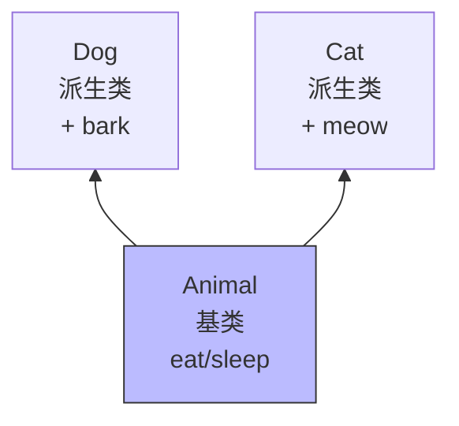

## 学习目标

- 理解继承的作用：代码复用与表达「is-a」关系
- 掌握基类与派生类的定义方式
- 理解三种继承方式对访问权限的影响
- 掌握派生类对象构造和析构的调用顺序

---

## 继承的意义

假设你在写一个学校的管理系统。先有一个 `Person` 类：

```cpp
class Person {
public:
    void setName(const char* n) { /* ... */ }
    void setAge(int a) { age = a; }
protected:
    char name[20];
    int age;
};
```

现在你要写 `Student` 和 `Teacher`，它们都有姓名、年龄，但又各有自己的额外信息：学生有学号，老师有工号。如果不使用继承，你得把姓名、年龄在每个类里重新写一遍，既麻烦又容易不一致。

继承让你可以基于已有的类创建新类，复用已有代码，并添加或修改行为。




---

## 基类与派生类

被继承的类叫**基类**（父类），继承得到的类叫**派生类**（子类）。语法是：

```cpp
class 派生类名 : 继承方式 基类名 {
    // ...
};
```

看一个例子：

```cpp
#include <iostream>
#include <cstring>

class Animal {
public:
    Animal(const char* n) {
        std::strncpy(name, n, sizeof(name) - 1);
        name[sizeof(name) - 1] = '\0';
    }

    void showName() const {
        std::cout << "名字：" << name << std::endl;
    }

protected:
    char name[20];
};

class Dog : public Animal {
public:
    Dog(const char* n, const char* b) : Animal(n) {
        std::strncpy(breed, b, sizeof(breed) - 1);
        breed[sizeof(breed) - 1] = '\0';
    }

    void bark() const {
        std::cout << name << "：汪汪！" << std::endl;
    }

private:
    char breed[20];
};

int main() {
    Dog dog("旺财", "柴犬");
    dog.showName();   // 继承自 Animal
    dog.bark();       // Dog 自己的方法
    return 0;
}
```

这里 `Dog` 自动拥有了 `Animal` 的 `name` 和 `showName()`，只需要写自己特有的东西。

---

## 三种继承方式

继承方式有三种：`public`、`protected`、`private`。它们影响基类成员在派生类中的访问权限。

| 基类成员权限 | public 继承 | protected 继承 | private 继承 |
|--------------|-------------|----------------|--------------|
| public       | public      | protected      | private      |
| protected    | protected   | protected      | private      |
| private      | 不可访问    | 不可访问       | 不可访问     |

最常用的就是 `public` 继承，它保持基类的 `public` 和 `protected` 成员在派生类中的访问级别不变。

```cpp
class Base {
public:
    int a;
protected:
    int b;
private:
    int c;
};

class Derived : public Base {
public:
    void func() {
        a = 1;   // OK，public 继承后仍是 public
        b = 2;   // OK，protected 继承后仍是 protected
        // c = 3; // 错误！private 成员不可访问
    }
};

int main() {
    Derived d;
    d.a = 10;   // OK
    // d.b = 20; // 错误！b 在 Derived 中是 protected
}
```

:::tip 默认继承方式
如果你写 `class Dog : Animal`，没有写 `public`，默认就是 `private` 继承。为了避免权限混乱，我强烈建议你总是显式写出继承方式。
:::

---

## 派生类对象的构造与析构顺序

创建派生类对象时，构造顺序是：

1. 基类构造函数
2. 成员对象构造函数
3. 派生类构造函数

销毁时顺序正好相反：

1. 派生类析构函数
2. 成员对象析构函数
3. 基类析构函数

```cpp
#include <iostream>

class Base {
public:
    Base()  { std::cout << "Base 构造" << std::endl; }
    ~Base() { std::cout << "Base 析构" << std::endl; }
};

class Member {
public:
    Member()  { std::cout << "Member 构造" << std::endl; }
    ~Member() { std::cout << "Member 析构" << std::endl; }
};

class Derived : public Base {
public:
    Derived()  { std::cout << "Derived 构造" << std::endl; }
    ~Derived() { std::cout << "Derived 析构" << std::endl; }
private:
    Member m;
};

int main() {
    Derived d;
    return 0;
}
```

输出：

```
Base 构造
Member 构造
Derived 构造
Derived 析构
Member 析构
Base 析构
```

派生类构造函数的初始化列表里，可以显式调用基类构造函数。如果没有写，编译器会调用基类的默认构造。

---

## is-a 关系

`public` 继承表达的是一种「is-a」关系：

- `Dog` is a `Animal`：狗是动物。
- `Square` is a `Rectangle`：正方形是矩形。

只有当你的派生类确实是基类的一种时，才应该用继承。如果只是为了复用代码，更偏向组合，比如「汽车有一个引擎」：

```cpp
class Engine { /* ... */ };

class Car {
private:
    Engine engine;   // 组合，不是继承
};
```

继承要慎用，滥用继承会让类关系变得复杂。

---

## 常见错误与注意事项

1. **忘记在初始化列表中调用基类构造**

   如果基类只有带参构造函数，派生类必须显式调用：

   ```cpp
   class Dog : public Animal {
   public:
       Dog(const char* n) : Animal(n) {}   // 必须写 Animal(n)
   };
   ```

2. **误以为 private 成员能被继承访问**

   `private` 成员被继承到派生类对象中，但派生类代码不能直接访问。

3. **构造/析构顺序搞反**

   先基类后派生，析构反过来，这会影响资源管理。

---

## 小结

- 继承实现代码复用，表达「is-a」关系。
- 派生类语法：`class Derived : public Base { ... };`
- `public`、`protected`、`private` 继承影响基类成员在派生类中的访问权限。
- 构造顺序：基类 -> 成员 -> 派生类；析构顺序相反。

继承之后，一个很自然的问题出现了：如果派生类想重新实现基类的某个函数，该怎么做？这就涉及到函数重载与覆盖。

**下一篇预告：《函数重载与覆盖》。**
