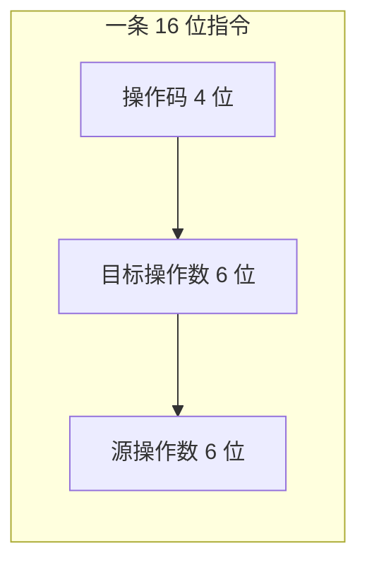
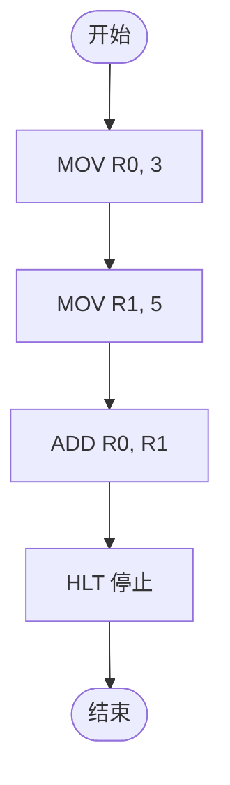
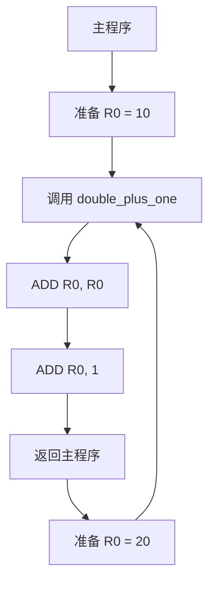
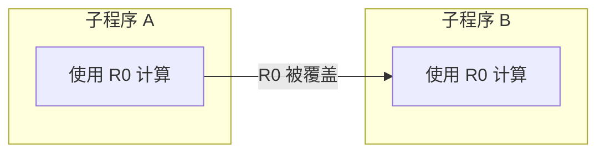
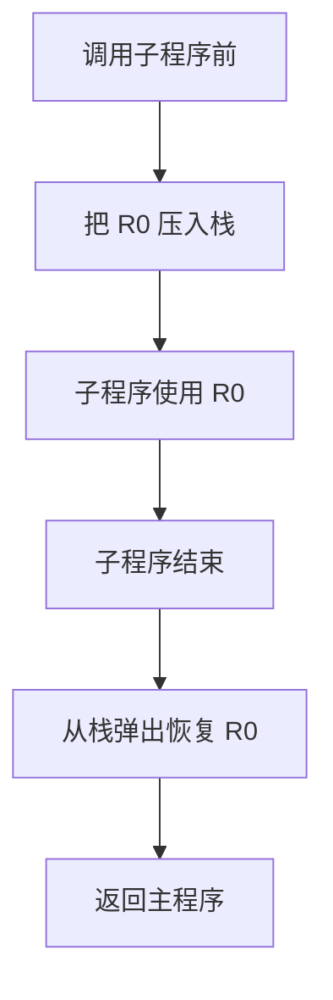
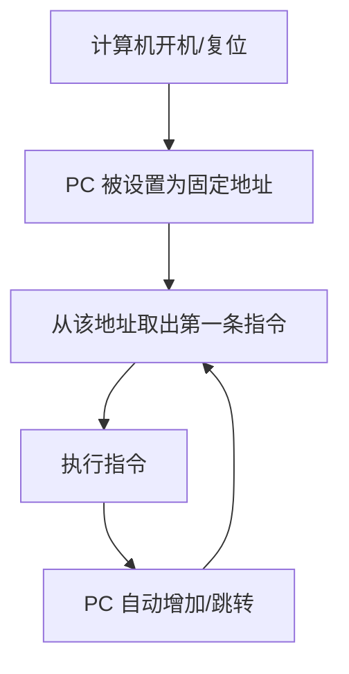

## 汇编语言

很多 `C` 语言教程一上来就教你写 `printf("Hello, world!");`，却很少解释为：什么程序这样写就可以运行？为什么 `printf` 这个函数一开始就存在？`main` 函数又是从哪里冒出来的？

这些问题看似和语法无关，但如果不理解，你写代码时就会一直带着疑惑。而汇编语言，就是连接“高级语言”和“机器硬件”的桥梁。理解了汇编，你就能明白 `C` 语言里的很多设计并不是凭空出现的。

## 只有 0 和 1 吗？

`CPU` 只认识二进制指令。因此很多电视剧上演那些低调的黑客，就用黑底绿字，配上一堆滚动的 `0101` 来表现，但实际上这种认知是错误的，使用绿字不但非常伤眼睛，程序员自己会写代码，也不至于傻到非得要用那个 `0011` 来写代码。

就是因为直接写一长串 `0` 和 `1` 太痛苦了，于是人们发明了**汇编语言**：用助记符代替二进制，例如 `MOV` 表示移动数据，`ADD` 表示相加。

但 `CPU` 最终执行的还是二进制。汇编代码需要通过**汇编器**翻译成机器码。

### 指令的格式

为了理解机器码，我们假想一种非常简单的 `CPU`，它会依次读取指令并执行，它的每条指令都是 `16` 位二进制数，操作码占 4 位。例如对于双操作数指令，分成三部分：



此外，我规定不同操作码的效果：

| 指令码 | 助记符 | 含义 |
| :--: | :-- | :-- |
| `0001` | `MOV` | 把操作数 2 的值赋给操作数 1 |
| `0010` | `ADD` | 把操作数 1 和操作数 2 相加，结果放回操作数 1 |
| `0011` | `SUB` | 把操作数 1 减去操作数 2，结果放回操作数 1 |
| `0100` | `JMP` | 跳转到操作数 1 指定的位置 |
| `0101` | `HLT` | 停止程序 |

例如：

```asm
MOV R0, 5    ; 把 5 放到寄存器 R0
ADD R0, R1   ; R0 = R0 + R1
```

:::tip 寄存器是什么
寄存器是 `CPU` 内部容量极小但速度极快的临时存储单元。你可以把它理解为 `CPU` 手边的草稿纸，用来放正在计算的数据。
:::

## 一段简单的汇编程序

假设我们要计算 `3 + 5`，并把结果存到 `R0`。汇编程序可以写成：

```asm
MOV R0, 3
MOV R1, 5
ADD R0, R1
HLT
```

执行流程如下图所示：



1. `PC` 指向第 1 条指令，执行 `MOV R0, 3`，`R0` 变成 `3`
2. `PC` 指向第 2 条指令，执行 `MOV R1, 5`，`R1` 变成 `5`
3. `PC` 指向第 3 条指令，执行 `ADD R0, R1`，`R0` 变成 `8`
4. `PC` 指向第 4 条指令，执行 `HLT`，程序停止

看起来简单，但稍微复杂一点，问题就来了。

:::tip 冯·诺依曼体系结构
现代计算机几乎都遵循冯·诺依曼体系结构：**程序指令和数据存储在同一个内存中**，CPU 通过程序计数器（PC）依次取出指令并执行。这就意味着，程序本身也是一组数据——你可以写程序、编译它，然后把编译后的机器码存起来，下次直接运行。汇编指令和 C 语言代码最终都会被编译成机器码放在内存里，CPU 逐条执行。
:::

## 为什么需要代码块：重复子任务的麻烦

假设我们要写一个程序，多次完成一个“把某个数乘以 2 再加 1”的小任务。这个任务需要三步：

```asm
MOV R0, x
ADD R0, R0    ; x + x = 2x
ADD R0, 1     ; 2x + 1
```

如果程序里需要对这个任务执行 3 次，最直接的办法是把这三行代码复制三遍：

```asm
; 第一次
MOV R0, 10
ADD R0, R0
ADD R0, 1

; 第二次
MOV R0, 20
ADD R0, R0
ADD R0, 1

; 第三次
MOV R0, 30
ADD R0, R0
ADD R0, 1

HLT
```

但是，这样写会带来很多麻烦

- 代码会很长，白白占用指令空间
- 如果需要计算的内容变了，三处都要改，很容易漏掉
- 如果任务更复杂，复制粘贴几十次也太多了，直接看花眼

于是人们想到了一个办法：**把这段常用指令打包成一个块，取个名字，需要时跳转过去执行，执行完再跳回来**。这就是子程序的雏形。

```asm
    MOV R0, 10
    CALL double_plus_one

    MOV R0, 20
    CALL double_plus_one

    MOV R0, 30
    CALL double_plus_one

    HLT

double_plus_one:
    ADD R0, R0
    ADD R0, 1
    RET
```



`CALL` 和 `RET` 指令会自动记住“我从哪里跳过来的”，而 `double_plus_one:` 标记了跳转的目标位置，执行完子程序后能准确返回原处。这个思想，就是后来 `C` 语言里**函数**的源头。

## 寄存器冲突

现在考虑一个更现实的问题。假设有两个子程序：

- `double_plus_one`：用 `R0` 做临时计算
- `triple_minus_two`：也用 `R0` 做临时计算

如果主程序先调用 `double_plus_one`，再调用 `triple_minus_two`，第二个子程序会把 `R0` 里的值覆盖掉。如果第一个子程序的结果还需要用，就会出错。



为什么会这样？因为 `CPU` 的寄存器数量有限，是所有子程序共享的“公共资源”。就像几个人共用同一张草稿纸，一个人还没算完，另一个人就在上面写东西，结果当然会乱。

解决办法是：每个子程序开始执行时，把自己要用的寄存器先保存到内存里的一个特殊区域——**栈（Stack）**；执行完再恢复回来。这样每个子程序都有自己的“草稿纸”，互不干扰。



这种“每个子程序有自己独立的临时空间”的机制，就是后来 `C` 语言里**局部变量**和**函数调用栈**的底层来源。

讲到这里，你应该能感觉到，即便是一个很简单的程序，汇编也已经挺麻烦了：

1. **要时刻关心硬件细节**：哪个寄存器是空的，数据在内存哪里，栈指针指向哪里。
2. **代码很难移植**：给一种 `CPU` 写的汇编，换另一种 `CPU` 往往要重写。
3. **表达能力太弱**：“我有一个整数变量”、“我要调用一个函数”这些自然想法，都要拆成很多条指令。
4. **容易出错**：地址、寄存器、跳转目标，搞错一个就麻烦。

所以人们开始想：能不能发明一种语言，让我们用更接近人类思维的方式写程序，然后让机器自动翻译成汇编或机器码呢？

于是，高级语言诞生了。

## C 语言

`C` 语言诞生于 `1972` 年，它的设计目标之一就是既要保留对硬件的精细控制能力，又要提供高级语言的抽象和便利。很多人把 `C` 称为“可移植的汇编”，这个说法很贴切。

`C` 语言把汇编里的概念包装成了更友好的形式：

| 汇编里的概念 | C 语言里的对应 |
| :-- | :-- |
| 寄存器 / 内存地址 | 变量 |
| 标签和跳转 | 函数和流程控制语句 |
| 栈上的独立空间 | 局部变量和函数调用 |
| 机器指令 | 表达式和语句 |

比如，汇编里写：

```asm
MOV R0, 3
MOV R1, 5
ADD R0, R1
```

在 `C` 语言里就变成了：

```c
int a = 3;
int b = 5;
int c = a + b;
```

汇编里的标签和 `CALL/RET`，在 `C` 里变成了函数：

```c
int double_plus_one(int x) {
    return x * 2 + 1;
}
```

编译器会自动处理参数传递、栈空间分配、跳转和返回。

## C 语言模板

铺垫了这么多，我们终于回到最开始的那段代码：

```c
#include<stdio.h>

int main() {
    return 0;
}
```

现在一行一行解释，你应该会觉得合理多了。

### `#include<stdio.h>`

`#include` 是预处理指令，意思是“把另一个文件的内容复制到这里”。`stdio.h` 是标准头文件，里面声明了 `printf`、`scanf` 等输入输出函数。

在这里，相当于直接拼接了一大段已经写好的代码到你的程序里。就像你写作文时引用了别人的话，编译器会把这些引用的内容放到你的程序里一起编译。

### `int main()`

`main` 是程序的入口函数。操作系统加载你的程序后，会从 `main` 函数开始执行。

想象一下你打开一本书，总得知道第一页是哪一页，才能开始读。程序也一样：计算机运行一个程序时，必须知道**第一条指令在哪里**。

当计算机开机或复位时，`CPU` 内部的程序计数器（Program Counter，简称 `PC`）会被设置成一个固定的地址。这个地址里存放着整个系统的第一条指令。操作系统加载你的程序后，也会把 `main` 函数的地址设置为程序的入口，然后 `CPU` 就从那里开始取指令、执行。



:::tip 程序入口的本质
程序入口就是“约定的起点”。操作系统和编译器约定好：程序从这里开始执行。在 `C` 语言里，这个约定好的起点就是 `main` 函数。
:::

`int` 表示 `main` 执行完后会返回一个整数给操作系统，`0` 通常表示正常结束。

### 大括号 `{}`

大括号标志着一个代码块的范围。在汇编里，我们用标签标记一段指令的开始和结束；在 `C` 里，我们用大括号标记一个函数或代码块的开始和结束。同时，大括号也定义了一个作用域，里面声明的变量只在里面有效。

### `return 0;`

这行表示 `main` 函数结束，并返回 `0`。从汇编角度看，`return` 对应恢复栈空间、把返回值放到约定位置、跳转回调用者。

## 从源代码到可执行文件，中间不只一步

把 C 代码直接说成“编译成机器码”适合一句话介绍，但以后遇到头文件和链接错误时会不够用。更准确的流程是：

```text
源文件 -> 预处理 -> 编译 -> 汇编 -> 目标文件 -> 链接 -> 可执行文件
```

例如 `printf` 的声明来自头文件，而真正实现通常位于 C 运行库中。编译当前文件时，只要知道它的函数类型；链接时，才需要找到对应实现。

你可以观察中间结果：

```bash
gcc -E hello.c -o hello.i   # 只预处理
gcc -S hello.c -o hello.s   # 生成汇编
gcc -c hello.c -o hello.o   # 生成目标文件，不链接
gcc hello.o -o hello        # 链接
```

:::warning 不要把某段汇编当作 C 语义本身
同一段 C 代码在不同 CPU、编译器、优化等级下会生成完全不同的汇编。寄存器分配、参数传递和局部变量是否真的落到内存中，都是实现选择。汇编可以帮助理解执行成本，却不能反过来替代语言规则。
:::

## “零开销抽象”也需要可观察行为

编译器只需保持 C 程序的可观察行为，不必逐句机械翻译。没有被外界观察到的中间变量可能被消除，循环可能被展开，常量表达式可能在编译期算完。因此调试优化后的程序时，源码行和机器指令不一定一一对应。

学习阶段先用 `-O0 -g` 理解流程；分析性能时再比较 `-O2` 的结果，并始终以正确的 C 语义为前提。

## 小结

- 计算机通过程序计数器 `PC` 知道下一条指令在哪里，程序入口就是约定的起点。
- 汇编指令由操作码和操作数组成，直接操作寄存器和内存。
- 重复的子任务会被打包成可复用的代码块，对应后来的函数。
- 寄存器是共享资源，子程序之间会冲突，栈用来保存和恢复寄存器状态。
- `C` 语言把这些底层细节抽象成变量、函数、局部变量等概念。
- `main` 函数就是 `C` 程序的入口，对应着汇编里的第一条指令位置。

## 下一篇预告

理解了程序为什么从 `main` 开始，下一篇我们就正式进入 `C` 语言语法，从最基础的**变量、数据类型和占位符**讲起。
