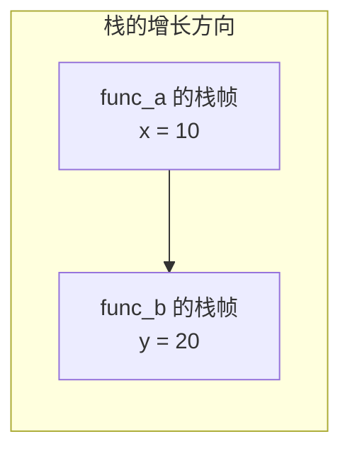

之前，我们把变量比作装数据的盒子。这一篇要把这个比喻补完整：盒子不是凭空出现的，它需要存储空间，也只能在一段有限的时间里被合法使用。

## 三个概念：变量到底怎么活着？

| 概念 | 回答的问题 |
|---|---|
| 作用域（scope） | 在源代码的哪些位置能写出这个名字？ |
| 存储期（storage duration） | 保存这个对象的存储从何时存在到何时？ |
| 生命周期（lifetime） | 这个对象从何时可以被当作该类型使用，到何时结束？ |

下面的 `x` 只在大括号内部有名字：

```c
if (1) {
    int x = 10;
    printf("%d\n", x);
}
// 这里写 x 会编译失败，因为 x 已经不在作用域内
```

对这种普通局部变量而言，离开代码块时，它的生命周期通常也随之结束。<span style="color: #409EFF;">但“看不见名字”和“对象不再存在”不是永远同步的，例如 `static` 局部变量离开作用域后仍然存在，只是只能在原来的函数中通过那个名字访问。</span>

## C 语言真正保证的是存储期

C 标准不要求实现必须存在名为“栈”和“堆”的物理区域。它定义了几类存储期；栈与堆是主流系统实现这些规则时常用的机制。

### 自动存储期

普通局部变量和普通形参通常具有自动存储期：进入代码块或函数时开始存在，离开时结束。

```c
void work(int parameter) {
    int local = 42;
}
```

在常见实现中，`parameter` 和 `local` 可能放在调用栈的栈帧里，也可能暂时只在寄存器中。为了理解生命周期，可以把它们视为“随本次函数调用一起创建和销毁”，但不要把“所有形参一定在栈上”当成语言保证。

### 静态存储期 (static)：详解与对比

文件作用域变量、全局变量以及带 `static` 的局部变量，通常从程序开始运行一直存在到程序结束。

```c
int global_count = 0;  // 全局变量，程序启动时初始化，程序结束时销毁

void visit(void) {
    int normal = 0;          // 普通局部变量：每次调用都重新创建初始化为 0
    static int times = 0;    // static 局部变量：只创建并初始化一次，调用结束后不销毁
    normal++;
    times++;
    printf("普通变量 = %d, static 变量 = %d\n", normal, times);
}

int main() {
    visit();
    visit();
    visit();
    return 0;
}
```

输出：

```text
第一次调用 → 普通变量 = 1, static 变量 = 1
第二次调用 → 普通变量 = 1, static 变量 = 2
第三次调用 → 普通变量 = 1, static 变量 = 3
```

理解这个例子是掌握 `static` 的关键：

1. **`normal` 是普通局部变量**：每次进入 `visit` 时，系统都会重新为它分配空间并初始化为 `0`。函数结束，`normal` 就销毁了。所以每次调用打印的都是 `1`。
2. **`times` 是 `static` 局部变量**：它只在程序启动时被初始化一次，然后一直存在。第一次调用变为 `1`，第二次调用在 `1` 的基础上加 `1` 变为 `2`……每次调用之间，它的值被保留了下来。

`times` 的名字只能在 `visit` 内使用（作用域受限），但它的值会保留到下一次调用（生命周期延长）。这正说明<span style="color: #409EFF;">作用域和存储期不是一回事</span>。

另一种直观理解：`static` 变量就像是"一个住在大括号里的钉子户"——它的地址和内容在整个程序运行时始终存在，只是别的函数不知道它的名字而已。

### 分配存储期

通过 `malloc`、`calloc` 或 `realloc` 获得的存储，一直保留到你显式 `free` 它，或者程序结束。

```c
int *p = malloc(sizeof *p);
if (p != NULL) {
    *p = 42;
    free(p);
    p = NULL;
}
```

这里有两个不同的对象：

- 指针变量 `p` 本身通常具有自动存储期；
- `p` 指向的那块动态存储具有分配存储期。

因此“这个指针在栈上，所以数据也在栈上”是错误的推理。

## 栈和堆到底是什么

虽然 C 标准不强制要求存在"栈"和"堆"，但在 Windows、Linux、macOS 这些主流操作系统上，进程的内存布局确实是按照栈和堆来组织的。理解它们对写出正确的代码非常有帮助。

### 栈（Stack）——函数调用的"草稿纸"

**栈**是一块按"后进先出"方式管理的内存区域。每次调用一个函数，系统会在栈的顶部为它分配一块空间（称为**栈帧**），用来存放：

- 函数的参数
- 函数的局部变量
- 函数执行完后应该返回到哪里（返回地址）

当函数执行完毕，这块栈帧就被自动回收。

```c
void func_b(void) {
    int y = 20;  // y 在 func_b 的栈帧中
}

void func_a(void) {
    int x = 10;  // x 在 func_a 的栈帧中
    func_b();     // 创建 func_b 的栈帧，结束后自动回收
}                // func_a 结束后，x 的栈帧也被回收
```



**栈上的变量特点：**

- 分配和回收都由系统自动完成，不需要程序员手动管理。
- 速度很快（只需要移动一个指针）。
- 空间有限（通常只有几 MB），局部数组太大或递归太深会导致栈溢出。
- 离开作用域后自动销毁，不能继续使用它的地址。

**什么时候变量在栈上？**——函数内部定义的普通局部变量、函数参数，都属于自动存储期，在主流实现中通常在栈上分配。

### 堆（Heap）——程序员自己管的"仓库"

**堆**是另一块内存区域，和栈不同，它没有"后进先出"的规则。你可以随时从堆里申请一块空间，用完之后再还回去。谁申请、谁释放，完全由程序员控制。

堆上的空间通过 `malloc` 系列函数申请，通过 `free` 释放：

```c
#include <stdio.h>
#include <stdlib.h>

int main(void) {
    // 从堆上申请一块能放 5 个 int 的空间
    int *arr = (int *)malloc(5 * sizeof(int));
    if (arr == NULL) {
        printf("堆内存申请失败\n");
        return 1;
    }

    arr[0] = 10;  // 使用堆上的空间
    arr[1] = 20;

    free(arr);    // 用完必须释放，否则内存泄漏
    arr = NULL;
    return 0;
}
```

**堆上的变量特点：**

- 分配和回收都需要程序员手动操作（`malloc` / `free`）。
- 速度相对较慢（需要查找空闲块、管理元数据）。
- 空间更大（通常可以达到 GB 级别）。
- 生命周期完全由程序员决定，可以在函数返回后继续存在。
- 必须配对使用 `malloc` 和 `free`，否则会出现内存泄漏或重复释放。

**什么时候变量在堆上？**——使用 `malloc`、`calloc`、`realloc` 申请的空间属于分配存储期，在堆上分配。

### 快速对照表

|  | 栈（Stack） | 堆（Heap） |
| :-- | :-- | :-- |
| 管理方式 | 系统自动管理 | 程序员手动管理（malloc/free） |
| 分配速度 | 快（移动栈顶指针） | 慢（查找可用空闲块） |
| 空间大小 | 小（通常几 MB） | 大（可达数 GB） |
| 生命周期 | 随函数调用自动结束 | 持续到手动 free 或程序结束 |
| 典型用途 | 局部变量、函数参数 | 动态数组、链表节点、大块数据 |
| 常见错误 | 栈溢出（递归太深、局部数组太大） | 内存泄漏、重复释放、悬空指针 |

:::tip 记住一个简单的判断
如果你写的是 `int a;` 或函数里的 `int arr[100];`，它通常在**栈**上。如果你写 `malloc(...)`，申请的空间在**堆**上。
:::

在桌面操作系统中，一个进程常被画成下面这样：

```text
高地址
┌────────────────────────┐
│ 调用栈：栈帧、返回信息 │  通常向一个方向增长
├────────────────────────┤
│          空闲区域      │
├────────────────────────┤
│ 动态分配区域（堆）     │
├────────────────────────┤
│ 全局/静态数据、只读数据│
├────────────────────────┤
│ 程序代码               │
└────────────────────────┘
低地址
```

这张图有助于理解，但地址方向、区域位置和实现细节都可能不同。编译器优化后，某个局部变量甚至可能没有可观察的独立内存位置。

## 为什么局部数据适合自动存储期

函数调用具有明显的嵌套关系：

```text
main 调用 read_data
read_data 调用 parse_number
parse_number 返回
read_data 返回
main 继续
```

后调用的函数先返回，正好符合“后进先出”。调用栈可以快速恢复上一层函数的执行状态，管理成本低，而且通常不需要程序员手动释放。

<span style="color: #67C23A;">因此，当数据满足以下条件时，优先使用自动对象：</span>

- 大小在编译时或进入作用域时已经合理确定；
- 生命周期不需要超过当前作用域；
- 规模不会大到压垮有限的调用栈。

## 为什么有时需要动态分配

动态存储解决的是“大小或寿命不能由当前作用域直接决定”的问题，例如：

- 用户输入之后才知道数组要多大；
- 链表节点需要逐个创建；
- 数据必须在创建它的函数返回后继续存在；
- 对象数量很大，不适合放入有限的调用栈。

这并不表示堆“更高级”。<span style="color: #F56C6C;">动态分配需要寻找可用块、记录元数据、处理释放，通常比自动存储复杂，也更容易产生泄漏、重复释放和悬空指针。</span>

:::tip 选择存储方式的顺序
先问“能否让对象随作用域自动结束？”能就优先使用自动对象。只有大小或寿命确实需要动态决定时，才引入动态分配，并立即明确谁负责释放。
:::

## 生命周期结束后，地址还在也不能使用

```c
int *wrong(void) {
    int value = 10;
    return &value;
}
```

`wrong` 返回后，`value` 的生命周期已经结束。返回的数值可能看起来仍像一个地址，原位置甚至暂时还保留着 `10`，但通过这个指针读取已经是未定义行为。

关键不是“内存有没有立刻被清零”，而是“语言是否仍允许你把那块存储当作原对象使用”。

## 栈溢出和动态分配失败

两种区域都不是无限的：

- 局部数组过大或递归过深，可能导致栈溢出；
- `malloc` 可能因为大小过大、地址空间不足或系统限制而返回 `NULL`。

```c
int *data = malloc(count * sizeof *data);
if (data == NULL) {
    fprintf(stderr, "无法分配内存\n");
    return 1;
}
```

后面学习动态内存时，还要处理乘法溢出：如果 `count * sizeof *data` 本身先溢出，申请到的空间可能比你以为的小。

## 本章检查清单

看到一个对象时，依次回答：

1. 名字在哪个作用域可见？
2. 对象属于自动、静态还是分配存储期？
3. 谁决定它的生命周期何时结束？
4. 是否有指针可能活得比它更久？
5. 动态资源由谁释放，是否只释放一次？

理解这五个问题后，后面的指针、递归、链表和 C++ 析构函数会连成同一套逻辑，而不是一组互不相关的规则。
