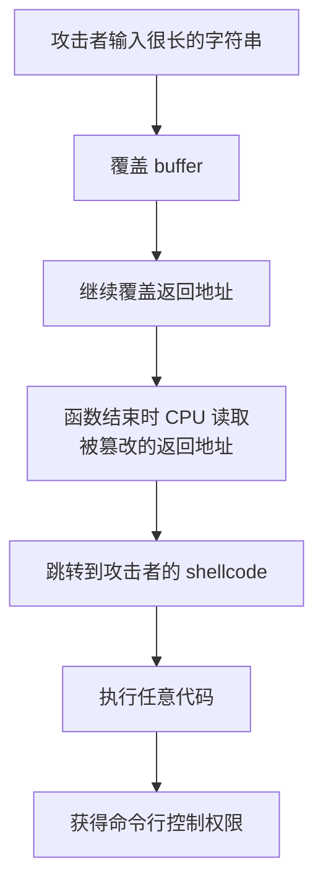

## 引入：C 语言怎么表示文字

前面我们处理的大多是数字，但程序经常要处理文字，比如用户名、密码、文件名等。C 语言本身没有专门的“字符串类型”，字符串是用<span style="color: #409EFF;">字符数组</span>来表示的。

理解字符数组，对后面学习字符串处理、文件读写都很重要。

## 字符数组与字符串的关系

字符数组就是元素类型为 `char` 的数组：

```c
char s[6] = {'H', 'e', 'l', 'l', 'o', '\0'};
```

这个数组表示字符串 `"Hello"`。注意最后一个字符 `\0`，它是字符串的<span style="color: #409EFF;">结束标志</span>。

更方便的写法是：

```c
char s[6] = "Hello";
```

编译器会自动在末尾加上 `\0`。如果写 `char s[] = "Hello";`，编译器会自动算出长度为 6。

## \0 结束符

`\0` 是一个特殊的字符，ASCII 码值为 0，表示字符串到此结束。所有处理字符串的函数都靠它来知道字符串在哪里结束。

```c
#include <stdio.h>

int main(void) {
    char s[] = "Hello";
    printf("%s\n", s);
    return 0;
}
```

输出：

```text
Hello
```

:::tip 字符串长度 vs 数组长度
字符串 `"Hello"` 有 5 个可见字符，但存放它的数组至少需要 6 个字节，因为还要留一个位置给 `\0`。
:::

## 常用字符串函数

C 语言提供了很多字符串处理函数，声明在 `<string.h>` 中。

### strlen：求字符串长度

返回字符串中 `\0` 之前的字符个数，不算 `\0`。

```c
#include <stdio.h>
#include <string.h>

int main(void) {
    char s[] = "Hello";
    printf("长度：%zu\n", strlen(s));
    return 0;
}
```

输出：

```text
长度：5
```

### strcpy：复制字符串

```c
#include <stdio.h>
#include <string.h>

int main(void) {
    char src[] = "Hello";
    char dest[20];

    strcpy(dest, src);
    printf("dest = %s\n", dest);
    return 0;
}
```

:::warning `strcpy` 不知道目标容量
如果 `dest` 不够大，`strcpy` 会越界。问题不在函数名字，而在它的接口没有接收目标缓冲区容量。只有在调用前已经证明目标足够大时才可以使用。
:::

### `strncpy`：受长度限制的复制及其陷阱

```c
#include <stdio.h>
#include <string.h>

int main(void) {
    const char src[] = "Hello, World!";
    char dest[10];

    strncpy(dest, src, sizeof(dest) - 1);
    dest[sizeof(dest) - 1] = '\0';

    printf("dest = %s\n", dest);
    return 0;
}
```

`strncpy` 不是简单的“安全版 `strcpy`”：

- 源字符串过长时，它可能不会写入终止空字符；
- 源字符串较短时，它会用大量零字节填满剩余长度；
- 它不会告诉调用者是否发生了截断；
- 对“必须完整保存”的姓名、路径等字段，静默截断可能比直接失败更糟。

更清楚的做法是先检查长度，再复制完整字符串：

```c
int copy_text(char *dest, size_t capacity, const char *src) {
    size_t length = strlen(src);
    if (length >= capacity) return 0;

    memcpy(dest, src, length + 1);
    return 1;
}
```

这个函数的契约是“放不下就失败，不做截断”。若业务确实需要截断，也应由专门函数明确返回是否截断，并保证终止符。

### strcmp：比较字符串

```c
#include <stdio.h>
#include <string.h>

int main(void) {
    char a[] = "apple";
    char b[] = "banana";

    int result = strcmp(a, b);

    if (result < 0) {
        printf("a 在字典序上小于 b\n");
    } else if (result > 0) {
        printf("a 在字典序上大于 b\n");
    } else {
        printf("a 和 b 相等\n");
    }

    return 0;
}
```

:::tip 不要用 == 比较字符串
`if (a == b)` 比较的是地址，不是内容。比较字符串内容必须用 `strcmp`。
:::

### strcat：连接字符串

```c
#include <stdio.h>
#include <string.h>

int main(void) {
    char s[20] = "Hello";
    strcat(s, " World");
    printf("%s\n", s);
    return 0;
}
```

输出：

```text
Hello World
```

同样要注意目标数组要有足够空间。

## scanf 读字符串的注意事项

用 `scanf` 读取字符串很方便，但也有坑：

```c
#include <stdio.h>

int main(void) {
    char name[20];
    printf("请输入你的名字：");
    scanf("%s", name);
    printf("你好，%s\n", name);
    return 0;
}
```

注意 `name` 前面不需要加 `&`，因为数组名本身就是地址。

但 `scanf("%s", ...)` 遇到空格就会停止。如果输入 "Kingcq Lee"，它只会读到 "Kingcq"。要读取整行文本（包括空格），还需要用另一个函数。留到下一节详细讲。

### sprintf 与 sscanf：字符串中的格式化

`sprintf` 和 `sscanf` 与 `printf`、`scanf` 作用类似，但操作对象是字符串而不是控制台：

```c
#include <stdio.h>

int main() {
    // 把格式化的数据写入字符串
    char buffer[100];
    int age = 20;
    double score = 89.5;
    sprintf(buffer, "年龄：%d，成绩：%.1f", age, score);
    printf("%s\n", buffer);  // 年龄：20，成绩：89.5

    // 从字符串中解析数据
    char data[] = "42 3.14";
    int a;
    double b;
    sscanf(data, "%d %lf", &a, &b);
    printf("a = %d, b = %.2f\n", a, b);  // a = 42, b = 3.14

    return 0;
}
```

<span style="color: #E6A23C;">`sprintf` 在拼接字符串时特别有用，但要注意目标缓冲区必须足够大，否则会越界。</span>更安全的替代是 `snprintf`，它可以指定最大写入长度。

## 字符数组越界问题

<span style="color: #F56C6C;">字符数组越界是 C 语言最容易出 bug 的地方之一。</span>

```c
char s[5] = "Hello";  // 错误！需要 6 个字节
```

这个例子中，`"Hello"` 需要 6 个字节（5 个字母加 `\0`），但数组只有 5 个字节，`\0` 被写到了数组外面，可能破坏其他数据。

使用 `strcpy`、`strcat` 时必须先证明目标容量足够。`strncpy` 也有不补终止符、零填充和静默截断等陷阱，不能只因为名字里有 `n` 就把它当作自动安全。

### 缓冲区溢出：不仅是 bug，更是安全漏洞

当写入的数据超过缓冲区容量时，多出来的数据会覆盖相邻内存中的其他内容。这种现象叫**缓冲区溢出（buffer overflow）**。它不仅仅是程序崩溃的问题——在网络安全领域，这是一种极其经典的攻击手段。

#### 溢出会覆盖什么？

在典型的函数调用中，局部变量在栈上排列，紧邻着函数的返回地址：

```
低地址
┌───────────────┐
│    buffer     │  ← 你声明的字符数组
├───────────────┤
│   其他局部变量  │
├───────────────┤
│  保存的基址指针 │
├───────────────┤
│  返回地址      │  ← 函数执行完后跳回哪里
├───────────────┤
│  调用者的栈帧   │
└───────────────┘
高地址
```

如果你用 `strcpy` 往一个只有 16 字节的缓冲区里写入 100 字节，多出来的 84 字节会一路往上覆盖，最终覆盖掉返回地址。

#### 黑客怎么利用？

攻击者会精心构造一段输入，让它的前半部分是攻击者想要执行的机器指令（称为 **shellcode**），后半部分则精确地将返回地址覆盖成 shellcode 的起始地址。



一个简化的攻击流程是：

1. 程序定义了一个很小的缓冲区，比如 `char name[16];`
2. 程序用 `gets(name)` 或 `scanf("%s", name)` 读取用户输入——没有限制长度
3. 攻击者输入远远超过 16 字节，其中包含一段可执行的机器指令和精心计算的地址值
4. `name` 数组溢出，返回地址被篡改为指向这段指令的地址
5. 函数执行完毕后 `return`，CPU 跳转到攻击者设定的地址
6. 攻击者的代码开始在受害者的计算机上执行——拿到一个 shell，可以执行任何命令

#### 经典案例

这种漏洞在历史上被无数次利用。著名的 **Morris 蠕虫**（1988 年）就是利用 Unix 系统 `fingerd` 服务中的缓冲区溢出漏洞传播，感染了当时互联网上约 10% 的计算机。直到今天，CVE 漏洞数据库中仍然频繁出现缓冲区溢出相关的记录。

#### 如何防范

- **永远使用带长度限制的函数**：`fgets` 替代 `gets`，`snprintf` 替代 `sprintf`，`strncpy` 或自己检查长度替代 `strcpy`。
- **不要假设输入的长度**：用户输入的数据长度是不可信的，每次读取都必须限制最大长度。
- **使用编译器提供的保护机制**：现代编译器默认启用栈保护（`-fstack-protector`），可以在一定程度上检测栈溢出，但这不能替代正确的代码。

:::warning 这不是危言耸听
缓冲区溢出是 C 语言历史上造成损失最多的安全问题之一。每次你写下 `strcpy`、`gets`、`sprintf` 而不检查长度时，都是在代码里埋下一个可能被远程利用的地雷。好在现代编译器和操作系统提供了很多缓解措施（栈保护、地址随机化等），但最根本的防御仍然是**在写代码时就确保缓冲区不会溢出**。
:::

## 常见错误与注意事项

1. <span style="color: #F56C6C;">忘记给 `\0` 留位置</span>：声明数组时长度要比可见字符多 1。
2. <span style="color: #F56C6C;">用 `==` 比较字符串</span>：应该使用 `strcmp`。
3. <span style="color: #F56C6C;">`scanf` 读入带空格的字符串</span>：会截断，需要用 `fgets`。
4. <span style="color: #F56C6C;">`strcpy`/`strcat` 越界</span>：确保目标数组足够大，或改用带长度限制的版本。
5. <span style="color: #F56C6C;">修改字符串常量</span>：`char *s = "Hello"; s[0] = 'h';` 是未定义行为，可能崩溃。

## 字节、字符和用户看到的文字不是一回事

C 字符串是以零字节结尾的 `char` 序列。它不知道 UTF-8 中一个用户可见字符可能占多个字节：

```c
strlen("你好")
```

在 UTF-8 环境中通常得到字节数 6，而不是汉字数量 2。字符串函数处理的是字节序列，编码、字形和人类字符边界是更高层问题。

## 始终区分长度和容量

- 长度：当前 `\0` 之前有多少字节；
- 容量：整个数组最多能保存多少字节，包括结尾 `\0`。

容量为 8 的数组最多保存 7 个普通字节再加终止符。复制前只比较字符串长度，不给终止符留空间，是典型越界来源。

## 读取一整行输入：fgets

在实际编程中，最常见的需求不是读一个单词，而是**读一整行文字**——比如用户名（可能带空格）、地址、一段文本。

### fgets 的基本用法

`fgets` 可以从输入流中读取一行，直到遇到换行符或缓冲区满了为止：

```c
#include <stdio.h>

int main(void) {
    char line[100];

    printf("请输入一行文字：");
    if (fgets(line, sizeof(line), stdin) != NULL) {
        printf("你输入了：%s", line);
    }
    return 0;
}
```

参数说明：

- `line`：存放读取内容的字符数组（缓冲区）。
- `sizeof(line)`：缓冲区的大小（包括留给 `\0` 的空间）。`fgets` 最多读取 `大小 - 1` 个字符，然后自动补 `\0`。
- `stdin`：从标准输入（键盘）读取。换成文件指针可以从文件读取。

**返回值**：成功读取返回传入的指针（`line` 本身）；如果读到文件末尾或发生错误，返回 `NULL`。所以一定要检查返回值。

### 需要处理的一个细节：换行符

`fgets` 的一个特点是：如果输入行不超过缓冲区，它会把末尾的换行符 `\n` 也存入数组中。

比如你输入 "Hello" 然后回车，`line` 里存的是 `"Hello\n"`，而不是 `"Hello"`。这是 `fgets` 和 `scanf` 不同的地方。

有时候你不需要这个换行符。去掉它的常用方法是用 `strcspn` 查找换行符的位置并替换成 `\0`：

```c
#include <stdio.h>
#include <string.h>

int main(void) {
    char line[100];

    printf("请输入一行文字：");
    if (fgets(line, sizeof(line), stdin) != NULL) {
        line[strcspn(line, "\n")] = '\0';  // 去掉末尾的换行符
        printf("你输入了：%s\n", line);
    }
    return 0;
}
```

:::tip strcspn 的作用
`strcspn(line, "\n")` 返回字符串中第一个 `\n` 的位置。如果找到了换行符，就把它替换成 `\0`；如果没找到（输入行太长没读到换行），`strcspn` 返回字符串长度，替换那个位置的 `\0` 也不会出错。
:::

### 输入行太长会怎样？

如果用户输入的一行文本超过缓冲区长度，`fgets` 不会报错，而是只读前 `大小 - 1` 个字符，末尾加 `\0`。剩下的字符还留在输入流中，下次读取时会继续读到它们。

```c
#include <stdio.h>

int main(void) {
    char short_buf[10];

    printf("请输入一段文字（试试超过 10 个字符）：");
    fgets(short_buf, sizeof(short_buf), stdin);
    printf("第一次读到：%s\n", short_buf);

    // 如果还有剩余字符，第二次读取会继续读
    if (fgets(short_buf, sizeof(short_buf), stdin) != NULL) {
        printf("第二次读到：%s\n", short_buf);
    }
    return 0;
}
```

这意味着极简的读取方式不会吞掉“太长”的输入。如果你的程序要求必须读完一整行（无论多长），需要自己处理剩余字符的丢弃或拼接。

### 一个更完整的读取模式

综合以上，写一个稳健的整行输入函数通常需要考虑：

1. 检查返回值（是否为 NULL）
2. 去掉末尾的换行符
3. 判断是否因为缓冲区太小而没有读完一整行

```c
#include <stdio.h>
#include <string.h>

int main(void) {
    char line[100];

    printf("请输入一行文字：");
    if (fgets(line, sizeof(line), stdin) == NULL) {
        printf("读取失败或遇到文件末尾\n");
        return 1;
    }

    // 去掉换行符
    line[strcspn(line, "\n")] = '\0';

    printf("你输入的是：%s\n", line);
    return 0;
}
```

:::warning 不要用 gets
`gets` 没有缓冲区大小参数，永远不要在生产代码中使用它。C 标准已经把它从语言中移除。`fgets` 是安全的替代。
:::

## 字符串字面量只读使用

```c
const char *message = "hello";
```

不要通过指针修改字符串字面量。需要可修改副本时使用数组：

```c
char message[] = "hello";
message[0] = 'H';
```

## 小结与下一篇预告

今天我们学习了字符数组和字符串的关系、结束符 `\0` 的作用，以及 `<string.h>` 中几个最常用的函数。字符数组是 C 语言处理文本的基础，越界问题需要格外小心。

下一篇先用一个成绩统计项目把控制流、函数、数组和字符串连起来；完成第一次综合练习后，再正式进入指针。
