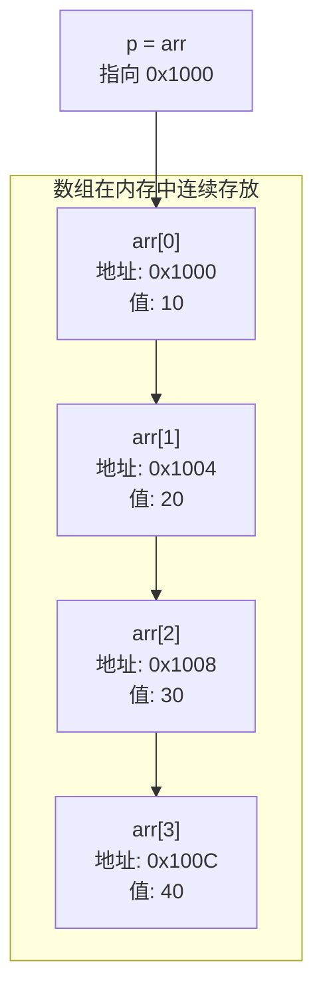

## 学习目标

学完本篇，你会理解：

- 数组名在大多数表达式中会转换为指向首元素的指针。
- `arr[i]` 和 `*(arr + i)` 为什么完全等价。
- 如何用指针遍历数组。
- 指针作为函数参数如何修改外部数组。
- 一维数组和指针到底有什么关系。

## 数组名通常会转换为首元素指针

前面我们学过数组：

```c
int arr[5] = {10, 20, 30, 40, 50};
```

现在告诉你一个关键事实：<span style="color: #409EFF;">数组名 `arr` 在大多数表达式中会自动转换为指向首元素 `arr[0]` 的指针。</span>数组本身仍不是一个指针变量。




```c
#include <stdio.h>

int main(void) {
    int arr[5] = {10, 20, 30, 40, 50};

    printf("arr 的值：    %p\n", (void *)arr);
    printf("&arr[0] 的值：%p\n", (void *)&arr[0]);

    return 0;
}
```

这两个值是一样的。

:::tip 两个例外
数组名不是指针的例外情况主要有两个：`sizeof(arr)` 得到整个数组的字节数；对数组名取地址 `&arr` 得到的是整个数组的地址，类型不同。初学阶段先记住主要规则即可。
:::

## arr[i] 和 *(arr + i) 等价

既然 `arr` 是首元素地址，那么 `arr + i` 就是第 `i` 个元素的地址。解引用一下，就是第 `i` 个元素的值：

```c
*(arr + 0)  // arr[0]
*(arr + 1)  // arr[1]
*(arr + 2)  // arr[2]
```

因此，编译器实际上把 `arr[i]` 处理成 `*(arr + i)`。<span style="color: #67C23A;">甚至你还可以写成 `i[arr]`，因为加法满足交换律，但不推荐这种写法，太奇怪了。</span>

```c
#include <stdio.h>

int main(void) {
    int arr[5] = {10, 20, 30, 40, 50};

    for (int i = 0; i < 5; i++) {
        printf("arr[%d] = %d, *(arr+%d) = %d\n", i, arr[i], i, *(arr + i));
    }

    return 0;
}
```

输出显示两边完全一致。

## 用指针遍历数组

既然数组名可以当指针用，指针自然也可以当数组名用。

```c
#include <stdio.h>

int main(void) {
    int arr[5] = {10, 20, 30, 40, 50};
    int *p = arr;  // p 指向 arr[0]

    for (int i = 0; i < 5; i++) {
        printf("%d ", *p);
        p++;  // 移动到下一个元素
    }

    return 0;
}
```

也可以不移动指针，而是直接写 `*(p + i)`：

```c
for (int i = 0; i < 5; i++) {
    printf("%d ", *(p + i));
}
```

两种写法都是对的，前者更像迭代器，后者更像索引。

## 指针作为函数参数

还记得值传递吗？普通变量传进函数只是副本。但数组传给函数时，传的其实是首元素地址，所以函数内部可以修改原数组：

```c
#include <stdio.h>

void double_values(int *arr, int n) {
    for (int i = 0; i < n; i++) {
        arr[i] *= 2;  // 等价于 *(arr + i) *= 2
    }
}

int main(void) {
    int nums[4] = {1, 2, 3, 4};
    double_values(nums, 4);

    for (int i = 0; i < 4; i++) {
        printf("%d ", nums[i]);
    }

    return 0;
}
```

输出：

```text
2 4 6 8
```

:::tip 数组传参时退化
把数组作为参数传给函数时，它会“退化”为指针。所以函数参数写成 `int arr[]` 和 `int *arr` 是等价的。我个人更推荐写 `int *arr`，因为它明确表示这是个指针。
:::

## 一维数组与指针的关系总结

| 写法 | 含义 |
| --- | --- |
| `arr` | 首元素地址 |
| `&arr[0]` | 首元素地址，与 `arr` 值相同 |
| `arr + i` | 第 `i` 个元素的地址 |
| `*(arr + i)` | 第 `i` 个元素的值，等价于 `arr[i]` |
| `*arr` | 首元素值，等价于 `arr[0]` |

理解这个映射关系后，数组和指针之间很多看起来奇怪的写法都会变得自然。

## 常见错误

1. <span style="color: #F56C6C;">越界访问</span>。`arr[5]` 访问了不属于数组的内存，可能崩溃也可能悄悄出错。
2. <span style="color: #F56C6C;">函数内用 sizeof 算数组长度</span>。数组传参后退化为指针，`sizeof(arr)` 算的是指针大小，不是数组长度。长度要从外部传入。
3. <span style="color: #F56C6C;">误以为 `arr` 可以被赋值</span>。`arr = p;` 是非法的，因为数组名不是变量，不能修改。

## 数组转换为指针的三个重要例外

数组名在大多数表达式中转换为首元素指针，但以下场景要特别记住：

```c
sizeof array       // 得到整个数组的字节数
&array             // 得到“指向整个数组”的指针
char text[] = "hi"; // 字符串字面量用于初始化数组内容
```

`array` 转换后通常是 `int *`，而 `&array` 是 `int (*)[N]`。二者数值地址可能看起来相同，但类型和 `+1` 的步长不同。

## 参数写成数组并不会自动携带长度

```c
void fill(int data[100]);
```

在函数参数中仍会调整为 `int *data`，`100` 通常不能让函数获知调用者实际数组长度。可靠接口要显式传入：

```c
void fill(int *data, size_t length);
```

C99 的 `static` 数组参数可表达调用者至少提供多少元素：

```c
void transform(size_t n, int data[static n]);
```

<span style="color: #F56C6C;">但它仍不会进行运行时自动边界检查，调用者违反约定会导致未定义行为。</span>

## 指针遍历和下标遍历没有本质高下

现代编译器通常能把清楚的下标循环优化得很好。选择更能表达边界的写法，不要为了“指针一定更快”把代码改得难读。性能结论应通过基准和生成代码验证。

## 小结

- 数组名在表达式中通常代表首元素地址。
- `arr[i]` 本质上是 `*(arr + i)`。
- 指针可以遍历数组，数组也可以当作指针使用。
- 数组传参时退化为指针，因此函数可以修改原数组。

## 下一篇预告

下一篇《二级指针、函数指针与回调》会继续追踪“指针本身也是对象”这一事实，并解释函数怎样修改调用者的指针、怎样接收一段可替换行为。
