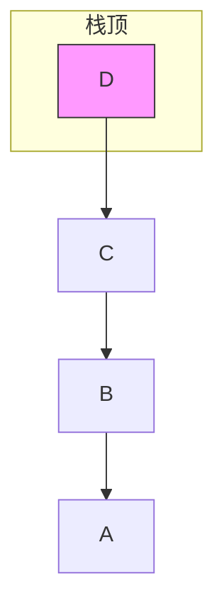

## 什么是栈？

刷盘子时，最后放上去的盘子会最先被拿走；编辑文档时，最后一步操作最先被撤销。这种“后进先出”（Last In First Out，简称 LIFO）的规则，就是栈的核心思想。

栈是一种只允许在一端进行插入和删除操作的线性表。这一端叫**栈顶（top）**，另一端叫**栈底（bottom）**。你可以把栈想象成一个只有顶部开口的筒子，东西只能从顶部放进去，也只能从顶部拿出来。




## 学习目标

读完本文后，你将能够：

- 理解栈的 LIFO 特性；
- 分别用数组和链表实现栈；
- 掌握入栈、出栈、判空，并能用栈做简单的括号匹配。

## 生活中的栈

- **一叠盘子**：放和取都在最上面。
- **浏览器后退**：点一次后退，回到最近访问的页面。
- **函数调用**：CPU 用栈保存每次函数调用的返回地址，先调用的函数最后返回。
- **撤销操作**：`Ctrl + Z` 本质上是把操作压栈，撤销时弹出最近一次操作。

## 顺序栈：用数组实现

用一个数组存放元素，再用一个 `top` 记录栈顶位置。

```c
typedef struct {
    int* data;      // 存储元素的数组
    int capacity;   // 栈的最大容量
    int top;        // 栈顶下标，-1 表示空栈
} SeqStack;
```

下面是创建、入栈、出栈、判空和释放的完整实现：

```c
SeqStack* create_seq_stack(int capacity) {
    SeqStack* s = malloc(sizeof(SeqStack));
    s->data = malloc(sizeof(int) * capacity);
    s->capacity = capacity;
    s->top = -1;
    return s;
}

int is_empty_seq(SeqStack* s) {
    return s->top == -1;
}

int is_full_seq(SeqStack* s) {
    return s->top == s->capacity - 1;
}

void push_seq(SeqStack* s, int value) {
    if (is_full_seq(s)) {
        printf("顺序栈已满，无法入栈\n");
        return;
    }
    s->data[++s->top] = value;
}

int pop_seq(SeqStack* s, int* out) {
    if (is_empty_seq(s)) {
        printf("顺序栈为空，无法出栈\n");
        return 0;
    }
    *out = s->data[s->top--];
    return 1;
}

void free_seq_stack(SeqStack* s) {
    free(s->data);
    free(s);
}
```

:::tip top 的取值约定
有些教材用 `top = 0` 表示空栈，入栈时先放数据再 `top++`。我用 `top = -1` 表示空栈，入栈时先 `++top` 再放数据。两种约定都可以，关键是入栈和出栈要配套。
:::

## 链式栈：用链表实现

用链表实现栈非常自然：把新节点插在链表头部，出栈也从头取。这就是链表“头插法”的栈版本。

```c
typedef struct StackNode {
    int data;
    struct StackNode* next;
} StackNode;

void push_linked(StackNode** top, int value) {
    StackNode* new_node = malloc(sizeof(StackNode));
    new_node->data = value;
    new_node->next = *top;
    *top = new_node;
}

int pop_linked(StackNode** top, int* out) {
    if (*top == NULL) {
        printf("链式栈为空，无法出栈\n");
        return 0;
    }
    StackNode* temp = *top;
    *out = temp->data;
    *top = temp->next;
    free(temp);
    return 1;
}

int is_empty_linked(StackNode* top) {
    return top == NULL;
}

void free_linked_stack(StackNode** top) {
    int dummy;
    while (!is_empty_linked(*top)) {
        pop_linked(top, &dummy);
    }
}
```

链式栈没有容量上限，只要内存够就能一直入栈，但出栈时不要忘记 `free` 弹出的节点。

## 栈的应用：括号匹配

括号匹配是栈最经典的入门应用之一。给定一个只包含 `()[]{}` 的字符串，判断它是否合法。规则很简单：

- 遇到左括号 `(`, `[`, `{` 就入栈；
- 遇到右括号 `)`, `]`, `}` 就和栈顶比较，如果匹配就出栈，否则不合法；
- 遍历结束后，栈为空才合法。

```c
#include <stdio.h>
#include <stdlib.h>

typedef struct StackNode {
    char data;
    struct StackNode* next;
} StackNode;

void push(StackNode** top, char c) {
    StackNode* node = malloc(sizeof(StackNode));
    node->data = c;
    node->next = *top;
    *top = node;
}

int pop(StackNode** top, char* out) {
    if (*top == NULL) return 0;
    StackNode* temp = *top;
    *out = temp->data;
    *top = temp->next;
    free(temp);
    return 1;
}

int is_match(char left, char right) {
    return (left == '(' && right == ')') ||
           (left == '[' && right == ']') ||
           (left == '{' && right == '}');
}

int bracket_match(const char* s) {
    StackNode* top = NULL;
    for (int i = 0; s[i] != '\0'; i++) {
        char c = s[i];
        if (c == '(' || c == '[' || c == '{') {
            push(&top, c);
        } else if (c == ')' || c == ']' || c == '}') {
            char left;
            if (!pop(&top, &left) || !is_match(left, c)) {
                return 0;
            }
        }
    }
    int ok = (top == NULL);
    char dummy;
    while (pop(&top, &dummy));  // 清理剩余节点
    return ok;
}

int main() {
    const char* s1 = "{[()]}";
    const char* s2 = "{[(])}";
    printf("%s: %s\n", s1, bracket_match(s1) ? "合法" : "不合法");
    printf("%s: %s\n", s2, bracket_match(s2) ? "合法" : "不合法");
    return 0;
}
```

运行结果：

```text
{[()]}: 合法
{[(])}: 不合法
```

:::tip 表达式求值
除了括号匹配，栈还可以用来做表达式求值，比如把中缀表达式 `3 + 5 * 2` 转成后缀表达式 `3 5 2 * +`，再用一个栈逐步计算。思路不难，核心仍然是“后进先出”，感兴趣的话可以自己尝试实现。
:::

## 常见错误与注意事项

1. **出栈前没有判空**：空栈还继续出栈会造成下溢，访问非法内存。
2. **入栈前没有判满**：顺序栈容量固定，满了要给出提示或扩容。
3. **返回值没有检查**：像 `pop_seq` 返回 0/1，调用时一定要判断是否真的取到了值。
4. **链式栈内存泄漏**：出栈时如果只移动指针而忘记 `free`，节点就永远留在堆里。
5. **`top` 约定不一致**：同一个程序里不要混用“空栈是 0”和“空栈是 -1”两种约定。

## 完整可运行代码（顺序栈版）

```c
#include <stdio.h>
#include <stdlib.h>

typedef struct {
    int* data;
    int capacity;
    int top;
} SeqStack;

SeqStack* create_seq_stack(int capacity) {
    SeqStack* s = malloc(sizeof(SeqStack));
    s->data = malloc(sizeof(int) * capacity);
    s->capacity = capacity;
    s->top = -1;
    return s;
}

int is_empty_seq(SeqStack* s) { return s->top == -1; }
int is_full_seq(SeqStack* s) { return s->top == s->capacity - 1; }

void push_seq(SeqStack* s, int value) {
    if (is_full_seq(s)) {
        printf("栈已满\n");
        return;
    }
    s->data[++s->top] = value;
}

int pop_seq(SeqStack* s, int* out) {
    if (is_empty_seq(s)) {
        printf("栈为空\n");
        return 0;
    }
    *out = s->data[s->top--];
    return 1;
}

void free_seq_stack(SeqStack* s) {
    free(s->data);
    free(s);
}

int main() {
    SeqStack* s = create_seq_stack(5);
    push_seq(s, 10);
    push_seq(s, 20);
    push_seq(s, 30);

    int val;
    while (pop_seq(s, &val)) {
        printf("出栈：%d\n", val);
    }

    free_seq_stack(s);
    return 0;
}
```

## 数据结构的栈与调用栈要区分

“栈”首先是一种后进先出的抽象数据类型。函数调用栈是操作系统和 ABI 常用栈结构管理调用状态的一个应用。自己实现的 `SeqStack` 可以位于动态内存中，它和“栈空间”不是同一个概念。

## 接口要处理上溢和下溢

```c
bool stack_push(Stack *stack, int value);
bool stack_pop(Stack *stack, int *out);
```

- 固定容量栈满时，`push` 不能继续写；
- 空栈 `pop` 不能读取不存在的元素；
- 用返回状态区分失败，不要用某个普通整数当“错误哨兵”，因为该整数可能也是合法数据。

## 顺序栈的核心不变量

可选择让 `size` 表示元素数量：

```text
0 <= size <= capacity
下一个入栈位置是 data[size]
栈顶元素是 data[size - 1]（size > 0 时）
```

统一这个定义后，初始化、入栈、出栈和判空会自然对应，避免一会儿把 `top` 当下标、一会儿当数量。

## 动态扩容要保留原指针

顺序栈扩容应使用临时指针接收 `realloc`，并检查容量乘法与增长溢出。扩容成功后，旧元素地址可能变化，外部不应长期保存指向栈内部元素的指针。

## 小结与预告

栈是一种简单却极其常用的结构。无论是函数调用、递归、DFS，还是表达式求值、括号匹配，背后都能看到栈的影子。掌握它的关键是时刻记住：**后进先出**。

下一篇我们将学习另一种线性结构——队列。它的规则正好和栈相反：**先进先出**。
