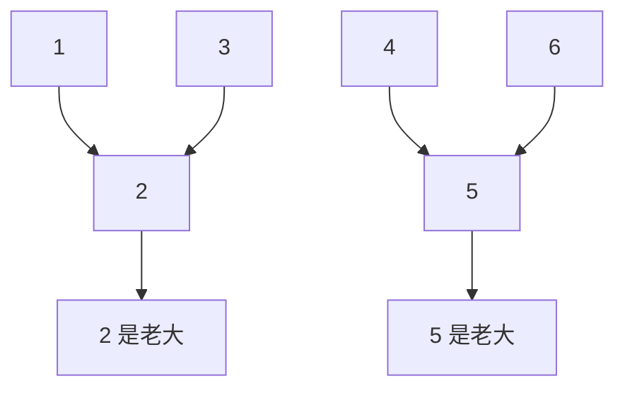
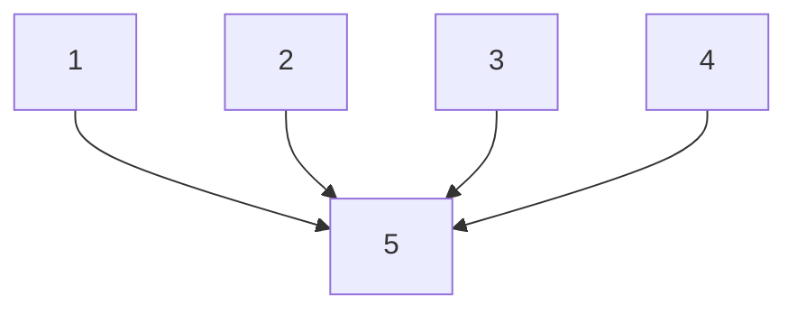

## 并查集解决什么问题

假设班上有若干同学，他们之间有一些“朋友关系”。朋友的朋友也是朋友，所以这些人会形成一个一个的小圈子。现在的问题是：

- 给定两个人，他们是不是同一个圈子的？
- 如果让两个人成为朋友，会不会把两个原本不相干的圈子合并成一个？

这种“判断元素是否属于同一集合”以及“合并两个集合”的问题，就是**并查集**（Union-Find，也叫 Disjoint Set Union，DSU）的专长。

经典应用场景包括：

- 社交网络中的圈子判断
- 迷宫生成：判断两个格子是否连通
- 最小生成树算法 `Kruskal`
- 图像处理中的连通块标记

## 基本思想：每个集合选出一个“老大”

并查集用一棵或多棵树来表示集合。每个元素都有一个 `parent` 指针指向自己的父节点，而每棵树的根节点就是这颗集合的“老大”（代表元）。

判断两个元素是否在同一集合，只需要沿着 `parent` 一路往上找，看最终是否到达同一个根节点。



上图表示两个集合：`{1, 2, 3}` 的老大是 `2`，`{4, 5, 6}` 的老大是 `5`。

## 三个核心操作

并查集只有三个基本操作：

1. **make_set(x)**：初始化，让 `x` 自己成为一个集合，父节点指向自己。
2. **find(x)**：找到 `x` 所在集合的根节点。
3. **union(x, y)**：把 `x` 和 `y` 所在的两个集合合并。

## 最朴素的实现

```c
#include <stdio.h>

#define N 100

int parent[N];

// 初始化：每个人的老大都是自己
void make_set(int n) {
    for (int i = 0; i < n; i++) {
        parent[i] = i;
    }
}

// 查找：沿着 parent 一直往上走到根
int find(int x) {
    while (parent[x] != x) {
        x = parent[x];
    }
    return x;
}

// 合并：让 x 所在集合的老大指向 y 所在集合的老大
void union_set(int x, int y) {
    int rx = find(x);
    int ry = find(y);
    if (rx != ry) {
        parent[rx] = ry;
    }
}

int main(void) {
    make_set(6);

    union_set(0, 1);
    union_set(1, 2);
    union_set(3, 4);
    union_set(4, 5);

    printf("0 和 2 是否连通：%s\n", find(0) == find(2) ? "是" : "否");
    printf("0 和 3 是否连通：%s\n", find(0) == find(3) ? "是" : "否");

    union_set(2, 3);
    printf("合并后 0 和 3 是否连通：%s\n", find(0) == find(3) ? "是" : "否");

    return 0;
}
```

## 优化一：路径压缩

上面的 `find` 操作在最坏情况下会退化成一条长链，效率很低。


路径压缩的想法很简单：在 `find` 的过程中，把沿途每个节点的 `parent` 都直接指向根节点。这样下次再访问这些节点时，就一步就能到根。

```c
int find(int x) {
    if (parent[x] != x) {
        parent[x] = find(parent[x]);  // 递归的同时把父节点直接挂到根上
    }
    return parent[x];
}
```



经过路径压缩后，原来的链状结构变成了扁平的星形结构。

## 优化二：按秩合并

合并两个集合时，如果总是把大树挂在小树下面，树的高度会增长得比较快。按秩合并的做法是：让高度较小的树挂在高度较大的树下面，从而控制树的高度。

```c
int parent[N];
int rank_arr[N];  // 记录每棵树的高度估计值

void make_set(int n) {
    for (int i = 0; i < n; i++) {
        parent[i] = i;
        rank_arr[i] = 0;
    }
}

int find(int x) {
    if (parent[x] != x) {
        parent[x] = find(parent[x]);
    }
    return parent[x];
}

void union_set(int x, int y) {
    int rx = find(x);
    int ry = find(y);
    if (rx == ry) return;

    if (rank_arr[rx] < rank_arr[ry]) {
        parent[rx] = ry;
    } else if (rank_arr[rx] > rank_arr[ry]) {
        parent[ry] = rx;
    } else {
        parent[ry] = rx;
        rank_arr[rx]++;
    }
}
```

:::tip rank 不是精确高度
`rank` 只是一个“上界估计”，并不保证等于树的实际高度。但即便如此，它依然能有效控制树的深度，保证并查集的效率。
:::

## 复杂度分析

并查集的效率非常优秀。使用路径压缩 + 按秩合并后：

- **单次 `find` / `union` 操作的均摊时间复杂度约为 O(α(n))**，其中 α 是阿克曼函数的反函数。
- 这个函数增长得极其缓慢，在实际数据范围内（`n < 10^600`），`α(n)` 都不超过 `4`，所以通常可以把它当成**常数时间**看待。
- 空间复杂度是 **O(n)**，只需要两个数组。

## 常见错误

1. **初始化时父节点没有指向自己**。如果 `parent[i] = 0`，那所有元素一开始就在同一个集合里了。
2. **`union` 时忘记先 `find`**。要合并的是根节点，不是参数本身。
3. **路径压缩写错**。写成 `return find(parent[x]);` 而没有 `parent[x] = ...` 就无法压缩路径。
4. **数组越界**。并查集通常用元素值作为下标，要确保数组开得足够大。

## 并查集维护的是分组，不保存具体路径

它可以高效回答“两个元素是否属于同一集合”，却不能直接告诉你它们之间经过哪些边，也不能维护最短路。`parent` 数组形成的是内部代表树，不一定对应原图中的真实连接边。

## 按秩和按大小二选一即可

- 按秩合并维护树高的上界；
- 按大小合并维护集合元素数。

两者都让小树挂到大树下，再配合路径压缩。变量名要和含义一致，不要把 `rank` 当作真实高度或集合大小输出。

## 路径压缩会修改结构

```c
parent[x] = find(parent[x]);
```

`find` 不只是查询，它会让沿途节点直接指向代表元。因此在需要持久化历史结构或并发访问的场景，要考虑可变性和同步。

## 初始化边界

元素编号若为 `0..n-1`，所有数组都必须至少有 `n` 个元素，传入 `find` 和 `union` 前应验证编号。错误编号不会被算法自动发现，只会变成数组越界。

## 小结

- 并查集用于维护若干集合，支持快速的“合并”和“查询是否同集”。
- 每个集合用一棵树表示，根节点是集合的代表元。
- 路径压缩能让树变扁平，按秩合并能控制树的高度。
- 时间复杂度接近常数，空间复杂度为 O(n)。

## 下一篇预告

下一篇进入图搜索：先学习深度优先搜索 DFS，观察递归调用栈、访问标记与回溯状态怎样配合。
