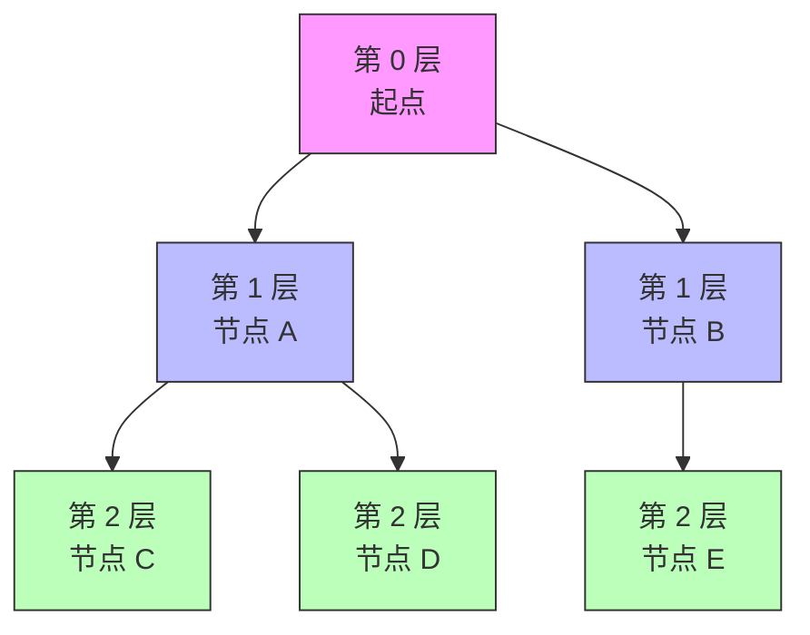

## 引入：从“一条路走到黑”到“层层推进”

上一篇我们学了 DFS：遇到岔路先挑一条走到底，走不通再回头。这种策略很直观，但在某些问题里不是最优的。

比如你想知道从起点到终点最少要走多少步。如果用 DFS，你可能先沿着一条很长的死路走到底，才发现不是最优解；而更好的做法是：先扩展起点周围所有一步能到的地方，再扩展两步能到的地方，以此类推。这就是**广度优先搜索**，简称 BFS（Breadth-First Search）。

BFS 的思想就像往水面扔一颗石子，波纹一圈一圈向外扩散。

## 学习目标

- 理解 BFS “层层扩展”的思想。
- 掌握用队列实现 BFS 的方法。
- 能写出层序遍历和最短路径的代码。
- 会比较 DFS 和 BFS 的适用场景。
- 会分析 BFS 的时间复杂度和空间复杂度。

## BFS 的基本思想

BFS 从起点开始，先访问所有与起点距离为 1 的节点，再访问距离为 2 的节点，依此类推。它保证第一次到达某个节点时，走的路径一定是最短的（在无权图中）。




由于要先访问先发现的节点，BFS 天然适合用**队列**来实现：

1. 把起点放入队列。
2. 从队列头部取出一个节点。
3. 把这个节点的所有未访问邻居加入队列尾部。
4. 重复步骤 2 和 3，直到队列为空。

## 用队列实现 BFS

上一篇你已经学过队列了，这里我们会用数组模拟一个简单队列。实际工程中也可以用链表或标准库提供的队列。

```c
#include <stdio.h>
#include <string.h>

#define MAXN 100

int n = 5, m = 5;
int maze[5][5] = {
    {0, 0, 1, 0, 0},
    {0, 0, 0, 1, 0},
    {1, 0, 1, 0, 0},
    {0, 0, 0, 0, 1},
    {0, 1, 1, 0, 0}
};
int visited[5][5] = {0};
int dist[5][5] = {0};  // 记录到每个点的最短距离

int dx[] = {-1, 1, 0, 0};
int dy[] = {0, 0, -1, 1};

// 用数组模拟队列
int qx[MAXN * MAXN];
int qy[MAXN * MAXN];
int head = 0, tail = 0;

void bfs_maze(int sx, int sy)
{
    qx[tail] = sx;
    qy[tail] = sy;
    tail++;
    visited[sx][sy] = 1;
    dist[sx][sy] = 0;

    while (head < tail) {
        int x = qx[head];
        int y = qy[head];
        head++;

        int i;
        for (i = 0; i < 4; i++) {
            int nx = x + dx[i];
            int ny = y + dy[i];

            if (nx < 0 || nx >= n || ny < 0 || ny >= m) continue;
            if (maze[nx][ny] == 1 || visited[nx][ny]) continue;

            visited[nx][ny] = 1;
            dist[nx][ny] = dist[x][y] + 1;
            qx[tail] = nx;
            qy[tail] = ny;
            tail++;
        }
    }
}

int main(void)
{
    bfs_maze(0, 0);

    if (visited[n - 1][m - 1]) {
        printf("可以到达出口，最短距离为 %d\n", dist[n - 1][m - 1]);
    } else {
        printf("无法到达出口\n");
    }
    return 0;
}
```

输出：

```text
可以到达出口，最短距离为 8
```

:::tip BFS 求最短路径的前提
BFS 能求最短路径，要求每条边的“代价”相同，也就是**无权图**。如果不同路径的代价不同，需要用 Dijkstra 等更复杂的算法。
:::

## 经典例子：层序遍历二叉树

BFS 也可以用来按层遍历二叉树。虽然你还没系统学习二叉树，但可以用结构体简单模拟：

```c
#include <stdio.h>
#include <stdlib.h>

#define MAXN 100

struct Node {
    int val;
    struct Node *left;
    struct Node *right;
};

struct Node *new_node(int val)
{
    struct Node *node = malloc(sizeof(struct Node));
    node->val = val;
    node->left = node->right = NULL;
    return node;
}

int main(void)
{
    // 构造一棵简单二叉树
    struct Node *root = new_node(1);
    root->left = new_node(2);
    root->right = new_node(3);
    root->left->left = new_node(4);
    root->left->right = new_node(5);
    root->right->right = new_node(6);

    // 用数组模拟队列
    struct Node *queue[MAXN];
    int head = 0, tail = 0;

    queue[tail++] = root;

    while (head < tail) {
        struct Node *cur = queue[head++];
        printf("%d ", cur->val);

        if (cur->left)  queue[tail++] = cur->left;
        if (cur->right) queue[tail++] = cur->right;
    }
    printf("\n");

    return 0;
}
```

输出：

```text
1 2 3 4 5 6 
```

这就是按层遍历：先第一层，再第二层，再第三层。

## DFS 与 BFS 的对比

| 特性 | DFS | BFS |
|-----|-----|-----|
| 数据结构 | 递归栈（或显式栈） | 队列 |
| 搜索顺序 | 先深入后扩展 | 先扩展后深入 |
| 最短路径 | 不保证 | 无权图中保证 |
| 空间占用 | O(深度) | O(宽度) |
| 典型应用 | 连通块、全排列、子集、回溯 | 最短路径、层序遍历、最少步数 |

:::tip 怎么选 DFS 还是 BFS
- 如果问题问“是否存在”“所有方案”“能不能走到”，两种都可以，看哪个写起来顺手。
- 如果问题问“最短距离”“最少步数”“最少操作次数”，优先考虑 BFS。
- 如果搜索空间很大，两种都可能需要剪枝或换更高效的算法。
:::

## 时间复杂度与空间复杂度分析

### 时间复杂度

BFS 每个节点最多入队一次、出队一次，处理它的所有邻居。因此时间复杂度通常是 O(V + E)，其中 V 是节点数，E 是边数。

在迷宫问题里，每个格子最多访问一次，每条边最多检查一次，所以复杂度是 O(n × m)。

### 空间复杂度

BFS 的空间主要由队列和访问标记数组决定。最坏情况下，队列里可能同时存有某一层的所有节点，所以空间复杂度是 O(V) 或 O(宽度)。

对于 n × m 的迷宫，空间复杂度是 O(n × m)。

:::tip 为什么复杂度分析很重要
BFS 的队列可能一瞬间变得很大。如果图的宽度很大，BFS 可能比 DFS 更费内存。写算法前先估算复杂度，能帮你提前发现内存或时间上的风险。
:::

## 常见错误与注意事项

1. **忘记标记访问状态**：和 DFS 一样，BFS 也需要 `visited` 数组，否则节点会被重复加入队列。
2. **标记时机太晚**：应该在入队时就标记已访问，而不是出队时才标记。否则同一个节点可能被多次入队。
3. **队列越界**：用数组模拟队列时，要开足够大的空间。最坏情况下可能同时存储大量节点。
4. **把 BFS 用于带权图的最短路径**：BFS 只能处理边权相同的情况，带权图要换算法。

## BFS 最短路结论有前提

在无权图，或每条边代价相同的图中，BFS 按距离层扩展，第一次发现节点时得到最少边数距离。若边权不同，普通 FIFO 队列不再保证最短，需要根据权重选择其他算法。

## 标记必须发生在入队时

```c
visited[start] = true;
queue_push(start);

while (!queue_empty()) {
    int current = queue_pop();
    for (每个 next) {
        if (!visited[next]) {
            visited[next] = true;
            parent[next] = current;
            queue_push(next);
        }
    }
}
```

如果出队才标记，同一节点可能在同一层被多个父节点重复加入，队列膨胀，`parent` 也可能被反复覆盖。

## 用 parent 恢复路径

找到终点后，从 `target` 反复读取 `parent[target]` 直到起点，得到逆序路径，再反转输出。只保存距离只能回答“多远”，保存父节点才能回答“怎么走”。

## 二叉树层序遍历也要明确空指针

入队前检查根是否为空；出队节点后，只把非空孩子入队。队列保存的是借用节点指针，树必须在遍历期间保持存活。

## 小结与预告

这一篇我们学习了广度优先搜索：

- BFS 的核心思想是“层层扩展”，用队列实现。
- BFS 在无权图中可以找到最短路径。
- 层序遍历是 BFS 在树结构上的典型应用。
- DFS 适合深度探索和枚举方案，BFS 适合求最短距离和按层处理。
- BFS 的时间和空间复杂度需要结合图的大小来估算。

到这里，C 语言中的内存、数据结构和基础搜索已经形成一条完整链路。下一篇先用文本索引项目综合文件、哈希表、排序和命令行，再进入现代 C++。
