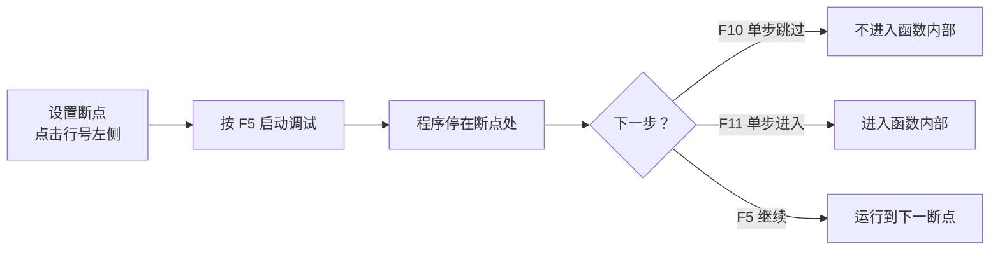

## 引入：Bug 是编程的一部分

无论你多么细心，写出来的程序总会有出错的时候。有些错误编译器能帮你发现（语法错误），有些错误程序运行时才会暴露（逻辑错误）。学会调试——即定位和修复错误——是程序员最重要的技能之一。

调试的方法有很多种，从最简单的 `printf` 大法，到使用专业的调试器。这篇文章我们会逐一介绍。

---

## 学习目标

- 理解调试的基本思路：复现 → 定位 → 修复 → 验证
- 掌握使用 `printf` 手动调试的技巧
- 学会安装和使用 GDB
- 理解断点、单步执行、查看变量等核心操作
- 学会在 VSCode 中进行图形化调试

---

## 调试的基本思路

调试不是随机改代码，而是一个系统性的过程：

1. **复现问题**：确保你能稳定地让 bug 出现
2. **定位根源**：通过观察和推理，找到出错的代码行
3. **修复错误**：修改代码
4. **验证修复**：重新运行，确认问题解决且没有引入新问题

初学者最容易跳过的就是第 2 步——看到程序出错了，凭感觉乱改，结果越改越糟。定位问题比修复问题更重要。

---

## printf 大法：最简单的调试

最朴素也最直接的调试方式就是在关键位置插入 `printf`，输出变量的值，看看程序执行过程中发生了什么。

```c
#include <stdio.h>

int main() {
    int a = 5, b = 0;
    printf("debug: a = %d, b = %d\n", a, b);  // 查看输入值

    int c = a / b;  // 这里会崩溃（除以 0）

    printf("debug: c = %d\n", c);  // 这一行永远不会执行
    return 0;
}
```

通过 `printf` 输出，你可以确认：

- 函数是否被调用（在函数开头加一句输出）
- 循环执行了多少次（在循环里输出计数）
- 变量的值是否符合预期（在变量变化后输出）
- 程序在哪里崩溃（在可疑位置前后加输出，看哪个输出没被执行）

### printf 调试的优缺点

| 优点 | 缺点 |
|------|------|
| 简单直接，没有学习成本 | 需要修改代码，改完要重新编译 |
| 适合任何环境，包括嵌入式 | 输出大量信息时难以阅读 |
| 可以输出复杂的数据结构 | 不小心会引入新 bug（比如在 printf 里写错表达式） |

:::tip 调试输出建议
调试完成后记得删掉或注释掉调试用的 `printf`。保留过多调试输出会让程序变得杂乱。你可以用一个宏来控制：

```c
#ifdef DEBUG
    #define DBG_PRINT(fmt, ...) printf("[DEBUG] " fmt "\n", ##__VA_ARGS__)
#else
    #define DBG_PRINT(fmt, ...)  // 空宏，编译后不产生任何代码
#endif

// 使用时：
DBG_PRINT("a = %d, b = %d", a, b);
// 编译时加 -DDEBUG 开启调试输出，不加则关闭
```
:::

---

## GDB：专业的命令行调试器

`printf` 虽然简单，但遇到复杂的 bug 就力不从心了。比如程序崩溃了，你想知道崩溃时所有变量的值、函数的调用栈、参数传递的路径——这些 `printf` 很难做到，而调试器正是为此而生。

`GDB`（GNU Debugger）是 `Linux` 和 `macOS` 上最常用的命令行调试器。`Windows` 上也可以用（通过 `MinGW` 安装）。

### 安装 GDB

```bash
# Windows (MSYS2)
pacman -S mingw-w64-ucrt-x86_64-gdb

# Windows (scoop)
scoop install gdb

# macOS (Homebrew)
brew install gdb

# Linux (Ubuntu/Debian)
sudo apt install gdb
```

### 编译带调试信息的程序

要让 GDB 正常工作，编译时需要加 `-g` 选项，这样编译器会把源代码和变量信息写入可执行文件：

```bash
gcc -g hello.c -o hello
```

### GDB 基本操作

启动 GDB：

```bash
gdb ./hello
```

这会进入 GDB 的交互界面，出现 `(gdb)` 提示符。以下是最常用的命令：

| 命令 | 简写 | 作用 |
|------|------|------|
| `run` | `r` | 运行程序 |
| `break 行号` | `b 行号` | 在指定行设断点 |
| `break 函数名` | `b 函数名` | 在函数入口设断点 |
| `continue` | `c` | 继续执行到下一个断点 |
| `next` | `n` | 单步执行，不进入函数内部 |
| `step` | `s` | 单步执行，进入函数内部 |
| `print 变量` | `p 变量` | 打印变量的值 |
| `backtrace` | `bt` | 查看函数调用栈 |
| `list` | `l` | 查看当前附近的源代码 |
| `info locals` | — | 查看所有局部变量 |
| `quit` | `q` | 退出 GDB |

### 一个完整的 GDB 调试示例

假设有下面这个有 bug 的程序 `buggy.c`：

```c
#include <stdio.h>

int factorial(int n) {
    int result;
    for (int i = 1; i <= n; i++) {
        result *= i;  // bug: result 没有初始化！
    }
    return result;
}

int main() {
    int n = 5;
    printf("%d! = %d\n", n, factorial(n));
    return 0;
}
```

编译并启动 GDB：

```bash
gcc -g buggy.c -o buggy
gdb ./buggy
```

在 GDB 中的操作：

```
(gdb) break main              # 在 main 函数入口设断点
(gdb) run                      # 运行程序，停在 main 入口
(gdb) step                     # 进入 factorial 函数
(gdb) print n                  # 查看 n 的值
$1 = 5
(gdb) print result             # 查看 result 的值（未初始化！）
$2 = 32767                     # 垃圾值
(gdb) break 5                  # 在循环内部设断点
(gdb) continue                 # 继续执行到断点
(gdb) print result             # 再次查看
$3 = 32767 * 1                 # 还是垃圾值乘以 1
(gdb) quit                     # 退出
```

通过这个过程，你能清楚地看到 `result` 没有初始化，导致计算结果随机。

### GDB 实用插件：gef

`gef`（GDB Enhanced Features）是一个 GDB 插件，能让 GDB 的输出更美观、功能更丰富。安装方法：

```bash
# 一行命令安装
bash -c "$(curl -fsSL https://gef.blah.cat/sh)"
```

安装后启动 GDB，你会看到界面变成了彩色，还有更多辅助信息（寄存器、汇编代码等）。初学者可以先掌握原版 GDB，等用熟了再考虑插件。

其他常用的 GDB 插件还有 `pwndbg`（偏安全研究）和 `peda`（偏逆向分析），初学阶段不用纠结，`gef` 就够用了。

---

## 在 VSCode 中进行图形化调试

命令行的 GDB 对初学者不太友好。VSCode 的 `C/C++` 插件提供了图形化的调试界面，本质上还是调用的 GDB，但操作起来直观得多。

### 配置调试器

1. 打开你的 `C` 源文件
2. 点击左侧的**运行和调试**图标（或按 `Ctrl+Shift+D`）
3. 点击**创建 launch.json 文件**，选择 `C++ (GDB/LLDB)`
4. VSCode 会自动生成一个 `.vscode/launch.json` 文件

默认配置通常可以直接用。如果你需要手动调整，保持下面的配置即可：

```json
{
    "version": "0.2.0",
    "configurations": [
        {
            "name": "GDB 调试",
            "type": "cppdbg",
            "request": "launch",
            "program": "${workspaceFolder}/hello",
            "args": [],
            "stopAtEntry": false,
            "cwd": "${workspaceFolder}",
            "environment": [],
            "externalConsole": false,
            "MIMode": "gdb",
            "setupCommands": [
                {
                    "description": "为 gdb 启用整齐打印",
                    "text": "-enable-pretty-printing",
                    "ignoreFailures": true
                }
            ],
            "preLaunchTask": "C/C++: gcc 生成活动文件"
        }
    ]
}
```

### 图形化调试的操作

配置好后，按 `F5` 启动调试。你会看到：

- **断点**：点击代码行号左侧的空白区域，会出现一个红点，表示断点已设置
- **单步执行**：调试工具栏上有 `F10`（跳过）、`F11`（进入）、`Shift+F11`（跳出）
- **变量查看**：左侧"变量"面板会显示所有局部变量的当前值
- **监视**：在"监视"面板中添加表达式，持续跟踪某个变量的变化
- **调用堆栈**：左侧"调用堆栈"面板显示函数调用链



### 常用的调试快捷键

| 快捷键 | 作用 |
|--------|------|
| `F5` | 启动调试 / 继续执行 |
| `F9` | 切换断点 |
| `F10` | 单步跳过（不进入函数） |
| `F11` | 单步进入（进入函数） |
| `Shift+F11` | 跳出当前函数 |
| `Ctrl+Shift+F5` | 重新启动调试 |
| `Shift+F5` | 停止调试 |

:::tip 断点的本质
断点并不会修改你的源代码。调试器会在执行到断点位置时，临时把那条指令替换成一条"暂停指令"，等用户操作后再换回来继续执行。所以设断点不会破坏你的程序。
:::

---

## 常见调试场景

### 场景一：程序崩溃了，我想知道崩溃的位置

用 GDB 运行程序，崩溃后输入 `bt`（backtrace）查看调用栈，或输入 `list` 查看崩溃位置附近的源代码。

在 VSCode 中，程序崩溃后会自动停在崩溃位置，变量面板会显示崩溃时的变量值。

### 场景二：某个变量的值不对，我想跟踪它

在变量变化的地方设断点，单步执行，观察变量每次变化后的值。也可以在 VSCode 的"监视"面板中添加变量名，持续关注它的变化。

### 场景三：循环次数太多，我不想一步步走

在循环开始的地方设一个"条件断点"。在 VSCode 中，右键点击红点，选择"编辑断点"，输入条件表达式，比如 `i == 100`。这样只有在 `i` 等于 100 时才会停下来。在 GDB 中可以用 `break 行号 if i == 100`。

---

## 常见错误与注意事项

1. **编译时忘记加 `-g`**：没有调试信息，GDB 无法关联源码，只能看到汇编。
2. **优化级别太高**：`-O2` 或 `-O3` 会让编译器重排代码，导致单步执行时跳来跳去。调试时建议用 `-O0`（默认）。
3. **在 release 版本上调试**：发布给用户的版本通常不加 `-g` 且启用优化。调试一定要用 debug 版本。
4. **设了断点但没触发**：检查断点位置是否真的会执行到；检查是否编译的是当前版本的代码。

---

## 先区分错误发生在哪一层

- 编译错误：语法、类型或声明问题；
- 链接错误：声明存在但定义或库没有连接；
- 运行时崩溃：非法访问、断言失败、资源问题；
- 逻辑错误：程序运行完但答案不对；
- 未定义行为：源程序已越过语言规则，表现可能随优化变化。

分类后再选工具，比盲目加打印更快。

## 最小复现是最重要的调试技能之一

删除与问题无关的输入、模块和分支，直到仍能稳定触发错误的最小程序。这个过程经常直接暴露真正前置条件，也让别人能够准确帮助你。

## Sanitizer 应成为日常编译配置

```bash
gcc demo.c -std=c17 -Wall -Wextra -Wpedantic -g \
    -fsanitize=address,undefined -fno-omit-frame-pointer -o demo
```

它能在第一次非法访问附近报告堆栈，而不是等内存被破坏很久后才崩溃。Sanitizer 构建用于测试，不代表发布版本必须携带这些开销。

## 断言记录“程序员认为不可能失败”的条件

```c
#include <assert.h>
assert(index < length);
```

断言适合内部不变量，不适合处理用户输入、文件不存在等正常可恢复错误。发布构建可能禁用断言，因此不能依赖断言执行必要副作用。

## 调试器里优先观察控制流和生命周期

遇到指针问题时，不只看地址数值，还要问：目标对象何时创建、在哪条路径释放、有哪些别名、当前栈帧是否仍有效。单步执行的目标是验证模型，而不是随机点“下一步”。

## 小结

- 调试是一个系统性的过程：复现 → 定位 → 修复 → 验证
- `printf` 是最简单的调试方法，适合快速验证
- GDB 是专业的命令行调试器，支持断点、单步、查看变量、调用栈
- VSCode 提供图形化调试界面，适合初学者
- 编译时加 `-g` 才能调试，调试时用 `-O0` 关闭优化

调试是编程中不可或缺的技能。掌握它之后，你再也不会对着一个崩溃的程序束手无策了。

定位问题之后，还要让多文件项目能够稳定、重复地构建。下一篇从 Makefile 的依赖关系开始，把编译和链接流程自动化。
