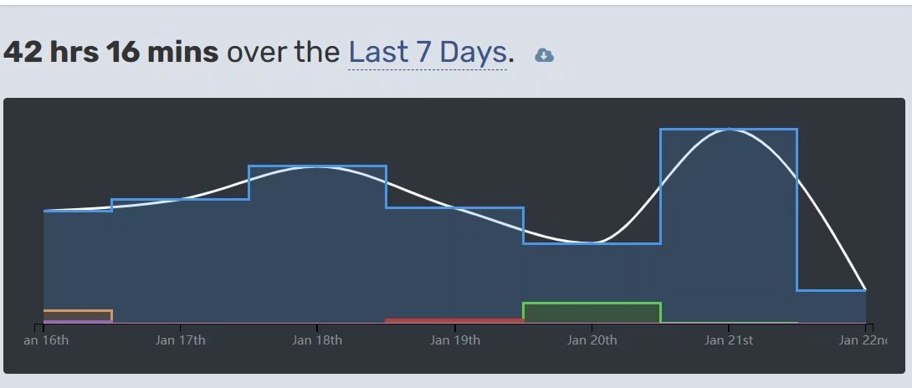

还在为不知道怎么写CPL课程的小游戏项目而烦恼吗？

那可真是太巧了！我这恰好一不小心花了点时间写了一个小项目：

你猜怎么着！恰好完成了其中一道期末项目的要求！

我将代码都留了下来，并且编写了一段较为详尽的教程来告诉你我是怎么写出这个项目的。

我把项目放在 [GitHub](https://github.com/Kingcxp/Console-Runners) 这里了！要是真的不知道大项目该怎么写，那你也来看看吧！

别忘了给我点颗星~o((>ω< ))o

**（特别提醒：可以参考我的代码，学习我的一些做法，但是不能直接抄袭，这是对课程、老师和其它同学的不尊重！，如若抄袭并不幸被查重，后果自负）**
