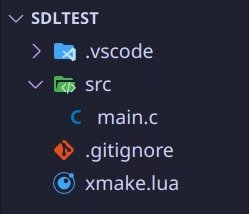
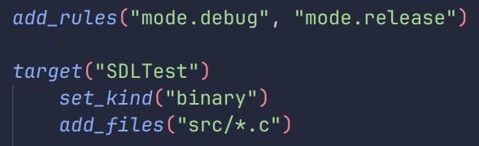
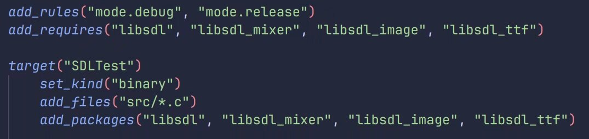
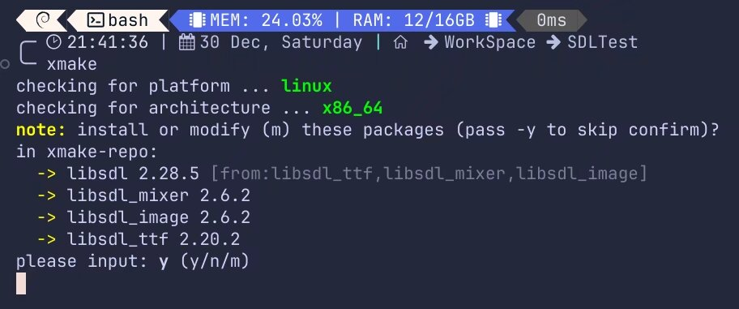
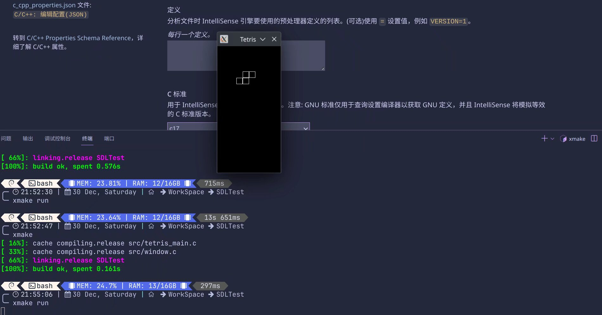

`XMake` 是由国人开发的基于 `Lua` 的 `C/C++` 构建系统，支持多重编译器和平台，利用 `Lua` 轻量、简洁、灵活、跨平台等特性，带来不一样的构建体验。

请注意：不建议使用除 `vscode` 以外的编辑器使用 `XMake` 编写项目，这些编辑器有 `XMake` 插件但并不好用，没有办法提供合适的 `include` 解析，导致编写代码十分的困难，好在我们现在仅仅是借助 `XMake` 来帮助我们打包项目，在这里我们以 `SDL2` 为例，但 `XMake` 不仅限于此，它有十分充足的仓库，你几乎能在里面找到所有你想要使用的 `C/C++` 库。

安装

安装指示在官方页面上写的非常清楚，就不在这里多写了

镜像加速

`XMake` 的 `C/C++` 包都在 `GitHub` 上，访问速度很慢，甚至在一定程度上使用了魔法的情况下还会出现下载失败的情况，十分影响使用体验，因此十分有必要借助 `github` 镜像加速这个过程，在命令行中运行以下命令来使用 `xmake` 内部提供的镜像：

```sh
xmake g --proxy_pac=github_mirror.lua
```

工具链

`XMake` `支持几乎所有常见的工具链，XMake` 也会在你的环境中探测使用它认为最合适的工具链，特别地，`Windows` 下建议使用 `MSVC` 构建工具链，它最稳定。

`XMake`，启动！

所有的前置步骤已经完成，下面就可以来开始打包项目了！我们以 `SDLTest` 项目名为例，来创建并编译一个新的SDL2项目吧！
首先在指定的文件夹路径下使用 `xmake` 命令创建一个名为 `SDLTest` 的新项目：

```sh
xmake create SDLTest
```

它会在当前路径下创建一个名为 `SDLTest` 的文件夹，并在该文件夹中生成以下目录结构：



其中 `src/` 文件夹是存放项目代码的位置，`.gitignore` 文件与 `git` 有关，在此不多说，而 `xmake.lua` 文件便是这个 `xmake` 项目的配置文件，它的默认内容如下：



你会发现，事实上我们还并没有将 `SDL2` 添加到我们的配置文件中作为编译内容的一部分，这一步其实很容易，我们只需要在仓库中找到对应的库名，并像这样添加到配置当中即可：



保存！在 `SDLTest/` 文件夹路径的命令行中输入：

xmake

即可启动编译！此时，xmake 会自动检查平台、工具链和需要安装的内容，并询问是否需要安装：



输入 y 并回车，xmake 便会使用指定的工具链编译对应的库并安装到全局（xmake的安装位置）。

此时，我们已经准备好编译运行我们的 SDL2 程序了！
我在 Gitee 上随便找了一个 SDL2 编写的 tetris项目，并将代码拷贝到了 src 文件夹，并且这些文件正好适合 xmake.lua 的 add_files 命令

那么，编译，启动！

```sh
xmake
xmake run
```



使用 xmake 编译的项目也不需要考虑动态链接库的问题， xmake 考虑到了这一点，它将链接库也一起带了进去，让可执行文件点开即玩，非常顺畅！

vscode includePath 配置（可选）

虽然 xmake 官网上提供了详尽的解决方案，但是实际用起来效果并不尽如人意，相信使用 vscode 的大部分同学都使用了 C/C++ 插件吧？
Ctrl + Shift + P运行C/C++ 编辑配置：UI命令，并编辑includePath，添加 xmake 的安装路径/packages/**/**/**/**/include ，然后再去看你的代码，就会发现 include 解析成功啦
