:::tip
这是在一次学术分享活动中，我分享的 Vue3 网络前端开发的 PPT 内容，主要介绍了 HTML 基础、CSS 基础和 Vue3 的基本概念、组件、路由、状态管理等，以及如何使用 Vue3 开发一个简单的网络前端应用。

因为配置问题，PPT 中的代码高亮似乎丢失了，敬请谅解

看不清的话，点击一下幻灯片后按 `F` 开启幻灯片全屏模式
:::

@slidestart

<style>
html {
  font-family: Consolas;
}
.box-centered {
  width: fit-content;
  margin: auto;
  display: flex;
  flex-direction: column;
  justify-content: center;
}
.box-left {
  flex: 1;
  height: 100%;
  display: flex;
  flex-direction: column;
}
.text {
  font-size: 1.5rem;
  text-align: left;
  margin-top: 0.8rem !important;
  margin-bottom: 0.8rem !important;
}
.list {
  margin-left: 3rem !important;
  margin-top: 0.4rem !important;
  margin-bottom: 0.4rem !important;
}
.title {
  font-size: 2.8rem;
  text-align: left;
  font-weight: bold;
}
.font-larger {
  font-size: 2rem;
}
.img-tip {
  font-size: 1.32rem;
  text-align: center;
  color: rgba(255, 255, 255, 0.45);
  margin-top: 1rem !important;
}
.img-fit {
  margin-bottom: 0 !important;
  max-height: 45vh !important;
}
.img-right {
  max-height: 55vh !important;
  max-width: 32vw !important
}
.box-four-combo {
  margin-top: 4rem;
  display: flex;
  flex-direction: row;
  justify-content: center;
  width: 100%;
}
.four-combo {
  width: 18%;
  margin-left: 2rem !important;
  margin-right: 2rem !important;
}
.reveal pre code {
  font-family: Consolas;
  font-size: 1.2rem;
  line-height: 2rem;
  overflow: visible;
  padding-right: 1.5rem;
}
</style>

### 使用 Vue3 的前端开发
****
&emsp;&emsp;&emsp;&emsp;&emsp;&emsp;&emsp;&emsp;&emsp;&emsp;&emsp;@Kingcq 2025

---

#### 一、引言

--

<div class="box-centered">
  <p class="text">如果你在浏览网页时，不小心按下了 F12。</p>
  <p class="text">你可能会在你的浏览器右侧或底部看到类似这样的界面：</p>
</div>

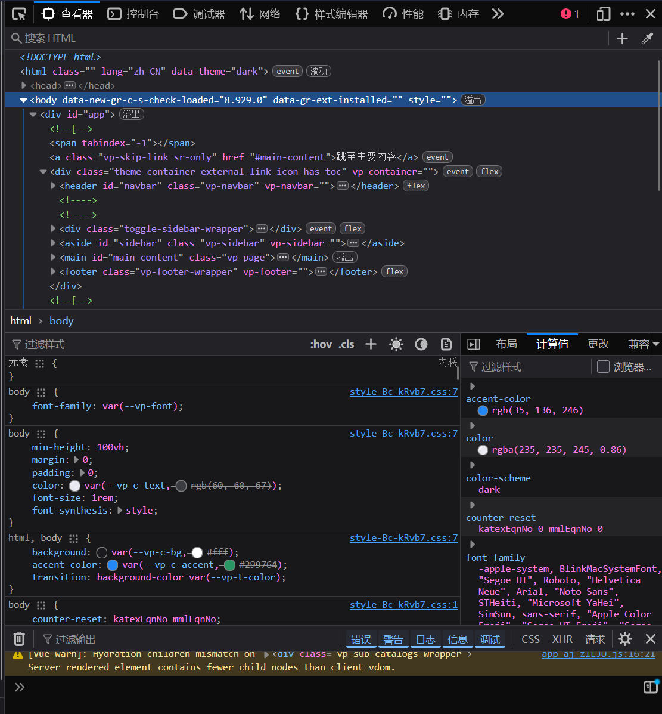
<p class="img-tip">浏览器中的开发者工具</p>

--

<div class="box-centered">
  <p class="text">几乎所有的主流浏览器都带有这个开发者工具。</p>
  <p class="text">它可以帮助你快速地浏览网页设计、js代码、网络请求状态等：</p>
</div>

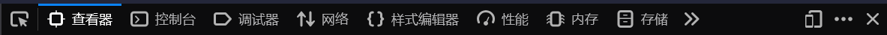
<p class="img-tip">开发者工具中的选项</p>

--

<div class="box-centered">
  <p class="text">当你打开开发者工具的查看器，并将鼠标移动到某个元素上并点击时</p>
  <p class="text">你可能会发现，开发者工具为你标出了这个元素在页面中的位置，以及它的一些元素细节：</p>
</div>

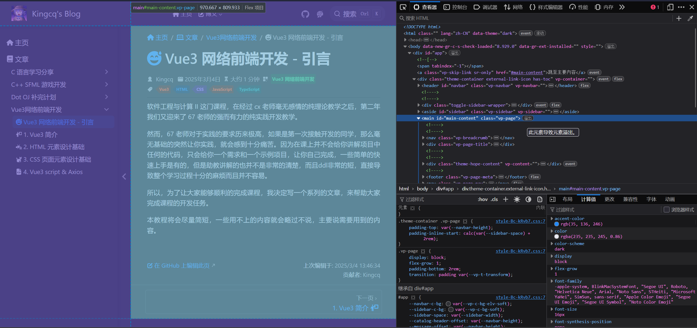
<p class="img-tip">开发者工具指出了元素位置、id 和 class 属性和 CSS 样式</p>

--

<div class="box-centered">
  <p class="text font-larger">当你浏览这些设计的异常漂亮的网站时，你有没有想过：</p>
  <p class="text font-larger">“这些网站是怎么被写出来的？我有机会能写出这样的网页吗？”</p>
</div>

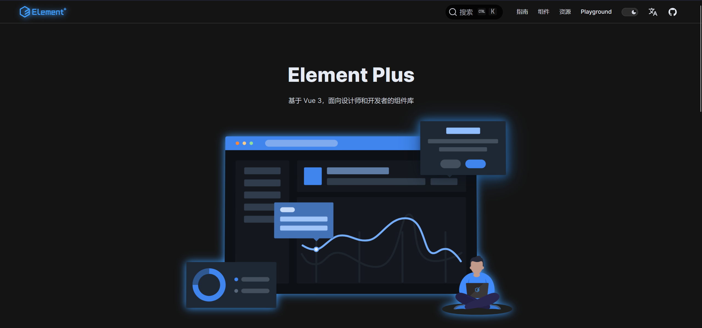
<p class="img-tip">看上去似乎非常精美的网站</p>

--

<div class="box-centered">
  <p class="text">答案自然是可行的，这也就是我们今天来此的目的：</p>
  <p class="text">我们将从 HTML、CSS 的一些基础用法切入，</p>
  <p class="text">逐渐为大家展开目前最流行的前端框架之一 —— Vue.js</p>
</div>
<div class="box-four-combo">
  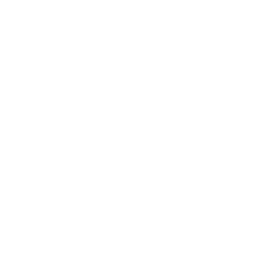
  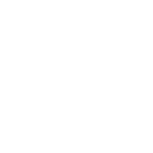
  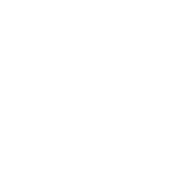
  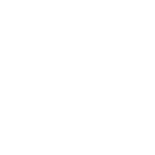
</div>

---

#### 二、HTML 基础

--

<div class="box-centered">
  <p class="text">超文本标记语言 （英语：HyperText Markup Language，简称：HTML）</p>
  <p class="text">这是一种用于创建网页的标准标记语言。HTML由浏览器解析并展示给用户：</p>
</div>


<p class="img-tip">[菜鸟教程] HTML 文件结构</p>

<div class="box-centered">
  <p class="text">这次，我们只需要关注 body 和 head 中的一些元素，它们是网页设计的核心。</p>
</div>

--

<div class="box-centered">
  <p class="title">HTML</p>
  <p class="text list">• HTML 是一种非常有特点的语言</p>

  ```html
  <div>
    标签可以拥有属性，它能用来指定标签的一些额外信息
    <p class="text-content" style="color: red;">
      一个标签总是以<strong>开始标签</strong>起始，
      以<strong>结束标签</strong>终止
    </p>
    一个完整的闭合标签及其内部子元素一同被称为一个元素
    当然，一个标签如果没有内容，它也可以在开始标签中直接关闭：
    
    <!-- ! HTML 也可以像这样添加注释 -->
  </div>
  ```
  <p class="text list">• 你可以使用任意名称作为 HTML 标签，但你需要自行为它设计样式</p>
  <p class="text list">• HTML 标签名称规范应当使用 <strong>小写字母，可以使用 '-' 号隔开单词</strong></p>
</div>

--

<div class="box-centered">
  <p class="title">常用标签</p>
  <p class="text">这些标签使用了 HTML 标准为他们指定的默认样式</p>
  <p class="text">当然，你也可以使用 CSS 设计你自己的标签样式，或者覆盖它们原本的样式。</p>
  <p class="text">这里，我们会分类简单了解一些在页面设计中最常用的标签。</p>
</div>

--

<div class="box-centered">
  <p class="title">块级标签</p>
  <p class="text">这些标签通常用来将内容分块，它们可以为内部内容添加一些默认样式。</p>
  <p style="margin: 0.4rem !important;"></p>
  <p class="text list"><strong>• div 标签</strong></p>
  <p style="margin: 0.4rem !important;"></p>
  <p class="text list">div 是一种通用的内容容器，它默认不包含任何语义和样式设计</p>
  <p class="text list">它通常被用来包裹其他标签，使页面不同区域分开，方便管理和单独设计内部样式</p>
  <p class="text list">div 在浏览器中显示时，内部元素通常会以新行来开始</p>
  <p style="margin: 0.8rem !important;"></p>
  <p class="text list"><strong>• span 标签</strong></p>
  <p style="margin: 0.4rem !important;"></p>
  <p class="text list">span 是一种通用的行内，默认没有任何特殊语义和样式设计</p>
  <p class="text list">它通常被用来编组元素以达到某种样式意图</p>
  <p class="text list">span 在浏览器中显示时，内部元素通常不会以新行来开始</p>
</div>

--

<div class="box-centered">
  <p class="title">文本标签</p>
  <p class="text">这些标签通常用来展示文本，并为文本添加样式设计</p>
  <p style="margin: 0.4rem !important;"></p>
  <p class="text list"><strong>• p 标签</strong></p>
  <p style="margin: 0.4rem !important;"></p>
  <p class="text list">p 表示文本的一个段落，它通常表现为与相邻块分隔的文本块</p>
  <p class="text list">它在浏览器中显示时，默认通常会以新行来开始</p>
  <p style="margin: 0.8rem !important;"></p>
  <p class="text list"><strong>• 标题标签</strong></p>
  <p style="margin: 0.4rem !important;"></p>
  <p class="text list">h1 - h6 标签表示文本的标题，它们通常表现为文本的标题</p>
  <p class="text list">它们在浏览器中显示时，默认通常会以新行来开始</p>
  <p class="text list">它们的大小从 h1 到 h6 逐渐变小</p>
</div>

--

<div class="box-centered">
  <p class="title">图片</p>
  <p class="text">img 标签用来展示图片，它通常表现为一个图片元素</p>
  <p class="text">它通常不会以新行来开始</p>
  <p class="text">需要 src 属性来指定图片的来源</p>
  <p class="text">需要 alt 属性来指定图片的替代文本，在阅读页面时会被读出来</p>
  <p class="text">可以用 width 和 height 属性来指定图片的宽高</p>

  ```html
  
  ```
  
</div>

--

<div class="box-centered">
  <p class="title">一个新概念</p>
  <p style="margin: 0.4rem !important;"></p>
  <p class="text list"><strong>• 语义标签</strong></p>
  <p style="margin: 0.4rem !important;"></p>
  <p class="text list">语义标签的使用关系到文本可读性和无障碍阅读</p>
  <p class="text list">在观感上，语义标签会为文本添加一些样式设计，使得它们相对更加突出</p>
  <p class="text list">在无障碍阅读上，语义标签会为文本添加一些额外的信息，比如需要重读</p>
  <p class="text list">在代码编写上，语义标签可以使代码可读性变强</p>
  <p class="text list">例如，被 strong 标签包裹的文本会加粗，并且在阅读页面时，会被重读。</p>
  <p class="text list">像这样：</p>
  <strong>Hello</strong>
</div>

--

<div class="box-centered">
  <p class="title">为什么要使用语义标签？</p>
  <p style="margin: 0.4rem !important;"></p>
  <p class="text">理论上，一切页面设计都可以用 div + CSS 解决</p>
  <p class="text">但是，相信你一定不希望看到这样的代码：</p>

  ```html
  <div class="container">
    <div class="container01">
      <div class="container01-1">
        <div class="p01-1-1"></div>
      </div>
    </div>
    <div class="container02">
      <div class="container02-1">
        <div class="p02-1-1"></div>
      </div>
    </div>
  </div>
  ```
</div>

--

<div class="box-centered">
  <p class="text">虽然说，这样的代码看起来很整齐，分块分的也很好</p>
  <p class="text">但是，这样的代码没有任何语义，实际读起来，总是会让人头晕眼花😵</p>
  <p class="text">而且，这样的代码在无障碍阅读上，也会让阅读器无法理解页面内容</p>
  <p class="text">这样写代码的最终结果只会同时痛击开发者和用户的大脑。</p>
  
  <p class="img-tip">大脑被强碱</p>
</div>

--

<div class="box-centered">
  <p class="title">块级语义标签</p>
  <p class="text">它们可以用来代替 div 这种无含义的包装器，增加可读性</p>
  <p class="text">例如，一个页面可以用这些语义标签来拆分：</p>
  
  <p class="img-tip">[菜鸟教程] 带语义的页面布局</p>
</div>

--

<div class="box-centered">
  <p class="title">内联文本语义标签</p>
  <p class="text">它们可以用来代替 span 这种无含义的包装器</p>
  <p class="text">用来定义单词、内容、或任意文字的语义、结构或样式。</p>
  <p style="margin: 0.4rem !important;"></p>
  <p class="text list"><strong>• a 标签</strong></p>
  <p style="margin: 0.4rem !important;"></p>
  <p class="text list"><a href="">a 标签用它的 href 属性 指定通向其它地址的超链接</a></p>
  <p style="margin: 0.4rem !important;"></p>
  <p class="text list"><strong>• strong 标签</strong></p>
  <p style="margin: 0.4rem !important;"></p>
  <p class="text list"><strong>strong 标签表示其内容十分重要，严肃或紧迫</strong></p>
  <p style="margin: 0.4rem !important;"></p>
  <p class="text list"><strong>• i 标签</strong></p>
  <p style="margin: 0.4rem !important;"></p>
  <p class="text list"><i>i 标签表示其内容是斜体的</i></p>
  <p style="margin: 0.4rem !important;"></p>
  <p class="text list"><strong>• sup 和 sub 标签</strong></p>
  <p style="margin: 0.4rem !important;"></p>
  <p class="text list"><sup>上标</sup> 和 <sub>下标</sub></p>
</div>

--

<div class="box-centered">
  <p class="title">小结一下</p>
  <p class="text">HTML 是整个网页页面的骨架，它允许你设计整个页面，并保存为文本文件</p>
  <p class="text">浏览器可以读取并显示这些内容</p>
  <p class="text">HTML 标签的编写非常简单，但应当注意尽可能多地使用含语义的标签</p>
</div>

---

#### 三、CSS 基础

--

<div class="box-centered">
  <p class="text">CSS (Cascading Style Sheets，层叠样式表）</p>
  <p class="text">这是一种用来为结构化文档添加样式（字体、间距和颜色等）的计算机语言</p>
</div>


<p class="img-tip">[菜鸟教程] CSS 单个规则结构</p>

<div class="box-centered">
  <p class="text">在这一小节中，我们将了解一些简单好用并且十分常用的 CSS 属性。</p>
</div>

--

<div class="box-centered">
  <p class="title">CSS</p>
  <p class="text list">• 一条单独的 CSS 规则大概长这样：</p>

  ```css
  p {
    /* 你可以像这样在 CSS 中编写注释 */
    color: red;
    line-height: 1.5rem;
    text-align: center;
    font-weight: bold !important;
  }
  ```
  <p class="text list">• 你可以选择任何一个/一些元素，为它们指定样式</p>
  <p class="text list">• 规则中指定了许多属性，这些属性决定了浏览器渲染元素的方式</p>
  <p class="text list">• 一些属性可能存在部分覆盖（如 padding 和 padding-top），总是以后定义的为准，如果父子元素指定的样式不一样，则以子元素的样式为准。</p>
  <p class="text list">• 如果某一个你很需要的设计属性在之后不得不被覆盖，而且你没有办法修改顺序，你可以在属性具体值之后，“;” 之前加上 “!important” 来强制使用该属性。</p>
</div>

--

<div class="box-centered">
  <p class="title">CSS 选择器</p>
  <p class="text">CSS 选择器用来指定本条规则到底对哪些标签生效</p>

  <p class="text list">• 通配选择器：选择页面中的所有元素，以 `*` 开头</p>
  <p class="text list">• 元素选择器：选择页面中的所有指定元素，例如 `div`、`p`、`a` 等。</p>
  <p class="text list">• 类选择器：选择页面中所有具有指定类名的元素，以 `.` 开头，例如 `.my-class`。</p>
  <p class="text list">• ID 选择器：选择页面中具有指定 ID 的元素，以 `#` 开头，例如 `#my-id`。</p>
  <p class="text list">• 属性选择器：选择页面中具有指定属性的元素，例如 `[type="text"]`。</p>
  <p class="text list">• 伪类选择器：选择页面中具有指定状态的元素，例如 `:hover`（鼠标悬停）。</p>
  <p style="margin-top: 0.4rem !important;"></p>
  <p class="text">类选择器一般是最常用的，因为它可以兼顾泛用性和特异性。</p>
</div>

--

<div class="box-centered">
  <p class="title">组合你的选择器</p>
  <p class="text list">• 你可以使用逗号来组合多个选择器，使它们共享同一条规则（p, h1）</p>
  <p class="text list">• 你可以使用空格来组合多个选择器（.class-name .another-class-name）：</p>

  ```html
  <element class="class-name">
  …
    <target class="another-class-name">
  ```
  <p class="text list">• 你可以连接类选择器或 ID 选择器（.class-name.another-class-name#id-name）：</p>

  ```html
  <target class="class-name another-class-name" id="id-name">
  ```
  <p class="text list">• 你可以用 '>' 来表示严格的子元素（.class-name>.another-class-name）：</p>

  ```html
  <element class="class-name">
    <target class="another-class-name">
  ```
</div>

--

<div class="box-centered">
  <p class="title">长度单位选择</p>
  <p style="margin: 0.4rem !important;"></p>
  <p class="text list"><strong>• px 像素单位</strong></p>
  <p class="text list">px 是最常用的长度单位，它代表了屏幕的一个像素</p>
  <p class="text list">px 在同一分辨率下表现非常好，但对于过低/高的分辨率会造成比例失衡</p>
  <p style="margin: 0.4rem !important;"></p>
  <p class="text list"><strong>• rem 字体尺寸单位</strong></p>
  <p class="text list">rem 的大小不是固定的，它总是等于 HTML 根元素设定的 font-size 大小</p>
  <p class="text list">HTML 根元素在任何一个浏览器上的默认 font-size 都是 16px</p>
  <p class="text list">可以通过修改根元素的 font-size 来适配不同的分辨率</p>
</div>

--

<div class="box-centered">
  <p class="title">暴力布局</p>
  <p class="text list"><strong>• flex 弹性盒子</strong></p>
  <p class="text list">display: flex; 会为你的页面元素指定布局方式为 flex</p>
  <p class="text list">flex 是最暴力但是也最好用的布局方式</p>
  <p class="text list">我们会讲述它最常用的几个布局属性</p>
</div>

--

<div class="box-centered">
  <p class="title">flex 布局原理</p>
  <p class="text list">采用 flex 布局的元素被称为 flex 容器</p>
  <p class="text list">它的所有子元素自动成为容器成员，被称为 flex 项目</p>
  <p class="text list">容器默认存在两根轴：水平的主轴和与其垂直的交叉轴</p>
  <p class="text list">你可以通过调整 flex-direction: column 来修改主轴方向</p>
  <p class="text list">主轴的方向决定了项目的排列方向</p>
  <p class="text list">你也可以在 column 或者 row 后面加上 'reverse' 来使元素反向排列</p>
</div>

--

<div class="box-centered">
  <p class="title">flex 布局属性</p>
</div>

--

<div class="box-centered">
  <p class="title">flex 布局属性</p>
  <p class="text list"><strong>• align-items</strong></p>
  <p class="text list">align-items 属性决定了元素在交叉轴上的对齐方式</p>
  <p class="text list">它的属性值有</p>
  <p class="text list">flex-start：交叉轴的起点对齐。</p>
  <p class="text list">flex-end：交叉轴的终点对齐。</p>
  <p class="text list">center：交叉轴的中点对齐。</p>
  <p class="text list">baseline: 项目的第一行文字的基线对齐。</p>
  <p class="text list">stretch（默认值）：如果项目未设置高度或设为auto，将占满整个容器的高度</p>
</div>

--

<div class="box-centered">
  <p class="title">align-items</p>
  
  <p class="img-tip">[CSDN] align-items 属性</p>
</div>

--

<div class="box-centered">
  <p class="title">flex 布局属性</p>
  <p class="text list"><strong>• justify-content</strong></p>
  <p class="text list">justify-content 属性决定了元素在主轴上的对齐方式</p>
  <p class="text list">它的属性值有</p>
  <p class="text list">flex-start（默认值）：左对齐</p>
  <p class="text list">flex-end：右对齐</p>
  <p class="text list">center：居中</p>
  <p class="text list">space-between：两端对齐，项目之间的间隔都相等。</p>
  <p class="text list">space-around：每个项目两侧的间隔相等。</p>
</div>

--

<div class="box-centered">
  <p class="title">justify-content</p>
  
  <p class="img-tip">[CSDN] justify-content 属性</p>
</div>

--

<div class="box-centered">
  <p class="title">flex-wrap</p>
  <p class="text list">flex-wrap 属性决定了元素在主轴上是否换行</p>
  <p class="text list">nowrap（默认）：不换行。</p>
  <p class="text list">你可以为它指定 wrap 来使元素自行换行：</p>
  
  <p class="img-tip">[CSDN] flex-wrap 自动换行元素</p>
</div>

--

<div class="box-centered">
  <p class="title">flex</p>
  <p class="text list">flex 属性定义项目的放大比例，默认为 0</p>
  <p class="text list">即如果存在剩余空间，也不放大</p>
  <p class="text list">如果 flex 值不为零，这些项目将按 flex 的比例等分剩余空间</p>
  <p class="text list">例如，如果一个项目的flex属性为2，其他项目都为1，则前者占据的剩余空间将比其他项多一倍：</p>
  
  <p class="img-tip">[CSDN] flex 按比例拉伸元素</p>
</div>

--

#### 示例环节

---

#### 四、Vue.js

--

<div class="box-centered">
  <p class="title">Vue.js</p>
  <p class="text">Vue.js 是一款非常火爆的前端项目框架，它基于标准 HTML、CSS 和 JavaScript 构建，并提供了一套声明式的、组件化的编程模型，可以高效地开发用户界面。无论是简单还是复杂的界面，Vue 都可以胜任。是目前生产环境中使用最广泛的 JavaScript 框架之一。</p>
</div>

--

<div class="box-centered">
  <p class="title">为什么要选择前端框架</p>
  <p class="text">传统的 JavaScript 在开发过程中有不少弊端，大概概括有以下问题：</p>
  <p class="text list">1. 开发效率低</p>
  <p class="text list">2. 性能优化困难</p>
  <p class="text list">3. 可维护性差</p>
  <p class="text list">4. 缺乏生态系统支持</p>
  <p class="text list">5. 不利于团队协作</p>
</div>

--

<div class="box-centered">
  <p class="title">比如说，我们要为某个按钮添加点击动画……</p>

  ```js
  var button = document.getElementById('myButton');
  button.addEventListener('click', function(event) {
      // 创建圆形遮罩元素
      var ripple = document.createElement('div');
      ripple.classList.add('ripple');

      // 设置遮罩的初始位置和大小
      var rect = button.getBoundingClientRect();
      var x = event.clientX - rect.left;
      var y = event.clientY - rect.top;

      // 设置遮罩的中心位置
      ripple.style.left = `${x}px`;
      ripple.style.top = `${y}px`;

      // 设置遮罩的初始大小（足够大以覆盖按钮）
      ripple.style.width = `${Math.max(rect.width, rect.height)}px`;
      ripple.style.height = `${Math.max(rect.width, rect.height)}px`;

      // 添加遮罩到按钮中
      button.appendChild(ripple);

      // 动画效果：逐渐变大并降低透明度
      setTimeout(() => {
          ripple.style.transform = `translate(-50%, -50%) scale(2.5)`; // 放大波纹
          ripple.style.opacity = '0'; // 逐渐降低透明度
      }, 0);

      // 在动画结束后删除遮罩
      setTimeout(function() {
          button.removeChild(ripple);
      }, 500);
  });
  ```
</div>

--

<div class="box-centered">
  <p class="title">创建第一个 Vue.js 应用</p>
</div>

--

<div class="box-centered">
  <p class="title">安装 node.js 运行时</p>
  <p class="text">Vue.js 运行在 node.js 运行时之上，因此我们需要先安装 node.js 运行时</p>
  <p class="text">node.js 在各个平台上安装都很简易，具体如下：</p>
  <p class="text">Windows（>= 10）:</p>

  ```sh
  winget install OpenJS.NodeJS.LTS
  ```
  <p class="text">Ubuntu 及类似发行版：</p>

  ```sh
  sudo apt install nodejs
  ```
  <p class="text">MacOS 使用 HomeBrew：</p>

  ```sh
  brew install nodejs
  ```
</div>

--

<div class="box-centered">
  <p class="title">创建 Vue.js 项目</p>
  <p class="text">node.js 运行环境附带了一个名为 npm 的包管理器，你可以用它创建新的运行环境</p>
  <p class="text">使用 Vue.js 提供的脚手架工具 create-vue，你可以创建一个新的 Vue 项目文件夹：</p>

  ```sh
  npm init vue@latest
  ```
</div>

--

<div class="box-centered">
  <p class="title">创建 Vue.js 项目</p>
  <p class="text">这一系列指令会安装并执行 create-vue，你会看到一些可选功能提示：</p>
</div>
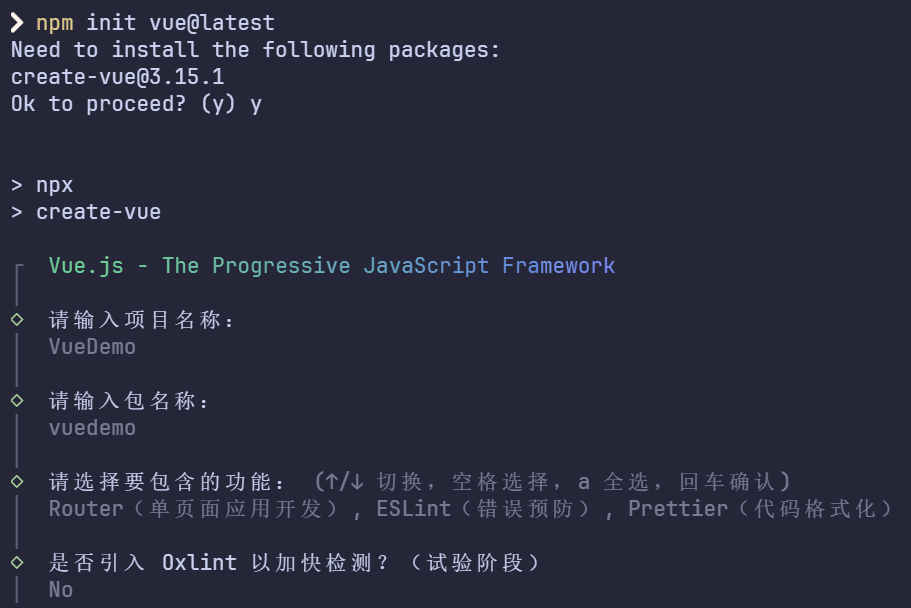
<p class="img-tip">create-vue 创建 Vue 项目</p>
<div class="box-centered">
  <p class="text">这次，我们将额外添加 Router（单页面应用开发） 的功能。</p>
</div>

--

<div style="
  display: flex;
">
  <div class="box-left">
    <p class="title">Vue.js 项目文件结构</p>
    <p class="text">创建完成后，你会看到这样的文件结构 👉</p>
    <p class="text">我们挑对实际开发比较重要的文件来讲：</p>
  </div>
  <div class="box-centered">
    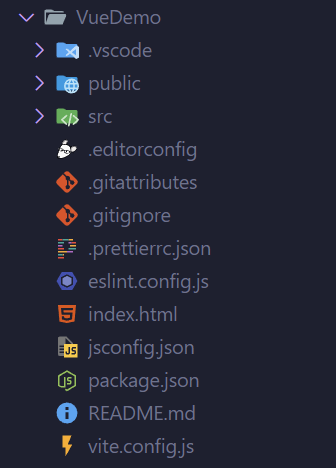
    <p class="img-tip">Vue.js 项目文件结构</p>
  </div>
</div>

--

<div style="
  display: flex;
">
  <div class="box-left">
    <p class="title">package.json 👉</p>
    <p class="text">package.json 里面包含了项目的配置，包括：</p>
    <p class="text list">1. 项目名称、版本和类型</p>
    <p class="text list">2. 是否允许发布到 npm</p>
    <p class="text list">3. 项目脚本命令行</p>
    <p class="text list">4. 项目依赖项</p>
  </div>
  <div class="box-centered">
    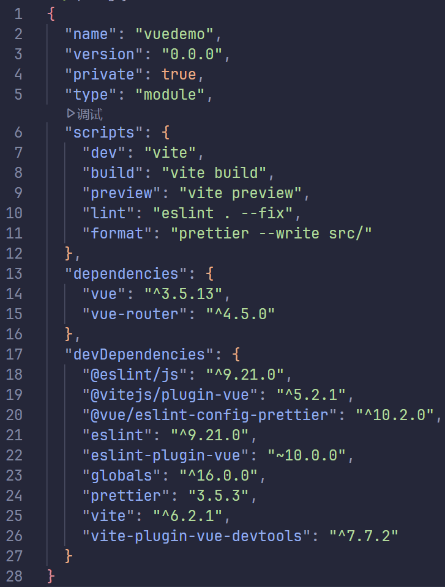
    <p class="img-tip">package.json</p>
  </div>
</div>

--

<div style="
  display: flex;
">
  <div class="box-left">
    <p class="title">vite.config.js 👉</p>
    <p class="text">vite.config.js 里面包含了开发服务器的配置：</p>
  </div>
  <div class="box-centered">
    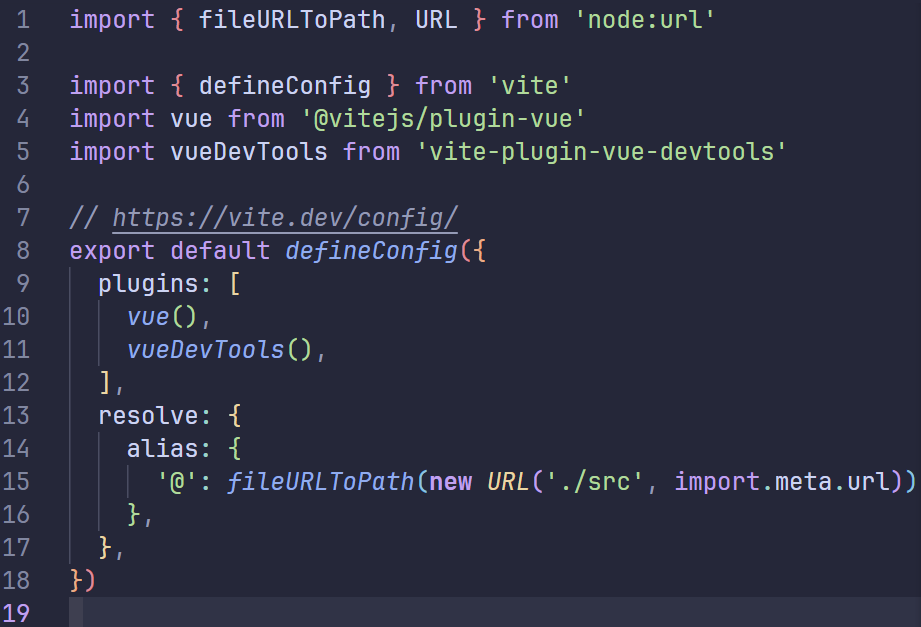
    <p class="img-tip">vite.config.js</p>
  </div>
</div>

--

<div style="
  display: flex;
">
  <div class="box-left">
    <p class="title">vite.config.js 👉</p>
    <p class="text">你可以在这里调整一些服务器属性</p>
    <p class="text">比如，将服务器开放到局域网访问</p>
    <p class="text">同时，将 '/api' 路由前缀的请求转发到本地另一个端口（通常是后端服务器所在的位置）</p>
    <p class="text">转发解决了请求的跨域问题，同时使得服务器所需要开放访问的端口更少。</p>
    <p class="text"><del>跨域问题在这里并不会细说</del></p>
  </div>
  <div class="box-centered">
    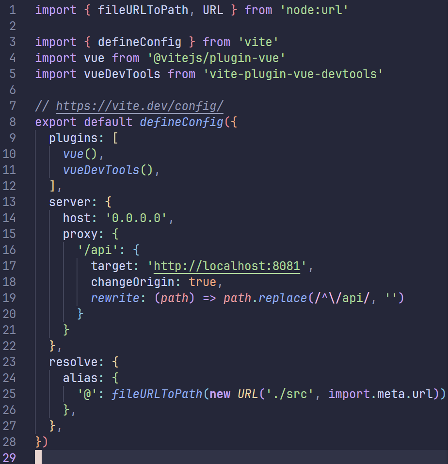
    <p class="img-tip">更牛逼的 vite.config.js</p>
  </div>
</div>

--

<div style="
  display: flex;
">
  <div class="box-left">
    <p class="title">index.html 👉</p>
    <p class="text">就是你想的那个东西，没错，入口文件：</p>
    <p class="text">在这里，我们可以看到，它导入了 /src/main.js</p>
    <p class="text">这是 Vue.js 的入口脚本，它默认会整合你编写的所有内容，并将内容挂载到 id="app" 的页面元素上</p>
    <p class="text">同时，它还使用了 public 文件夹中的 favicon.ico，作为标签页的图标</p>
  </div>
  <div class="box-centered">
    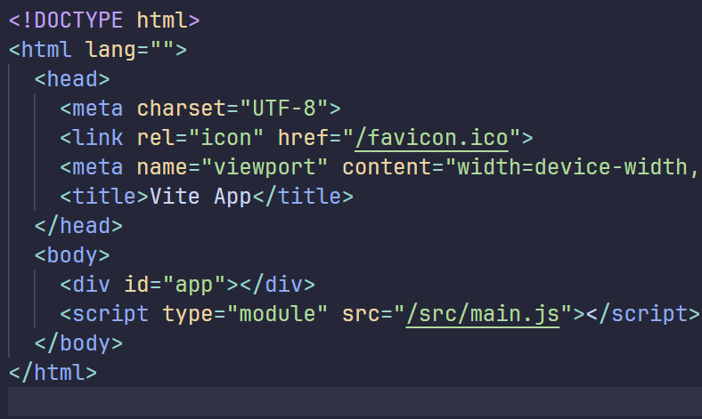
    <p class="img-tip">index.html</p>
  </div>
</div>

--

<div style="
  display: flex;
">
  <div class="box-left">
    <p class="title">Vue.js 项目文件结构</p>
    <p class="text">而对于 src/ 源码文件夹 👉</p>
    <p class="text">• assets/ 文件夹中存放了全局的 CSS 设计，默认是 Vue 的配色</p>
    <p class="text">• components/ 文件夹中存放了所有自定义的组件</p>
    <p class="text">• router/ 文件夹中的 index.js 描述了所有的网页访问路径</p>
    <p class="text">• views/ 文件夹中存放了所有单独的页面设计</p>
    <p class="text">• App.vue 是主组件，它是默认的 Vue.js 的入口组件</p>
    <p class="text">• main.js 是 Vue.js 的入口脚本</p>
    <p class="text">我们的开发主要围绕这一个文件夹展开。</p>
  </div>
  <div class="box-centered">
    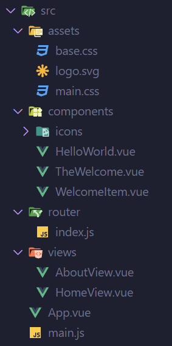
    <p class="img-tip">源码文件夹结构</p>
  </div>
</div>

--

<div class="box-centered">
  <p class="text">先看 main.js：</p>

  ```js
  import './assets/main.css'
  import { createApp } from 'vue'
  import App from './App.vue'
  import router from './router'
  const app = createApp(App)
  app.use(router)
  app.mount('#app')
  ```
  <p class="text">可以看到，main.js 的结构非常简单，意图也非常明显：</p>
  <p class="text">1. 导入全局 CSS 设计</p>
  <p class="text">2. 使用 createApp 创建一个新的 app 实例</p>
  <p class="text">3. 从 router 引入模块 router 并注册到 app 实例上</p>
  <p class="text">4. 将 app 实例挂载到 id="app" 的页面元素上</p>
</div>

--

<div class="box-centered">
  <p class="text">再看 App.vue：</p>
  <p class="text">默认生成的 App.vue 太复杂了，最简单写法就是这样子的：</p>

  ```vue
  <template>
    <RouterView />
  </template>
  ```
  <p class="text">里面使用了 Vue-Router 的 RouterView 组件，它会根据访问的路由选择显示的页面。</p>
</div>

--

#### router 的存在意义，以及工作原理

--

<div class="box-centered">
  <p class="title">什么是单页应用？</p>
  <p class="text list"><strong>• 传统的多页应用模式</strong></p>
  <p class="text list">传统的前端解决方案是通过在每个路由上都放置一个完整的页面来实现的</p>
  <p class="text list">当在各个页面之间跳转时，浏览器需要重新加载其他的页面</p>
  <p class="text list">对于较为复杂的页面，重新加载会带来大量的重复请求和闪屏，对用户体验非常不友好</p>
  <p class="text list">如果你还想实现一些页面的转场动画，那很抱歉，闪屏会无情地打断你流畅的动画</p>
</div>

--

<div class="box-centered">
  <p class="title">什么是单页应用？</p>
  <p class="text list"><strong>• 单页应用模式</strong></p>
  <p class="text list">顾名思义，它只需要加载一个独立的页面</p>
  <p class="text list">这实际上只是一个外壳页面，它会根据不同的 URL，选择合适的页面片段展示出来</p>
</div>

--

<div class="box-centered">
  <p class="title">单页应用，遥遥领先！</p>
  <p class="text list"><strong>• 单页应用模式的优点</strong></p>
  <p class="text list">单页应用模式首先解决了页面之间跳转的闪屏问题和重复请求问题</p>
  <p class="text list">单页应用的各个页面片段之间的数据可以互通，而不需要借助 cookie 或者 localStorage 实现，同时提高了数据复用的效率</p>
  <p class="text list">因为都在同一页面，想要实现页面之间的转场动画也十分轻松</p>
</div>

--

<div class="box-centered">
  <p class="title">配置你的 router</p>
  <p class="text">页面不是自动和 URL 绑定的，你需要在 router 中定义好具体怎么绑定：</p>
</div>
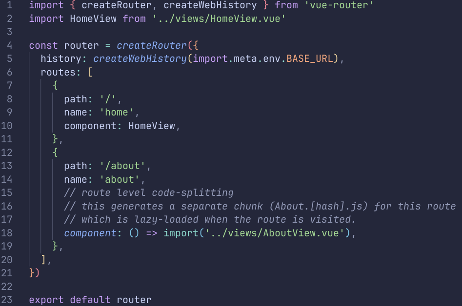
<p class="img-tip">router/index.js</p>

--

<div style="
  display: flex;
">
  <div class="box-left">
    <p class="title">一些进阶用法</p>
    <p class="text">• URL 总是按照编写的先后顺序进行匹配</p>
    <p class="text">• 你可以用正则表达式抓取剩余的跳转请求，并设置重定向</p>
    <p class="text">• 你可以使用 beforeEach 方法为页面跳转添加拦截器，预处理一些东西</p>
    <p class="text list">to: 跳转到哪个路由去</p>
    <p class="text list">from: 从哪个路由跳转过来</p>
    <p class="text list">next: 调用 next() 继续执行跳转，或者调用 next('/path') 跳转到其他路由</p>
  </div>
  <div class="box-centered">
    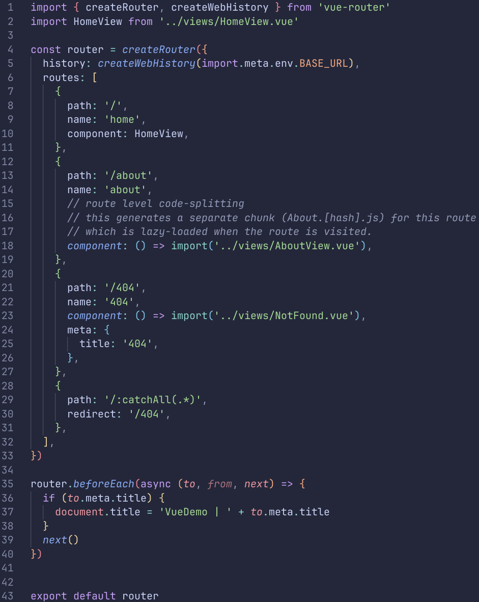
    <p class="img-tip">router/index.js</p>
  </div>
</div>

--

<div class="box-centered">
  <p class="title">Vue 单文件组件</p>
  <p class="text">Vue 的页面和组件都是使用单文件组件的方式定义的</p>
  <p class="text">也就是你在 views 和 components 文件夹里看到的内容</p>
  <p class="text">每一个 *.vue 文件都由三种顶层语言块构成：template、style 和 script</p>
  <p class="text">它们是网页开发中 HTML、CSS 和 JavaScript 三种语言经典组合的自然延伸</p>
  <p class="text">你也可以添加一些自定义块</p>
</div>

--

<div class="box-centered">
  <p class="title">示例代码</p>
  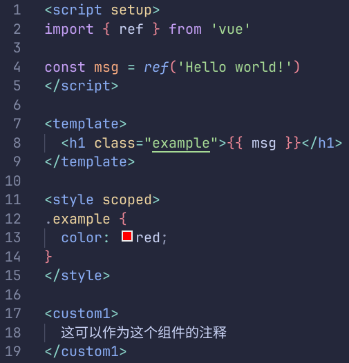
  <p class="img-tip">一个简短的 Vue 单文件组件</p>
  <p class="text"><a href="https://cn.vuejs.org/api/sfc-spec.html#language-blocks">语言块要求</a></p>
</div>

--

<div class="box-centered">
  <p class="title"><a href="https://cn.vuejs.org/tutorial/#step-1">Vue 互动教程</a></p>
</div>

--

<div class="box-centered">
  <p class="title">function 和箭头函数</p>
  <p class="text">JavaScript 中有两种函数定义方式：function 和箭头函数：</p>

  ```js
  function foo() {
    console.log('foo')
  }

  const bar = () => {
    console.log('bar')
  }
  ```
  <p class="text">它们有什么区别呢？</p>
</div>

--

<div class="box-centered">
  <p class="text">• 对于 function</p>
  <p class="text list">上下文指向函数调用时的上下文</p>
  <p class="text list">实际上用起来，很容易出现上下文指向混乱的问题，导致一些变量访问不到</p>
  <p class="text list">比如，当你引用某一个 function，它的上下文就不再指向实例了：</p>

  ```js
  class User {
    constructor() {
      this.name = "Alice"
    }
    sayHello() {
      console.log(`Hello, my name is ${this.name}`);
    }
  }
  let user = new User()
  user.sayHello(); // Hello, my name is Alice

  const sayHelloFunc = user.sayHello;
  sayHelloFunc(); // Uncaught TypeError: this is undefined
  ```
</div>

--

<div class="box-centered">
  <p class="text">• 对于箭头函数</p>
  <p class="text list">上下文指向函数定义时的上下文</p>
  <p class="text list">在任何地方，都可以访问到上下文中的所有变量，即使是引用</p>

  ```js
  class User {
    constructor() {
      this.name = "Alice"
    }
    sayHello = () => {
      console.log(`Hello, my name is ${this.name}`);
    }
  }
  let user = new User()
  user.sayHello(); // Hello, my name is Alice

  const sayHelloFunc = user.sayHello;
  sayHelloFunc(); // Hello, my name is Alice
  ```
  <p class="text">因此，为了避免混乱，请尽量使用箭头函数</p>
</div>

--

<div class="box-centered">
  <p class="title">异步 JavaScript</p>
  <p class="text">众所周知，JavaScript 是一种单线程的语言</p>
  <p class="text">但是，当你访问一个网站，然后一把扯掉你的网线，再试着让它发出网络请求</p>
  <p class="text">你就会发现，在网络请求被阻塞的情况下，网站还能响应你的其他操作</p>
  <p class="text">这是怎么一回事呢？</p>
</div>

--

<div class="box-centered">
  <p class="title">• 协程</p>
  <p class="text">在操作系统课程中，我们学到了协程的概念</p>
  <p class="text">协程就是多个任务在同一个线程上运行，当一个协程正在运行时，会做以下事情：</p>
  <p class="text list">1. 完成用户指定的事务</p>
  <p class="text list">2. 如果某个事务需要等待其返回（如网络请求），则挂起当前协程，切换到其他协程</p>
  <p class="text list">3. 当等待事务返回，并且切换回当前协程时，继续执行后续事务</p>
  <p class="text">异步是一种概念，指的是两个步骤的执行时间不固定，而异步的实现方式就是协程</p>
  <p class="text">协程通过这样的做法，在保证了编写过程中思维连贯性的情况下，实现了线程的最大化利用</p>
</div>

--

<div class="box-centered">
  <p class="title">• 协程</p>
  
  <p class="img-tip">[知乎] 各种任务方式（python）</p>
</div>

--

<div class="box-centered">
  <p class="title">异步 JavaScript</p>
  <p class="text">在 node.js 运行时下，JavaScript 使用 async/await 和 Promise 进行异步编程</p>
  <p class="text">首先，我们可以用 async 定义一个函数：</p>

  ```js
  const fn = async () => {
    setTimeout(() => {
      console.log('foo bar!')
    }, 2000)
    return "hello, world!"
  }

  console.log(fn()) // Promise { 'hello, world!' }
  ```
  <p class="text">可以看到，这个函数返回了一个 Promise 对象</p>
  <p class="text">如果内部结果已经返回，它会被封装在 Promise 当中</p>
</div>

--

<div class="box-centered">
  <p class="title">异步 JavaScript</p>

  ```js
  const fn = async () => {
    setTimeout(() => {
      console.log('foo bar!')
    }, 2000)
    return "hello, world!"
  }

  console.log(fn()) // Promise { 'hello, world!' }
  ```
  <p class="text">同时，我们在 fn 中调用了 setTimeout 方法，它会在 2 秒之后触发我们提供的回调函数</p>
  <p class="text">你会发现，在运行时，fn() 立刻就返回了结果，过了 2 秒之后才触发 "foo bar!" 的输出</p>
</div>

--

<div class="box-centered">
  <p class="title">异步 JavaScript</p>

  ```js
  const fn = async () => {
    setTimeout(() => {
      console.log('foo bar!')
    }, 2000)
    return "hello, world!"
  }

  console.log(fn()) // Promise { 'hello, world!' }
  ```
  <p class="text">这是因为，setTimeout 内部启动了一个异步任务</p>
  <p class="text">这个任务会自行阻塞 2 秒，在这个过程中，它会挂起，让 JavaScript 执行其它任务</p>
  <p class="text">2 秒等待完毕后，它会执行回调方法并返回。</p>
</div>

--

<div class="box-centered">
  <p class="title">异步 JavaScript</p>
  <p class="text">但是如果我想在这里等待方法回调完成，再返回 "hello, world!" 呢？</p>

  ```js
  const fn = async () => {
    setTimeout(() => {
      console.log('foo bar!')
    }, 2000)
    return "hello, world!"
  }

  console.log(fn()) // Promise { 'hello world!' }
  ```
</div>

--

<div class="box-centered">
  <p class="title">• await</p>
  <p class="text">于是，await 便出现了：</p>

  ```js
  const fn = async () => {
    return 'hello, world!'
  }

  const waitFn = async () => {
    const result = await fn()
    console.log(result) // hello, world!
  }
  ```
  <p class="text">await 只允许在 async 方法中使用</p>
  <p class="text">它会阻塞当前异步任务，直到等待的异步任务返回结果，并将结果从 Promise 中取出来</p>
</div>

--

<div class="box-centered">
  <p class="title">• Promise</p>
  <p class="text">同时，我们还需要掌握 Promise 的用法：</p>

  ```js
  const fn = () => {
    return new Promise((resolve, reject) => {
      setTimeout(() => {
        resolve('hello, world!')
      }, 2000)
    })
  }
  let result = fn()
  console.log(result) // Promise { <state>: "pending" }
  // 等待一秒后
  console.log(result) // Promise { <state>: "fulfilled", <value>: "hello, world!" }
  ```
</div>

--

<div class="box-centered">
  <p class="title">• Promise</p>

  ```js
  const fn = () => {
    return new Promise((resolve, reject) => {
      setTimeout(() => {
        resolve('hello, world!')
      }, 2000)
    })
  }
  ```
  <p class="text">new Promise((resolve, reject) => {}) 会创建一个 Promise 对象，传入方法会立刻开始执行</p>
  <p class="text">resolve 和 reject 参数分别代表成功和失败时的回调函数</p>
  <p class="text">直到方法调用 resolve 或者 reject 表明 Promise 已经返回，Promise 才算真正结束</p>
</div>

--

<div class="box-centered">
  <p class="title">异步 JavaScript</p>
  <p class="text">这下有办法了！我们可以用箭头函数的特性，在回调中 resolve 我们创建的 Promise：</p>

  ```js
  const delay = (ms) => {
    return new Promise((resolve, reject) => {
      setTimeout(() => {
        resolve('Done!')
      }, ms)
    })
  }
  ```
  <p class="text">这样，delay 方法返回的 Promise 会在 ms 毫秒后返回 "Done!"</p>
</div>

--

<div class="box-centered">
  <p class="title">异步 JavaScript</p>
  <p class="text">现在，我们就可以用 await 来等待 Promise 的结果了：</p>

  ```js
  const fn = async () => {
    const result = await delay(2000)
    console.log(result) // Done!
  }

  fn()
  ```
  <p class="text">等待一秒后，我们会看到 "Done!" 的输出</p>
</div>

--

<div class="box-centered">
  <p class="title">异步 JavaScript</p>
  <p class="text">有的时候，我们只需要调用一下异步方法，并不求立马获取到它的结果</p>
  <p class="text">但我们又会希望在异步方法结束后能有一个回调（比如说请求完成后弹窗通知）</p>
  <p class="text">这种时候，我们可以使用 Promise 的 then 和 catch 方法，它们都接受一个函数作为参数</p>
  <p class="text">它们分别会在 Promise.resolve() 和 Promise.reject() 调用的时候回调提供的函数</p>
</div>

--

<div class="box-centered">
  <p class="title">异步 JavaScript</p>

  ```js
  const fn = () => {
    delay(2000).then((result) => {
      console.log(result) // Done!
    })
  }

  fn()
  ```
  <p class="text">这样的操作不会阻塞当前的线程，也不会影响预期的结果。</p>
</div>

--

<div class="box-centered">
  <p class="title">Axios 网络请求库</p>
  <p class="text">Axios 是一个基于 promise 的网络请求库，它提供了通用的，易于拓展的网络请求接口</p>
  <p class="text">这是一款非常常用的网络请求库，同时前端也离不开网络请求</p>
</div>

--

<div class="box-centered">
  <p class="title">Axios 网络请求库</p>
  <p class="text">Axios 的请求编写起来非常的直观，像这样：</p>

  ```js
  Axios.get('/api/user').then((response) => {
    console.log(response.data) // 请求返回的 json 数据
  }).catch((error) => {
    console.error(error) // 请求失败，error.response 中包含了返回内容
  });
  ```
  <p class="text">Axios.get() 返回了一个 Promise 对象，当请求完成后，将会在 Promise 中返回结果</p>
</div>

--

<div class="box-centered">
  <p class="title">Axios 网络请求库</p>
  <p class="text"><strong>• 常见错误</strong></p>
  <p class="text">如果你对 Promise 不够了解，相信你会写出这样的代码：</p>

  ```js
  const fetch = () => {
    let result = null;
    Axios.get('/api/user').then((response) => {
      result = response.data;
    }).catch((error) => {
      console.error(error);
    });
    // 假设这里你想要使用 result 的结果
    console.log(result); // undefined
  }
  ```
  <p class="text">这样的后果？undefined！</p>
</div>

--

<div class="box-centered">
  <p class="title">Axios 网络请求库</p>
  <p class="text"><strong>• 常见错误</strong></p>
  <p class="text">解决方案非常简单，因为是箭头函数，所以添加上一个 await 就行了：</p>

  ```js
  const fetch = () => {
    let result = null;
    await Axios.get('/api/user').then((response) => {
      result = response.data;
    }).catch((error) => {
      console.error(error);
    });
    // 假设这里你想要使用 result 的结果
    console.log(result);
  }
  ```
</div>

--

<div class="box-centered">
  <p class="title">Axios 网络请求库</p>
  <p class="text"><strong>• 常见错误</strong></p>
  <p class="text">或者，你也可以直接舍去 Promise？</p>

  ```js
  const fetch = async () => {
    let result = null;
    try {
      result = await Axios.get('/api/user');
    } catch (error) {
      console.error(error);
    }
    console.log(result);
  }
  ```
</div>

--

<div class="box-centered">
  <p class="title">Axios 网络请求库</p>
  <p class="text">你也许会发现，Axios 发送的请求都是互相独立的，如果后端服务器尝试设置你的 cookie，或者你想让自己的每一条请求都附带登录信息，它总是会丢失，这怎么办呢？</p>
  <p class="text">Axios 提供了 axios.create() 方法，供你创建一个 axios 实例，像这样：</p>

  ```js
  const instance = axios.create({
    baseURL: 'https://some-domain.com/api/', // 设置请求的根路径
    timeout: 1000, // 设置请求超时时间
    withCredentials: true, // 允许跨域请求携带 cookie
  });
  ```
</div>

--

<div class="box-centered">
  <p class="title">Axios 网络请求库</p>
  <p class="text">作为一个合格的网络请求模块，你也可以为这个实例创建 请求拦截器 和 响应拦截器：</p>
  <p class="text">请求拦截器：</p>

  ```js
  //当前实例的拦截器，对所有要发送给后端的请求进行处理，在其中加入token
  instance.interceptors.request.use(
    config => {
      if (localStorage.getItem('token')) {
        config.headers['token'] = localStorage.getItem('token')
      }
      return config
    },
    error => {
      console.log(error);
      return Promise.reject();
    }
  )
  ```
</div>

--

<div class="box-centered">
  <p class="title">Axios 网络请求库</p>
  <p class="text">作为一个合格的网络请求模块，你也可以为这个实例创建 请求拦截器 和 响应拦截器：</p>
  <p class="text">响应拦截器：</p>

  ```js
  //当前实例的拦截器，对所有从后端收到的请求进行处理，检验http的状态码
  instance.interceptors.response.use(
    response => {
      if (response.status === 200) {
        return response;
      } else {
        return Promise.reject();
      }
    },
    error => {
      return Promise.reject();
    }
  )
  ```
</div>

--

<div class="box-centered">
  <p class="title">Axios 网络请求库</p>
  <p class="text">你可以创建一个文件，默认导出这个 axios 实例</p>
  <p class="text">在其它地方都不使用 axios 包本身而使用这个实例即可：</p>

  ```js
  export const API = axios.create({})

  // 在其它地方
  import { API } from './api.js'
  API.get('/api/user').then((response) => {
    // ...
  })
  ```
</div>

---

#### 五、总结

--

<div class="box-centered">
  <p class="title">在这次的分享中，我们学会了：</p>
  <p class="text list">1. 如何编写 html 代码</p>
  <p class="text list">2. 如何编写一些简单的 css 代码</p>
  <p class="text list">3. 如何安装 Vue & 创建项目</p>
  <p class="text list">4. 异步 JavaScript</p>
  <p class="text list">5. 使用 Axios 发送网络请求</p>
</div>

--

<div class="box-centered">
  <p class="text">在今天的分享中，我们从基础的 HTML 和 CSS 出发，逐步深入到 Vue.js 的使用，探索了前端开发的多个重要方面。我们了解了如何构建网页的结构、如何设计样式，以及如何通过 Vue.js 实现高效、动态的用户界面。同时，我们也学习了 JavaScript 的异步编程和网络请求，这些都是现代前端开发中不可或缺的技能。</p>
  <p class="text">希望这次分享能够帮助大家更好地理解前端开发的核心概念和实践方法</p>
</div>

--

#### 非常感谢大家的聆听和支持！

@slideend

:::tip
接下来是 CSS 基础部分讲完后示例环节中使用的两个例子的代码

第一个是一个简单的上侧导航栏

第二个是一个简单的登陆界面

可以自行复制到别处查看效果
:::

```html
<style>
.header {
  display: flex;
  align-items: center;
  padding: 10px;
  background-color: #f0f0f0;
  border-radius: 4px;
}

.header-logo {
  width: 40px;
  height: 40px;
  margin-right: 10px;
}

.header-title {
  color: #111;
  font-size: 28px;
  margin: auto 0;
}

.header-btn {
  color: #eee;
  background-color: #6f106e;
  height: 40px;
  width: 80px;
  margin-left: auto;
  border: none;
  border-radius: 4px;
  box-shadow: 2px 4px 8px rgba(0, 0, 0, 0.8);
  transition: all .3s ease-in-out;
}

.header-btn:hover {
  cursor: pointer;
  background-color: #5d0b5d;
  box-shadow: 2px 4px 8px rgb(0, 0, 0);
  transform: translateY(-1px);
}

.header-btn:active {
  background-color: #4b0a4b;
  box-shadow: 2px 4px 8px rgba(0, 0, 0, 0.6);
  transform: translateY(1px);
}
</style>

<nav class="header">
  <a class="header-logo" href="https://www.nju.edu.cn">
    
  </a>
  <p class="header-title">
    南京大学
  </p>
  <button class="header-btn">
    登录
  </button>
</nav>
```

```html
<style>
html {
  font-size: 2vw;
}

.bg-img {
  position: fixed;
  left: 0;
  width: 100vw;
  height: auto;
}

.main-container {
  position: fixed;
  left: 0;
  width: 100vw;
  height: calc(100vw / 16 * 9);
  display: flex;
  flex-direction: column;
  align-items: center;
  justify-content: center;
}

.login-panel {
  width: 80%;
  height: 75%;
  background-color: rgba(0, 0, 0, 0.6);
  display: flex;
  flex-direction: column;
  align-items: center;
  justify-content: center;
  padding: 16px;
  border-radius: 0.5rem;
  box-shadow: 2px 4px 8px rgba(0, 0, 0, 0.6);
  backdrop-filter: blur(8px);
}

.login-title {
  margin-bottom: 2rem;
  font-size: 2rem;
  color: white;
  text-shadow: 1px 2px 8px rgba(255, 255, 255, 0.5);
}

.input-item {
  display: flex;
  align-items: center;
  margin-bottom: 1rem;
}

.input-label {
  text-align: left;
  width: 5rem;
  font-size: 1rem;
  color: white;
  text-shadow: 1px 2px 8px rgba(255, 255, 255, 0.5);
}

.input {
  border: 2px solid rgba(255, 255, 255, 0.6);
  background-color: #131313;
  font-size: 0.8rem;
  height: min-content;
  padding: 5px 10px;
  border-radius: 4px;
  box-shadow: 1px 2px 4px rgba(0, 0, 0, 0.8);
  transition: all .3s ease;
  width: 16rem;
}

.input:focus {
  border: 2px solid #409eff;
  box-shadow: 2px 4px 8px rgba(0, 0, 0, 0.6);
}

.login-content {
  display: flex;
  flex-direction: column;
  align-items: center;
}
</style>


<main class="main-container">
  <div class="login-panel">
    <div class="login-content">
      <p class="login-title">登录</p>
      <div class="input-item">
        <label class="input-label">用户名</label>
        <input class="input" type="text" placeholder="请输入用户名" />
      </div>
      <div class="input-item">
        <label class="input-label">密码</label>
        <input class="input" type="password" placeholder="请输入密码" />
      </div>
    </div>
  </div>
</main>
```
